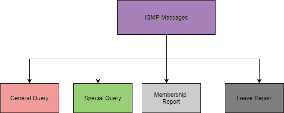
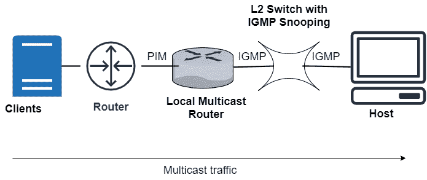
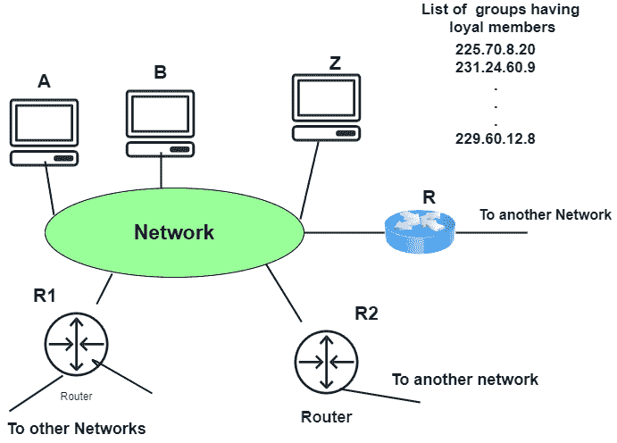

# IGMP 议定书

> 原文：<https://www.studytonight.com/computer-networks/igmp-protocol>

在本教程中，我们将介绍计算机网络中网络层的 IGMP 协议。

IGMP 是互联网组管理协议(IGMP)的缩写。互联网协议主要涉及两种类型的通信，即单播和多播。IGMP 协议是多播中必需的但不是有效的协议之一。

IGMP 基本上是互联网协议的伙伴。

IGMP 不是一个多播路由协议，但它是一个管理组成员的协议。该协议主要帮助组播路由器创建和更新与每个路由器接口相关的忠实成员列表。

该协议用于流式视频、游戏或网络会议工具。

## IGMP 信息

IGMP 有两个版本:IGMPv1 和 IGMPv2。

IGMPv2 版本有三种类型的消息:

*   查询

*   会员报告

*   休假报告。

查询消息有两种类型:**常规和特殊**

## 消息格式

现在让我们看看 IGMP 的格式(第 2 版):

### 类型

这是一个 8 位字段，主要用于定义消息的类型。该类型的值可以是十六进制和二进制表示法。

| 类型 | 价值 |
| --- | --- |
| 常规或特殊查询 | 0x11 或 00010001 |
| 会员报告 | 0x16 或 00010110 |
| 休假报告 | 0x17 或 00010111 |

### 最大响应时间

该字段的大小也是 8 位，它主要定义查询必须被回答的时间量。该字段的值在查询消息中不为零；而在其他两种类型中，它的值为零。

###  校验和

该字段的大小为 16 位，并携带校验和。校验和主要通过 8 字节消息计算。

### 群组地址

在一般查询消息的情况下，该字段的值为 0。在特殊查询、成员报告和离开报告消息的情况下，该字段的值定义了 groupid。

## IGMP 的工作

该协议主要工作在能够处理多组的设备上，用于动态组播；这些设备主要允许主机加入或退出多播组。

此外，允许这些设备在组中添加和删除客户端。

**IGMP 协议**主要在**主机和本地组播路由器**之间的中运行。

当创建多播组时，多播组地址在 D 类(224-239) IP 地址的范围内，并且作为分组中的目的地 IP 地址被转发。

L2 的意思是开关之类的二级设备；这些主要用于主机和组播路由器之间对 IGMP 的窥探。

IGMP 监听:这是一个用于以受控方式监听 IGMP 网络流量的过程。

交换机主要接收来自主机的消息，然后将成员报告主要转发给本地多播路由器。之后，组播流量使用 PIM(协议无关组播)协议从本地组播路由器进一步转发到远程路由器，以便客户端可以接收消息/数据包。

如果客户端希望加入网络，那么它们可以在查询中发送加入消息，然后交换机截取该消息，然后将客户端的端口添加到其多播路由表中。

## IGMP 行动

互联网组管理协议在本地运行。连接到网络的多播路由器主要具有该网络中至少有一个忠实成员的组的多播地址列表。对于每个组，主要有一台路由器负责分发发往该组的多播数据包。

这简单地表明，在这种情况下，如果有三个多播路由器连接到一个网络，那么它们的组号列表**是**互斥的。****

 **

以下是 IGMP 的业务情况:

*   **加入团体**

    *   在此操作中，主机和路由器都可以加入一个组。每当主机上的一个进程想要加入一个组时，它只需将请求发送给主机。然后，主机将进程名和组名添加到列表中。

    *   在这种情况下，如果这是该特定组的第一个条目，则主机向该组的多播路由器发送成员报告消息。

    *   如果该条目不是第一个条目，则不需要发送这样的消息。

*   **离队**

    *   每当主机发现没有对该组感兴趣的进程时，它主要会留下一条报告消息。

    *   该组的组播路由器不会对成员资格进行消毒，而是立即重复发送查询包，看看是否还有人感兴趣。

    *   如果它以成员报告消息的形式得到响应，那么主机或网络的成员资格将被保留。

*   **监控成员资格**
    主要是一般的查询消息没有定义特定的组。

*   **延迟响应**
    为了防止不必要的流量，IGMP 主要采用延迟响应策略。

## IGMP 的优势

下面列出了 IGMP 提供的一些好处:

*   在这个协议的帮助下，带宽被有效地利用，因为所有的共享链路都是连接的。

*   使用该协议，主机可以立即离开多播组，然后加入另一个组。

*   该协议的性能得到了优化，因为没有向主机传输垃圾数据包。

## IGMP 的缺点

以下是 IGMP 的一些缺点:

*   在过滤和安全期间，它不能提供良好的效率。

*   该协议容易受到拒绝服务攻击。

*   由于缺少 TCP，可能会出现网络拥塞。** 

* * *

* * *