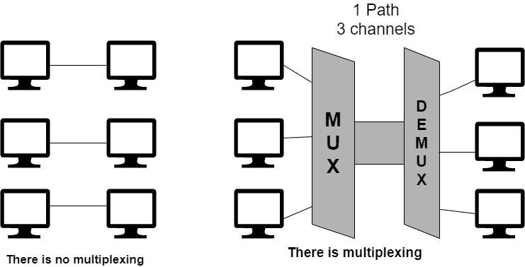
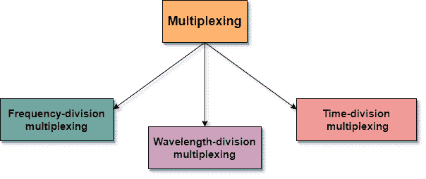
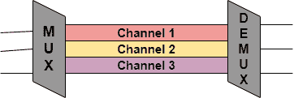
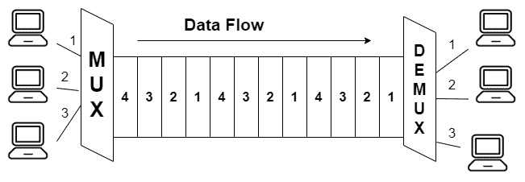
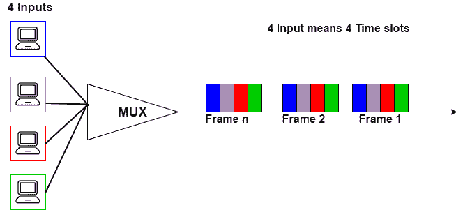

> 原文：<https://www.studytonight.com/computer-networks/multiplexing-in-computer-networks>

# 计算机网络中的多路复用

在本教程中，我们将介绍计算机网络中多路复用的概念。

允许在单个数据链路上同时传输多个信号的一组技术通常称为多路复用。多路复用是通过使用称为多路复用器**(多路复用器)**的硬件来完成的。

复用器 **(MUX)** 主要组合‘n’条输入线，以便在发送端生成‘1’条输出线**(这只是多对一)**。在接收器端，该流被馈送到解复用器 **(DEMUX)** ，然后该解复用器将该流分离回其分量传输**(这是一对多)**，然后将它们导向它们相应的线路。

复用技术的主要目的是共享**稀缺资源**。

让我们借助下面给出的图表来理解如何将 1 条链路分成 n 个通道:

在上图中，单词 link 指的是物理路径，单词 channel 简单地指的是链路中承载给定线路对之间传输的部分。因此，一条链路可以有许多通道。

## 多路复用的历史

在电信中，几个电话可以用一根电线传送。此外，多路复用起源于 19 世纪 70 年代的电报。现在，这项技术被广泛应用于通信领域。电话领域的乔治·欧文·斯奎尔被认为在 1910 年发展了电话载波多路复用技术。

## 多路复用的需求

正如我们已经告诉您的，多路复用基本上是一套技术，主要允许通过信号数据链路同时传输多个信号。

当需要从同时发送的发送端发送许多信号时，使用多路复用器将许多信号转换成一个信号，以便在接收端我们可以同时获得它们。

因为以不同的方式发送许多信号非常昂贵，而且还需要更多的线路来发送。因此，需要多路复用。让我们举一个电视电缆分配器的例子，它通过一根电线发送多个频道。

### 多路复用的优势

下面给出了使用多路复用的一些优点:

*   在多路复用的帮助下，可以通过单一介质或链路轻松发送多个信号。

*   多路复用有助于有效利用介质的带宽。

让我们看一下下图，了解多路复用与非多路复用:

## 多路复用的类别

让我们来看看多路复用的不同类别:

*   频分复用

*   波分复用

*   时分多路复用

让我们在接下来的章节中一个接一个地讨论上面给出的所有类别。

## 1.频分复用

频率除运算复用，即 **FDM** 是一种**模拟技术。**

*   利用这种技术，具有不同频率的信号被组合成复合信号，然后在链路上传输

*   主要应用于链路的**带宽大于待传输信号**的组合带宽的时间。

*   在这种情况下，每个信号具有不同的频率。

*   为了防止信号重叠，信道通常由未使用的带宽带即**保护带**分隔开。

*   在频分复用的情况下，假设输入信号是数字形式，那么在将其作为调制器的输入之前，必须将其转换为模拟形式。

频分复用

从上图来看，在 **FDM** 中，传输路径分为**三个部分**，每个部分主要**代表一个通道**，承载**一个传输**。

### 优势

下面给出了使用 FDM 的一些优势:

*   大量信号的同时传输很容易完成。

*   FDM 多路复用的解调很容易。

*   为了正常工作，发射机和接收机之间不需要同步。

*   在慢窄带衰落的情况下，只有一个信道受到影响。

### 不足之处

使用 FDM 有一些缺点:

*   通信信道必须具有非常大的带宽。

*   使用 FDM 时会出现串扰问题。

*   在宽带衰落的情况下，FDM 的所有信道都会受到影响。

*   需要大量的滤波器和调制器。

### 应用程序

FDM 的主要应用如下:

*   FDM 的主要应用之一是调幅和调频广播。

*   FDM 的另一个应用是它被用于电视广播。

*   第一代移动电话也使用 FDM。

## 2.波分复用

波长除运算复用，即 **WDM** 是一种**模拟技术。**

*   这个手法**类似于 FDM** 。

*   借助于波长除运算复用**不同的信号**，包括:**光或光**信号通过光纤传输**。**

*   在 WDM 技术的帮助下，光缆的高数据速率能力得到了利用。

*   利用这种技术，来自不同光源的各种光波被组合成复合光信号，该信号通过信道传输到接收器。

*   在接收器端，这个复合光信号在解复用器的帮助下被分解成不同的光波。

*   光波的合成和分裂过程是在**棱镜的帮助下完成的。**

*   这个棱镜有助于根据光的入射角和频率弯曲光束。

*   在 WDM 技术中，多路复用器的作用主要由棱镜发挥，然后它组合各种光信号，以便形成复合信号，然后该复合信号通过光纤电缆传输。

上图表示波分复用

让我们看看下面给出的图表，其中我们将使用棱镜进行波分复用和解复用。

### 优势

下面给出了使用 WDM 的一些优势:

*   在 WDM 的帮助下，全双工传输是可能的。

*   WDM 很容易重新配置。

*   在 WDM 的帮助下，各种信号可以同时传输。

*   这种技术成本较低，系统的扩展也很容易。

*   这种技术提供了很高的安全性。

*   因为我们在 WDM 使用光纤；此外，光学元件更可靠，并且它们还提供高带宽。

### 不足之处

使用 WDM 有一些缺点:

*   有使用光学设备，所以成本增加。

*   带宽的利用可能是低效的，这导致波长调谐的困难。

*   这项技术的主要关注点是可伸缩性。

## 3.时分复用

时间除运算复用是一种数字复用技术。

*   在这种技术中，信道/链路是根据时间而不是频率来划分的。

*   信道上的总可用时间在信道上的不同用户之间分配。

*   特定的时间间隔被分配给信道上的每个用户，它被称为时隙/片。

*   在时分复用中，数据速率容量应该远大于发送和接收设备所需的数据速率。

时分复用进一步分为两类:

*   同步时间除运算复用

*   异步时间除运算复用

### 1.同步时间除运算复用

在同步时分复用中，每个输入连接在输出中都有一个分配，即使它没有发送数据。

*   在这种多路复用中，每个设备都有相同的时隙，以便通过链路传输数据，而不管它是否必须向接收器发送数据。

*   每当它的时隙到达时，每个设备都将数据放在链路上，因此控制被轮流给予每个设备。

*   如果任何设备没有任何数据要发送，那么在这种情况下，该设备的时隙保持为空。

*   在这种多路复用中，如果有“n”个发送设备，那么同时会有“n”个时隙，这意味着每个设备有一个时隙。

*   此外，时隙以帧的形式组织，其中每个帧由一个或多个时隙组成。

**优势**

*   这种技术很容易实现。
*   使用这种技术可以保证性能。

**缺点**

*   如果用户没有数据要传输，那么时隙将被浪费。

*   在这种多路复用中，传输链路的容量必须始终高于输入线路的总容量。

### 2.异步时间除运算复用

异步时分复用的另一个名称是静态时间除运算复用。在这种情况下，时隙不是固定的，而是动态分配的，以提高带宽效率。

*   所有输入线路的总速度可能大于路径的容量。

*   在这个复用中，有 n 条输入线和 m 个时隙；因此总是(m

*   没有预定义时隙的概念，而是按需动态分配时隙。

*   在这种多路复用中，多路复用器主要接受输入数据，然后创建一个只包含数据而没有任何空槽的帧。

*   每个槽主要包含用于识别输入数据来源的地址部分。

*   这种多路复用中的帧数取决于对输入线数量的静态分析。

因此，在上图中，6 台设备中只有 4 台设备发送的数据是 1、2、4、6。在上图中，您可以看到数据部分包含地址，以便确定数据的来源。像 **A1** (数据及其来源)。

**优势**

*   在这种多路复用中，传输容量得到了有效利用。

**缺点**

*   在这种多路复用中，帧大小不同。

*   还需要缓冲器地址信息，因为没有为每个用户分配单独的时隙。

*   这种技术不提供固定的等待时间保证。

* * *

* * *