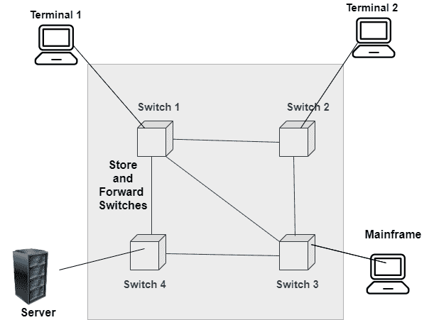

> 原文：<https://www.studytonight.com/computer-networks/messageswitched-networks>

# 消息交换网络

在本教程中，我们将介绍计算机网络中**消息交换网络**以及**消息交换**的概念。

消息交换技术主要是作为电路交换的一种替代物而发展起来的，这是在引入分组交换之前的 T2。基本上，信息是一个较小的单元。

*   在消息交换技术中，终端用户之间的通信是通过发送和接收消息来完成的，并且该消息包括要共享的整个数据。

*   在消息交换中，发送方和接收方之间没有像电路交换那样的专用路径。

*   发送方和接收方通过几个中间节点连接，这有助于并确保它们之间正确的数据传输。

*   消息交换数据网络也被称为逐跳系统。

## 消息交换的特点

下面给出了消息交换的两个特征:

*   **存储和转发**
    正如我们已经告诉您的，发送方和接收方没有直接连接。因此，发送方和接收方之间的中间节点主要负责将消息传递到路径中的下一个节点。因此，为了传输消息，中间节点必须具有存储容量，因为只有当下一个节点和它们之间的链路可连接时，任何消息才会被传递，否则该消息将被无限期地存储。因此，只有当有足够的资源可用并且下一个节点准备好接受数据时，存储转发交换机才会转发消息。该过程一直持续到数据被传送到目标计算机。因此，它被称为存储-&-转发属性。存储转发属性早期用于电报消息交换中心。
*   **消息传递:**在消息交换中，整个信息被编译成一条消息，然后该消息从源传输到目的地。为了成功到达目的地，每条消息必须在其报头部分包含路由信息。

图:消息交换和消息交换网络

## 消息交换的优势

下面给出了使用消息交换的一些优点:

*   在这种交换中，数据通道在网络设备之间共享。

*   通过为消息分配优先级，可以有效地管理流量。

*   效率有所提高，因为单个通道现在可以用于传输许多消息。
*   减少了网络流量拥塞，因为在这种技术中，我们使用存储和转发属性，并且任何交换节点都可以存储消息，直到网络可用。

*   使用消息交换，可以发送无限大小的消息。

*   广播消息时需要较少的带宽；因此，它比电路交换消耗更少的带宽。

*   在消息交换中，如果下一个节点或链路不可用，则当前节点存储消息

## 消息交换的缺点

使用消息交换有以下缺点:

*   对于整个网络来说，消息交换需要很大的容量。

*   这种技术不能用于实时应用，因为存储消息会导致延迟。

*   消息交换网络本质上非常慢，因为处理发生在每个节点上，因此可能会导致性能不佳。

* * *

* * *