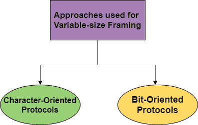
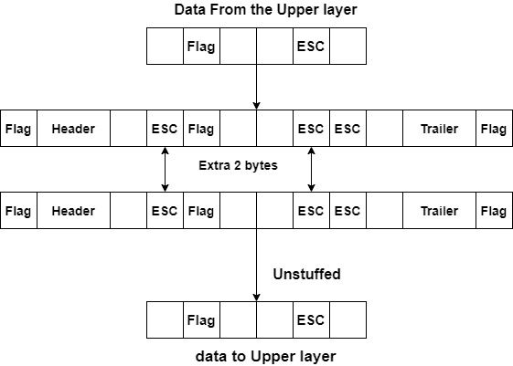
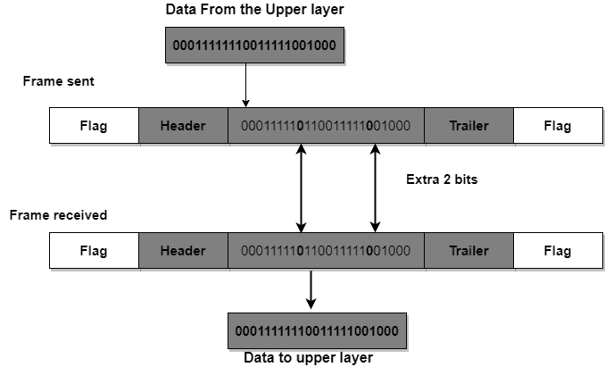

> 原文：<https://www.studytonight.com/computer-networks/data-link-control>

# 数据链路控制

在本教程中，我们将介绍数据链路层的一个重要概念，即数据链路控制。

数据链路层有两个主要功能，即数据链路控制和媒体访问控制。**数据链路控制**主要处理两个相邻节点之间通信的设计和流程:**节点到节点**通信。

**媒体访问控制**是**数据链路层**的另一个主要功能，主要指定**如何共享链路**。

让我们首先在本教程中介绍数据链接控制，然后在下一个教程中，我们将继续讨论媒体访问控制。

### 数据链路控制中的功能

数据链路控制中包括的功能有:

*   框架

*   流程和错误控制

*   软件实现的协议(在节点之间提供平滑和可靠的帧传输。)

## 框架

在物理层，数据传输意味着将比特以信号的形式从源传输到目的地。物理层还提供同步，主要确保发送方和接收方使用相同的位持续时间和时序。

数据链路层将比特打包到帧中；使得每一帧都可以与另一帧区分开。

数据链路层中的**成帧**仅通过添加发送者地址和目的地地址，将**消息**从**的一个源分离到目的地**或从其它消息分离到其它目的地；其中目的地地址指定了数据包必须到达的位置，发送方地址帮助接收方确认收到。

框架可以是固定大小的，也可以是可变大小的。通过使用帧，数据可以很容易地被分解成可恢复的块，并且为了检查传输中的损坏，可以很容易地检查这些块。

### 框架设计中的问题

下面给出了由于框架引起的一些问题:

1.  **检测帧的开始**
    无论何时传输帧，每个站都必须能够检测到该帧。任何站点都可以通过寻找一个特殊的位序列来检测帧，该位序列在帧的开头标记为起始帧定界符(SFD)。

2.  **任何站点如何检测帧**
    网络中的每个站点都通过时序电路监听 SFD 模式的链接。如果检测到 SFD，则时序电路向工作站发出警报。之后，工作站检查目的地址，以便接受或拒绝该帧。

3.  **检测帧结束**
    是什么时候停止读帧。

## 框架的一部分

框架的不同部分如下:

**1。旗帜**
一面旗帜用来标记帧的开始和结束。

**2。报头**
帧报头主要包含帧的源地址和目的地址。

**3。**
帧尾主要包含检错和纠错位。

**4。有效载荷字段**
该字段包含要传递的消息。

## 框架的类型

框架主要分为两部分:

*   固定尺寸框架

*   可变尺寸框架

让我们逐一讨论上面给出的两种类型；

### 固定尺寸框架

在固定尺寸的框架中，不需要定义框架的边界。帧本身的大小或长度可以用作分隔符。

固定大小帧的一个缺点是，如果数据的大小小于帧的大小，它将遭受内部碎片。

### 可变尺寸框架

在可变尺寸框架中，每个框架的尺寸是不同的。因此，需要一种方法来定义帧的结束和下一帧的开始。

可变尺寸框架有两种方法:

### 面向字符的协议

在面向字符的协议中，要传输的数据是来自编码系统(如 ASCII)的 8 位字符。

面向角色的框架中的框架部分如下:

**1。框架标题**

帧头包含字节形式的源地址和目的地址。

**2。有效载荷字段**

有效负载字段主要包含要传递的消息。在这种情况下，它是一个可变的数据字节序列。

**3。框架拖车**

帧的尾部包含用于纠错和检错的字节。

**4。标签〔t1〕字**

为了将一帧与下一帧分开，在帧的开头和结尾添加了一个 8 位(即 1 字节)标志。

让我们看看**面向字符协议:**中的框架

****

当数据是由数据链路层交换的文本形式时，这种技术很流行。所选标志可以是不用于文本通信的任何字符。但是需要发送其他类型的信息，如图表、音频和视频。

现在，用于标志的任何模式也可以是信息的一部分。如果发生这种情况，那么接收器在数据中间遇到这种模式，然后认为它已经到达帧的末尾。

为了解决上述问题，在面向字符的框架中增加了**字节填充策略**。

**字节填充**

每当有一个字符与标志具有相同的模式时，这是一个添加 1 个特殊字节的过程。

*   数据段填充了一个额外的字节，这个字节通常被称为转义字符 **(ESC)** ，它有一个预定义的位模式。

*   每当接收器遇到一个 ESC 字符时，它就会将其从数据段中删除，然后将下一个字符视为数据。

**字节填充和释放**

使用面向字符的成帧的缺点是，由于这一点，消息的开销变得太大，从而导致帧的总大小增加。另一个缺点是，目前的编码系统有 16 位或 32 位字符，肯定会与 8 位编码冲突。

### 面向比特的协议

在面向比特的成帧中，帧的数据部分主要是由上层解释为文本、图形、音频、视频等的比特序列。

在这种情况下，还需要一个定界符，以便将一帧与另一帧分开。

让我们看看面向比特的协议中的帧:

**比特填充**

每当数据中的 0 后面有五个连续的 1 时，就会增加一个额外的 0，这样接收器就不会将模式 01111110 误认为标志，这一过程通常称为位填充。

上图显示了发送端的位填充和接收端的位移除。值得注意的是，即使我们在五个 1 之后有一个 0，我们仍然会填充一个 0。移除 0 是由接收器完成的。

简单地说，每当数据中出现类似标志的模式 01111110 时，它会将数据更改为 011111010(填充的)，这样接收器就不会将它误认为标志。

发送方不会填充真实标志 01111110，因此接收方会识别该标志。

* * *

* * *