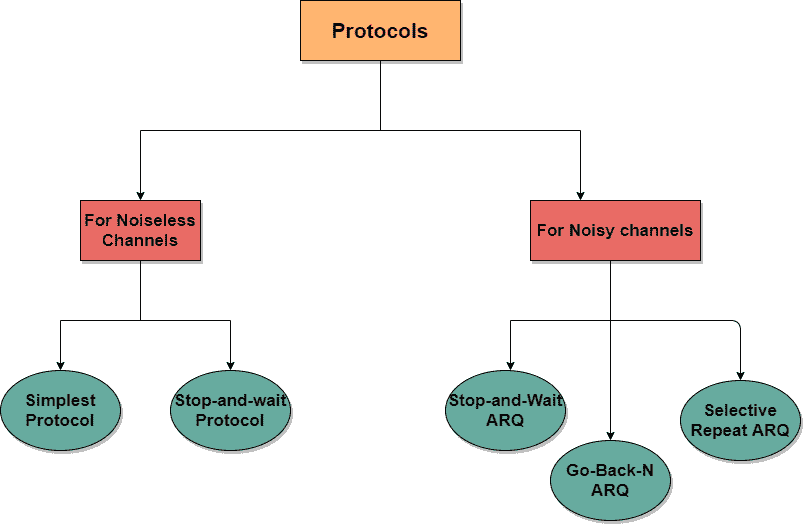

> 原文：<https://www.studytonight.com/computer-networks/flow-and-error-control>

# 流程和错误控制

在本教程中，我们将介绍数据链路层中流量和错误控制的概念。

流量控制和错误控制是数据链路层的两个主要职责。让我们理解这两个术语的含义。对于节点到节点的数据传递，流量和错误控制在数据链路层完成。

**流量控制**主要是在接收到接收方的确认之前，与能够发送的数据量进行协调，是数据链路层的主要职责之一。

*   对于大多数协议来说，**流量控制**是一组程序，主要告诉发送方在必须**等待来自**接收方**的确认**之前，发送方可以发送多少数据。

*   决不能让数据流淹没接收者；因为任何接收设备处理输入数据的速度都非常有限，存储输入数据的内存量也非常有限。

*   处理速率比传输速率慢；由于这个原因，每个接收设备都有一个内存块，通常称为**缓冲区，**，用于存储传入的数据，直到该数据被处理。如果缓冲区开始填满，那么接收者必须能够告诉发送者停止传输，直到接收者再次能够接收。

因此流量控制使发送者；在继续向接收器发送更多数据之前，等待接收器的确认。

一些常见的流量控制技术有:停止等待和滑动窗口技术。

**错误控制**包含错误检测和错误纠正。它主要允许接收方在传输过程中通知发送方任何损坏或丢失的帧，然后与发送方重新传输这些帧进行协调。

数据链路层的差错控制主要指差错检测和重传的方法。差错控制主要以一种简单的方式实现，即每当在交换期间检测到差错时，就重新发送指定的帧，这个过程也被称为**自动重复请求(ARQ)。**

## 协议

协议的实现主要通过使用一种常见的编程语言在软件中实现。协议的分类可以主要根据它们在哪里被使用来完成。

协议可以用于**无噪声信道**(即**无差错**)，也可以用于有噪声信道(即**产生差错**)。用于无噪声信道的协议主要不能在现实生活中使用，主要用作**有噪声信道的协议基础。**

****

所有上述协议都是单向的，即数据帧从一个节点(即发送方)传输到另一个节点(即接收方)。

称为确认(ACK)和否定确认(NAK)的特殊帧都可以在相反的方向上流动，用于流量和错误控制目的，并且数据只能在一个方向上流动。

但是在现实网络中，数据链路层的协议被实现为双向的，这意味着数据流是双向的。在这些协议中，流控制和错误控制信息，如 ack 和 NAKs，以一种通常被称为**捎带的技术包含在数据帧中。**

此外，双向协议比单向协议更复杂。

在我们的后续教程中，我们将详细介绍上述协议。

* * *

* * *