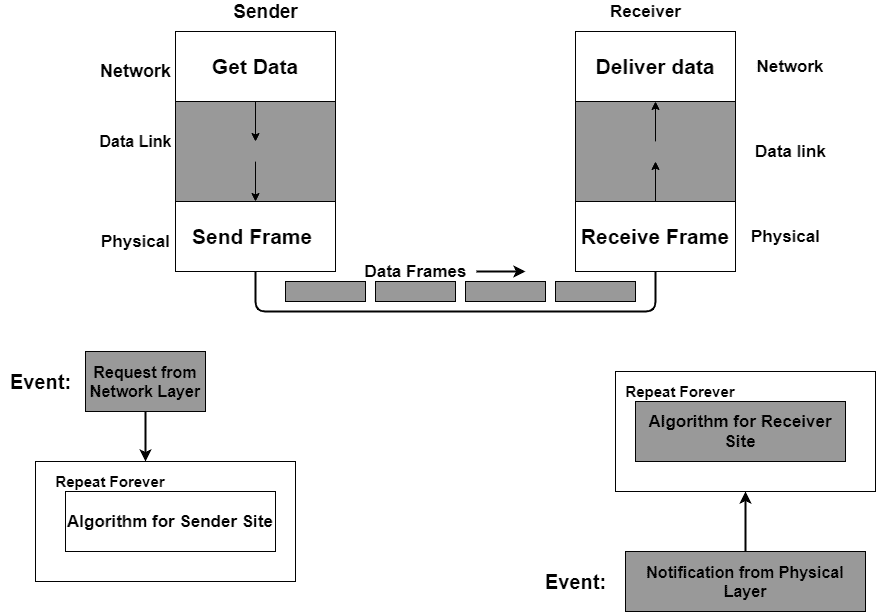
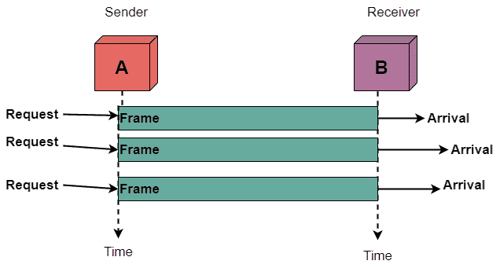

> 原文：<https://www.studytonight.com/computer-networks/simplest-protocol>

# 最简单的协议

在本教程中，我们将介绍数据链路层无噪声信道类别下的最简单协议。

最简单的协议是既没有**流量控制**也没有**错误控制**的协议(我们已经告诉过你，它属于无噪声信道的范畴)。

*   最简单的协议基本上是**单向协议**，其中数据帧只在一个方向上传输；从发送者到接收者。

*   在这种情况下，接收器可以立即处理它接收到的帧，其处理时间小到可以忽略不计。

*   基本上，接收器的数据链路层立即从帧中移除报头，然后将数据分组移交给网络层，网络层也立即接受数据分组。

*   我们还可以说，在这种协议的情况下，接收方永远不会被来自发送方的传入帧淹没。

## 最简单协议的设计

最简单的协议不需要流量控制。发送端的数据链路层主要从网络层获取数据，然后将数据制成帧发送出去。在接收器站点，数据链路层从物理层接收帧，然后从帧中提取数据，然后将数据传送到其网络层。



发送方和接收方的数据链路层主要为其网络层提供传输服务。数据链路层还使用物理层提供的服务，例如信令、多路复用等，用于比特的物理传输。

## 数据链路层使用的过程

现在让我们看一下数据链路层在两端(发送方和接收方)使用的过程。

*   发送方站点的数据链路层没有发送帧，直到其网络层有数据包要发送。

*   类似地，在帧到达之前，接收站点无法将数据包传送到其网络层。

*   如果协议的实现是作为一个过程来完成的，那么就需要在协议中引入事件的概念。

*   发送方站点的过程持续运行；在网络层发出请求之前，不会有任何操作。

*   此外，接收方的程序持续运行；在收到物理层的通知之前，不会有任何操作。

*   这两个过程都连续运行，因为它们中的任何一个都不知道相应的事件何时会发生。

让我们看一下发送者网站上使用的算法:

```
while(true)  //Repeat Forever
{
   WaitForEvent();   //Sleep until there is occurrence of an event
   if(Event(RequestToSend)) //means there is a packet to send
   {
     GetData();
     MakeFrame();    
     SendFrame();   //Send the frame 
   }
}
```

下面给出了接收方使用的算法:

```
while(true)  //Repeat Forever
{
   WaitForEvent();   //Sleep until there is occurrence of an event
   if(Event(ArrivalNotification)) //means there is a packet to send
   {
     ReceiveFrame();
     ExtractData();    
     DeliverData();   //Send the frame 
   }
}
```

## 最简单协议的流程图

使用最简单的协议，发送方 A 发送一系列帧，甚至不考虑接收方 b。



为了发送这三个帧，将在发送方 A 发生三个事件，在接收方 b 发生三个事件。

需要注意的是，在上图中，数据框是借助方框显示的。

框的高度主要表示帧的第一位和最后一位的传输时间差。


* * *

* * *