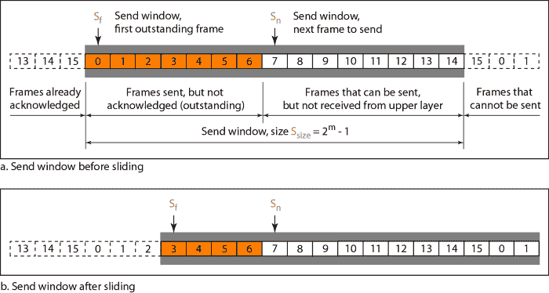
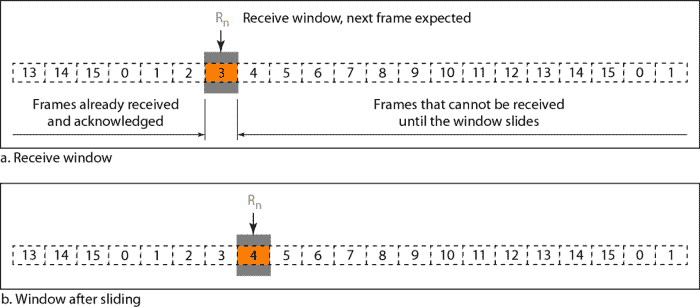
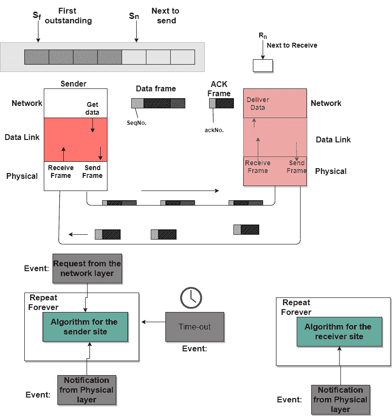
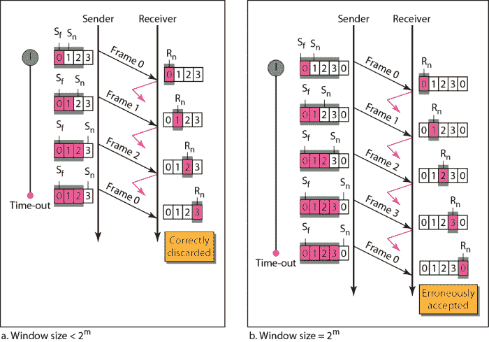
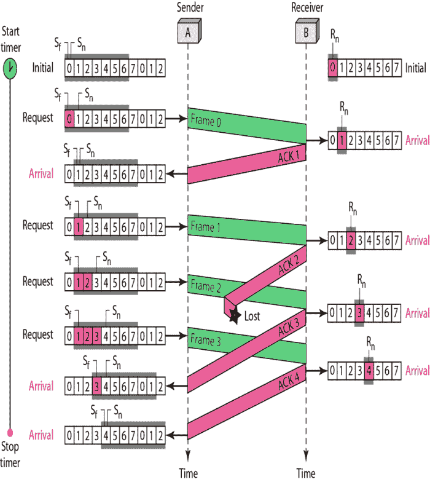

# 自动重复请求

> 原文：<https://www.studytonight.com/computer-networks/gobackn-automatic-repeat-request>

在本教程中，我们将介绍数据链路层中噪声信道的自动重复请求协议。

**Go-Back-N ARQ** 主要是自动重复请求 **(ARQ)协议**的一个具体实例，其中发送过程继续发送窗口大小指定的多个帧，即使没有从接收方接收到确认**(确认)数据包**。

发送方保留每个帧的副本，直到确认到达。

该协议是滑动窗口的实用方法。

*   在 ARQ，发送方窗口的大小是 N，接收方窗口的大小总是 1。

*   该协议使用**累积确认**，这意味着接收器保持一个确认定时器；每当接收器从发送器接收到新帧时，它就启动新的确认定时器。当定时器到期时，接收机发送所有帧的**累积确认**，此时接收机未确认这些帧。

*   需要注意的是，新的确认定时器仅在接收到新帧后启动，而不是在**旧确认定时器**到期后启动。

*   如果接收方收到一个损坏的帧，那么它会无声地丢弃该损坏的帧，并且在超时定时器到期后，发送方会重新发送正确的帧。因此，接收器无声地丢弃损坏的帧。我们所说的默默丢弃是指:“简单地拒绝框架，不为框架采取任何行动”。

*   如果在确认定时器到期后，假设只剩下一帧要确认。在这种情况下，接收器发送该帧的独立确认。

*   如果接收方接收到无序帧，那么它会丢弃所有帧。

*   如果发送方没有收到任何确认，那么在这种情况下，帧的整个窗口都将被重传。

*   在**超时定时器到期后，使用回退-N ARQ 协议会导致丢失帧的重新传输。**

## ARQ 回归的需要

该协议用于一次发送多个帧。在 ARQ 的帮助下，寄件人的等待时间减少了。

在 ARQ 协议的帮助下，传输效率提高了。

## ARQ 北部返回发送(滑动)窗口

基本上，发送方关心的范围被称为“返回-N-ARQ”的发送滑动窗口。它是一个假想的盒子，里面装着可能正在传输的数据帧的序列号。

这个假想框的大小是 2m-1，有三个变量 Sf(表示发送窗口，第一个未完成的帧)、Sn(表示发送窗口，下一个要发送的帧)、SSize。(指示发送窗口大小)。

*   发送方可以在收到确认帧之前发送 N 帧。

*   发送滑动窗口的大小为 n。

*   发送数据的副本保存在发送方的发送缓冲区中，直到所有发送的数据包都得到确认。

*   如果超时计时器超时，发送方将重新发送所有数据包。

*   一旦数据得到接收器的确认，那么该特定数据将从缓冲器中移除。

每当有效确认到达时，发送窗口可以滑动一个或多个时隙。

## 发件人窗口大小

正如我们已经告诉你的，发送窗口大小为 N。N 的值必须大于 1。

如果 N 的值等于 1，则该协议成为停止等待协议。

## ARQ 北部返回接收(滑动)窗口

接收器关注的范围称为接收器滑动窗口。

*   接收窗口主要是一个抽象的概念，定义了一个大小为 1 并且有一个变量 Rn 的虚盒。

*   当正确的帧到达时，窗口滑动，每次滑动一个时隙。

*   接收者总是寻找特定的帧以特定的顺序到达。

*   任何无序到达接收方的帧都将被丢弃，因此需要由发送方重新发送。

*   如果一个帧以特定的顺序安全地到达接收方，那么接收方就向发送方发回确认。

*   接收器的静默导致未确认帧的定时器到期。

## ARQ 折返线的设计

借助回退 N ARQ，多个帧可以正向传输，多个确认可以反向传输。该协议的思想类似于“停止并等待”的 ARQ 协议，但有所不同，它是“返回-N-ARQ”的窗口，允许我们在转换中有多个帧，因为在发送窗口中有许多时隙。

## ARQ 北部返回窗口大小

在 ARQ，发送窗口的大小必须始终小于 2m，接收窗口的大小必须始终为 1。

## 流程图

## 优势

下面给出了使用 ARQ 协议的一些好处:

*   这个协议的效率更高。

*   在这个协议中，等待时间非常短。

*   借助该协议，可以为许多帧设置定时器。

*   此外，发送方可以一次发送许多帧。

*   只有一个确认帧可以确认多个帧。

## 不足之处

下面给出了一些缺点:

*   超时计时器仅在接收器端运行。

*   发射机需要存储最后 N 个数据包。

*   许多无差错分组的重传跟随在一个差错分组之后。

* * *

* * *