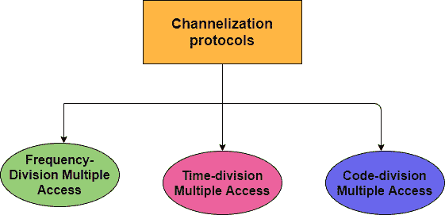
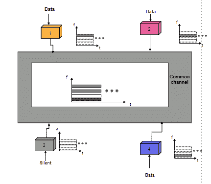
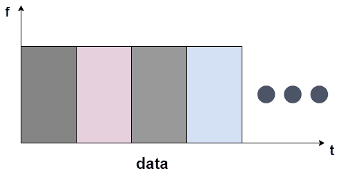

> 原文：<https://www.studytonight.com/computer-networks/channelization-protocols>

[← Prev](/computer-networks/multiple-access-in-data-link-layer "Multiple Access in DL")[Next →](/computer-networks/gigabit-ethernet "Gigabit Ethernet")

<nav aria-label="breadcrumb">

1.  [家](/)
2.  [计算机网络](/computer-networks)
3.  信道化协议

</nav>

<article>

# 信道化协议

在本教程中，我们将详细介绍多址接入的信道化协议。

信道化基本上是一种提供多址接入的方法，在这种方法中，链路的可用带宽在时间、频率上共享，或者通过不同站之间的代码共享。

信道化协议大致分类如下:

*   FDMA(频分多址)

*   时分多址

*   码分多址

让我们逐一讨论上面给出的技巧:

## 1.频分多址

在这种技术的帮助下，可用带宽被划分为多个频带。每个站被分配一个频带，以便发送其数据。或者换句话说，我们可以说，每个波段都是为特定的电台保留的，它一直属于该电台。

*   每个站利用**带通滤波器**来限制发射机的**频率。**

*   为了防止站内干扰，在小**保护频带的帮助下，分配的频带彼此分离。**

*   频分多址主要为整个通信周期指定预定频率。

*   在 FDMA 的帮助下，数据流很容易使用。

### FDMA 的优势

下面给出了使用 FDMA 技术的一些好处:

*   当流量一致恒定时，这种技术是有效的。

*   如果信道没有被使用，那么它就处于空闲状态。

*   FDMA 算法简单，复杂度较低。

*   对于 FDMA，对于基带的类型或调制的类型没有限制。

### FDMA 的缺点

*   通过使用 FDMA，每个通道的最大流速是固定的并且很小。

## 2.时分多址

时分多址是另一种接入共享介质网络信道的方法。

*   在这种技术的帮助下，这些站及时共享信道的带宽。

*   时隙被分配给每个站，在此期间它可以发送数据。

*   数据由每个站在指定的时隙中传输。

*   使用时分多址有一个问题，由于时分多址，不同站之间无法实现同步。

*   当使用时分多址技术时，每个站需要知道其时隙的开始和其时隙的位置。

*   如果站点分布在很大的区域，那么就会出现传播延迟；为了补偿这个守卫，使用了时间。

*   每个站中的数据链路层主要告诉其物理层使用分配的时隙。

图:时分媒体访问。

TDMA 的一些例子如下；

*   个人数字蜂窝电话

*   集成数字增强网络。

*   通用地面无线电接入(UTRA)

## 3.码分多址

码分多址是另一种用于信道化的技术。

*   码分多址技术不同于 FDMA 技术，因为只有一个信道占用链路的整个带宽。

*   码分多址技术不同于时分多址，因为所有的站可以同时发送数据，因为没有分时。

*   码分多址技术仅仅意味着用不同的代码进行通信。

*   在码分多址技术中，只有一个信道同时承载所有的传输。

*   码分多址主要基于编码理论；每个站都被分配一个代码，代码是一个被称为码片的数字序列。

*   来自不同站点的数据可以同时传输，但使用不同的编码语言。

### 码分多址的优势

下面给出了使用码分多址技术的一些优点:

*   提供高音质。

*   码分多址工作在低功率水平。

*   该系统的容量高于时分多址和 FDMA。

*   CDMA 性价比更高。

</article>

* * *

* * *