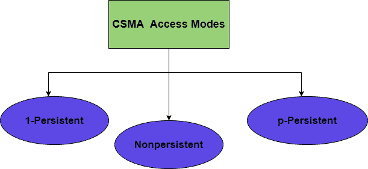
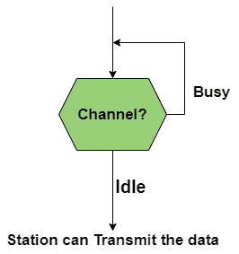
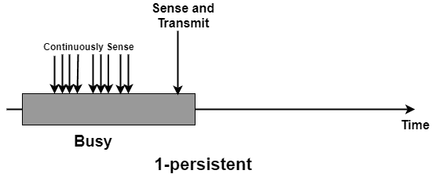
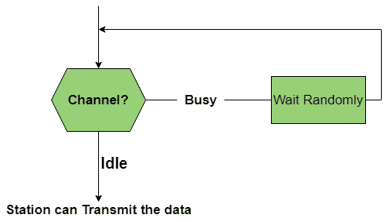
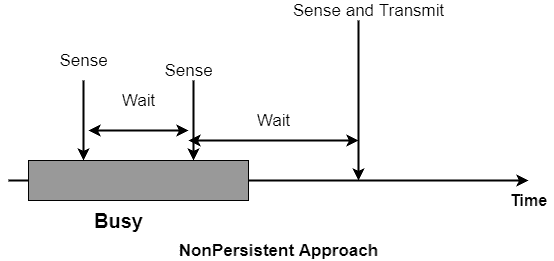
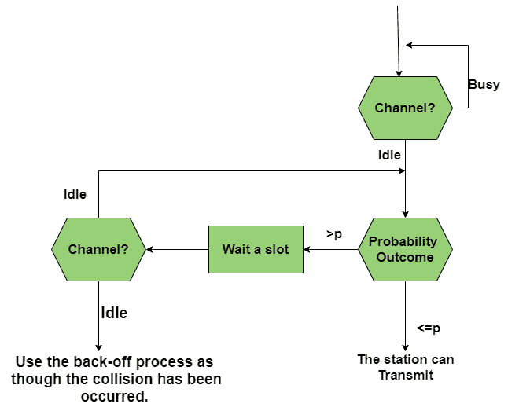
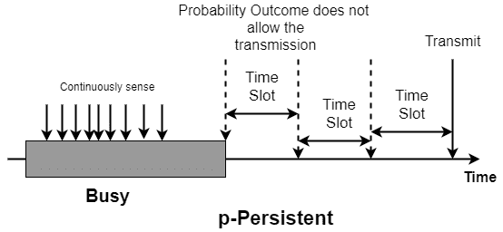

# 载波侦听多路访问

> 原文：<https://www.studytonight.com/computer-networks/carrier-sense-multiple-access>

在本教程中，我们将详细介绍数据链路层中随机接入方法类别下的载波侦听多路接入的概念。

为了最大限度地减少碰撞的机会，并作为提高性能的回报，开发了方法名称 **CSMA** 。

*   如果一个站点在尝试使用介质之前感知到它，那么它会导致碰撞几率的降低。

*   载波侦听多路访问(CSMA)主要要求每个站在发送数据之前先侦听介质。

*   简单地说，我们可以说 CSMA 方法是基于“先感后传”或“先听后说”的原则。

*   存在减少碰撞的可能性，但是 CSMA 方法不能消除碰撞。

### CSMA 的工作

在共享介质上，每当任何信道有数据帧要发送时，该站就试图检测来自连接到共享介质的其它站的任何载波信号的存在。

*   如果该站在共享介质上检测到任何载波信号，则意味着另一个传输正在共享介质上进行。

*   之后，该站等待直到正在进行的传输完成，然后在完成之后，该站启动其自己的传输。通常，站的传输由连接到信道/链路的所有其他站接收。

*   与 CSMA 一样，所有站点在发送自己的帧之前都会进行检测，这可以减少帧冲突。

*   如果共享媒体被两个站点检测为空闲，并且它们都同时启动传输，那么这将导致帧冲突。

### CSMA 的脆弱时期

传播时间在 CSMA 被称为易损时间，并被表示为`Tp`。这基本上是信号从介质的一端传播到另一端所需的时间。

当一个站发送一个帧，同时如果任何其他站试图发送一个帧，那么它将导致冲突。

在这种情况下，如果帧的第一位到达媒体的末尾，那么每个站都会听到该位，并抑制发送。

## CSMA 的接入方式

CSMA 有不同版本的访问模式，如下所示:

1.  1-持久的 CSMA

2.  非持久性 CSMA

3.  持久性 CSMA

## 

*   ### 1-Persistent CSMA 【T1]

这是最简单直接的方法之一。在这种方法中，一旦站点发现媒体空闲，它就立即发送帧。通过使用这种方法，发生冲突的几率更高，因为两个或多个站点可能同时发现共享介质空闲，然后立即发送它们的帧。

### 1-持续方法流程图:

下图显示了**1-持久方法的行为:**

*   ### Non-persistent CSMA 【T1]

在这种方法中，一个站有一个帧来发送传感线。如果线路空闲，则该站将发送帧，如果线路不空闲，则该站将等待随机的时间量，然后它再次感测线路。

在非持久 CSMA 方法的帮助下，碰撞的机会减少了，因为两个或多个站点等待相同的时间，然后再次尝试同时发送是不太可能发生的。

但是由于这种方法，网络的效率降低了，因为当可能有站要发送帧时，介质保持空闲。

### 非持久性方法的流程图:

下图显示了**非持久性方法的行为:**

*   ### Persistent CSMA 【T1]

如果信道具有时隙持续时间等于或大于最大传播时间的时隙，则使用该方法。p 持久方法主要结合了 1 持久和非持久 CSMA 的优点。

通过使用 p-persistent 方法，碰撞的机会减少，效率提高。

使用这种方法，如果站点发现线路空闲，那么它将遵循下面给出的步骤:

1.  用概率 p，站发送它的帧。

2.  在概率 q=1-p 的情况下，站主要等待下一个时隙的开始，然后再次检查线路。

    *   如果发现线路空闲，请转到步骤 1。

    *   如果发现线路繁忙，那么它就像发生了冲突一样，然后它利用退避过程。

### 持久性方法流程图:

### 

下图显示了 **p-Persistent 方法的行为:**

## 载波侦听多路访问的变化

CSMA 方法有两种变体:

1.  带冲突检测的载波侦听多路访问(CSMA/光盘)

2.  带冲突避免的载波侦听多路访问(CSMA/加州)

* * *

* * *