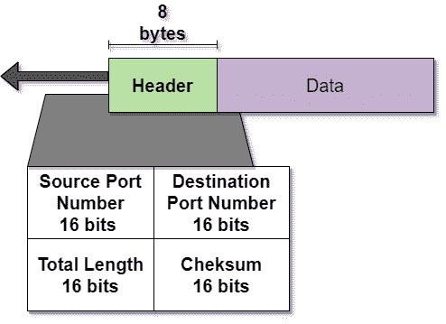
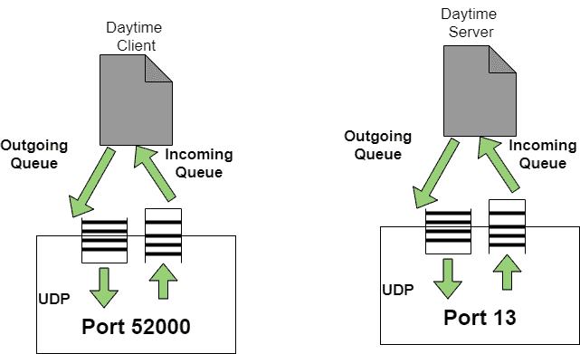

# UDP 协议

> 原文：<https://www.studytonight.com/computer-networks/udp-protocol>

在本教程中，我们将介绍计算机网络中的传输层协议，即 **UDP** 。

UDP 是用户数据报协议的简称。它是最简单的传输层协议之一。这是一种无连接且不可靠的传输协议。

*   这个协议主要是为了在互联网上发送数据包而设计的。

*   除了 UDP 提供进程到进程的通信而不是主机到主机的通信之外，该协议没有给 IP(互联网协议)的服务添加任何东西。

*   UDP 执行非常有限的错误检查。

*   该协议使用最小数量的开销。假设一个进程想要发送一条小消息，而不考虑可靠性，那么它可以利用 UDP。

*   该协议只是从网络层获取数据报，附加自己的报头，然后将其发送回用户。

## 用户数据报

UDP 数据包通常被称为用户数据报，报头大小是固定的，即 8 字节。

现在让我们看看用户数据报的格式；



### 1.源端口号

该端口号主要由源主机上运行的进程使用。其长度为 **16 位**，这意味着端口号的范围可以从 **0 到 65，535。**主要用于识别发送端口或**源应用。**

如果源主机是**客户端**(主要发送请求)，那么在大多数情况下，临时端口号由进程请求，也由运行在源主机上的 UDP 软件选择。

但是在**服务器作为源主机**(主要是发送响应的服务器)的情况下，在这种情况下端口号是众所周知的端口号。

### 2.目的端口号

该端口号主要由在**目的主机**上运行的进程使用。其长度为 **16 位。**

如果**目的主机是服务器**(发送请求的客户端)，那么**端口号就是一个众所周知的端口号**。

如果**目的主机是客户端**(发送响应的服务器)，那么在大多数情况下**端口号**是**临时端口号**。

### 3.长度

数据报报头的这个字段主要用于标识 UDP 报头和封装数据的组合长度。这是一个 16 位字段。

```c
UDP Length= Length of UDP header + Length of Encapsulated data
```

### 4.校验和

该字段主要用于检测错误。这是一个 16 位字段。

*   虽然校验和计算在用户数据报协议中不是强制性的。

## UDP 的特点

下面给出了用户数据报协议的一些特征:

*   UDP 是一种不可靠的无连接协议。

*   这几乎是一个空协议。

*   如果数据流是单向的，那么它就是一个好的协议。

*   该协议不保证数据的传送。

*   该协议不提供拥塞控制机制。

*   UDP 提供最少的传输服务。

*   这是一个无状态协议。

## UDP 的操作

下面给出了 UDP 的不同操作:

### 1.无连接服务

用户数据报协议提供无连接服务，这意味着由 UDP 发送的每个用户数据报都是一个独立的数据报。在不同的数据报中，没有任何关系，即使它们来自同一个源进程，也去往同一个目标程序。

用户数据报没有编号，没有连接建立，也没有连接终止。

每个数据报主要通过不同的路径传输。

### 2.流量控制和误差控制

用户数据报是一种非常简单和不可靠的传输协议。它不提供任何流量控制机制，因此没有窗口机制。因此，接收方可能会溢出传入的消息。

除校验和外，UDP 不提供任何错误控制机制。因此发送者不知道是否有任何消息丢失或重复。

由于缺乏流量控制和错误控制，这意味着使用 UDP 的进程应该提供这些机制。

### 3.封装和解封装

为了将消息从一个进程发送到另一个进程，用户数据报协议以 IP 数据报的形式封装和解封装消息。

## UDP 的应用

下面给出了用户数据报协议的一些应用:

*   **UDP** 由那些需要一个请求一个响应的应用程序使用。

*   它被**广播和组播应用程序使用。**

*   **SNMP** 等管理流程利用 **UDP** 。

*   像**路由信息协议**这样的路由更新协议利用了用户数据报协议。

*   有错误和流量控制机制的进程使用 UDP。同样的一个应用是**普通 FTP 协议(TFTP)。**

## 众所周知的 UDP 端口

现在是时候看看用户数据报协议使用的一些众所周知的端口号了:

| 港口 | 草案 | 描述 |
| --- | --- | --- |
| seven | 回声 | 该端口将收到的数据报回传给发送方。 |
| nine | 抛弃 | 它用于丢弃收到的任何数据报。 |
| Eleven | 用户 | 指示活动用户 |
| Thirteen | 白天 | 用于返回日期和时间 |
| Seventeen | 引用 | 用于返回当日报价 |
| Nineteen | 批次(batch) | 用于返回字符串。 |
| Fifty-three | 名称服务器 | 指示域名服务 |
| Sixty-seven | 布茨 | 用于下载引导信息的服务器端口。 |
| sixty-eight | 引导电脑 | 用于下载引导信息的客户端端口。 |
| sixty-nine | 普通文件传送协议(Trivial File Transfer Protocol) | 普通 FTP 协议 |
| One hundred and eleven | 位置遥控(remote position control) | 远程过程得 |
| One hundred and twenty-three | 标准温度和压力 | 网络时间协议 |
| One hundred and sixty-one | 简单网络管理协议(Simple Network Management Protocol) | 简单网络管理协议 |
| One hundred and sixty-two | 简单网络管理协议(Simple Network Management Protocol) | 简单网络管理协议(陷阱) |

## 用户数据报协议中的排队概念

在用户数据报协议中，队列通常与端口相关联:



传入队列主要用于接收消息，而传出队列主要用于发送消息。队列主要在进程处于运行状态时起作用，当进程终止时，队列同时被破坏。

有几个进程想要使用 UDP 提供的服务。

用户数据报协议主要对进程进行复用和解复用，以便在一台主机上运行多个进程。

## UDP 的优点

下面给出了 UDP 的一些优点:

1.  使用 UDP，广播和多播传输是可能的。

2.  UDP 有效地使用带宽，因为数据包开销很小。

3.  由于不需要建立连接，因此 UDP 非常快。

4.  没有包的缓冲和编号。

5.  不需要握手。

6.  没有拥塞控制，因此它用于实时应用。

## UDP 的缺点

现在是时候看看 UDP 了:

1.缺乏有保证的交货。

2.没有流量控制。

3.没有拥塞控制机制。


* * *

* * *