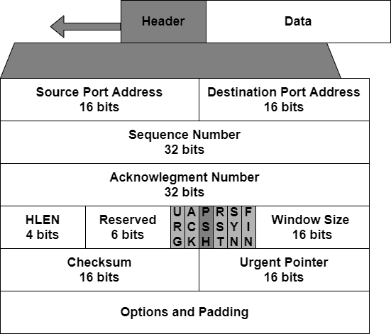
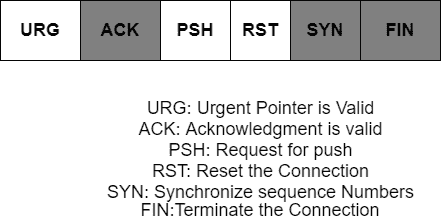
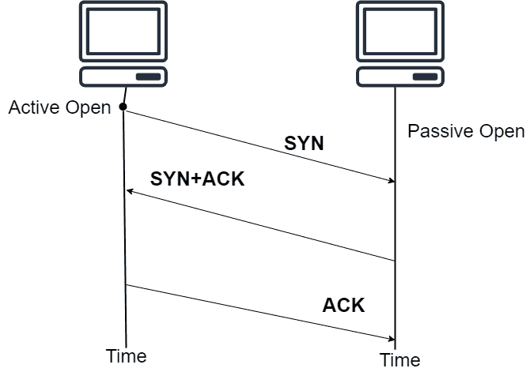

# TCP

> 原文：<https://www.studytonight.com/computer-networks/tcp-transmission-control-protocol>

在本教程中，我们将介绍计算机网络中传输层的另一种协议。

TCP 是**传输控制协议**的缩写。这是一个传输层协议。TCP 是一种面向连接的协议。这是一种用于传输的可靠协议。该协议为互联网协议的服务增加了面向连接和可靠性的特性。

该协议试图以特定的顺序从端到端传送字节流。

由于提供端到端通信是传输层的责任，因此 TCP 在传输层中起着非常重要的作用。

## 传输控制协议的特点

下面给出了 TCP 的特性，让我们来看看它们:

### 1.编号系统

TCP 中有两个字段，主要是序列号和确认号。TCP 中的这两个字段主要是指字节数。

*   **字节数**
    每个连接中正在传输的数据字节由 TCP 进行编号。编号主要从随机生成的数字开始。

    *   TCP 主要对连接中传输的所有数据字节进行编号。

    *   它生成一个介于 0 和 2 之间的随机数，第一个字节的数字的幂是 32 -1。

    *   示例:如果随机数是 1056，并且总共有 6000 个字节要发送，那么字节的编号是从 1056 到 7055。

*   **序号**
    字节编号后，TCP 以“段”的形式对字节进行分组。

    *   一个序列被分配给正在发送的每个段。

    *   每个段的序列号是该段中携带的第一个字节的编号。

    *   因此，段的序列号字段中的值主要定义该段中包含的第一个数据字节的数量。

*   **确认号**
    段中确认字段的值主要定义一方主要期望接收的下一个字节的数量。

    *   它本质上是累积的。

### 2.流控制

传输控制协议提供了流量控制的便利。在 TCP 的帮助下，数据的接收者控制发送者要发送的数据量。

*   流量控制主要是为了防止接收器被数据淹没

*   编号系统还允许 TCP 使用面向字节的流控制。

### 3.错误控制

由于 TCP 提供可靠的服务，因此它为此目的实现了一种错误控制机制。错误控制将数据段视为错误检测的数据单元。错误控制本质上是面向字节的。

### 4.拥塞控制

TCP 的另一个主要特点是它促进了网络中的拥塞控制。发送方发送的数据量不仅由接收方控制，网络中的拥塞也决定了它。

### 5.全双工

TCP 提供了另一个特性，那就是全双工，这意味着通过使用 TCP，数据可以双向传输。

**6。** TCP 是一种传输层协议，因为它主要用于将数据从发送方传输到接收方。

现在，在进入下一个概念之前，让我们看一下 TCP 数据包。

## 段

TCP 中的数据包主要称为段。

### 格式

下面给出了 TCP 数据包的格式，让我们来看看:

该段主要由一个 20 到 60 字节的标题组成，后面是应用程序。通常，报头是 20 个字节，但是有时如果没有选项，那么如果它包含许多选项，那么它会增加到 60 个字节。

*   **源端口地址**
    是一个 16 位字段，主要定义主机中应用程序的端口号，主要用于发送报文段。源端口地址的用途与 UDP 报头中的源端口地址相同。

*   **目的端口地址**
    这也是一个 16 位地址，主要是定义主机中应用程序的端口号，主要用于接收段。端口地址上的目的地**层**与 UDP 报头中的目的地端口地址相同。

*   **序列号**
    它是一个 32 位字段，主要定义分配给数据段中包含的第一个字节的编号。

*   **确认号**
    它也是一个 32 位字段，主要用于定义该段的接收方期望从对方接收的字节数。

*   **报头长度**
    它是一个 4 位字段，主要用于指示 TCP 报头中 4 字节的字数。报头长度在 20 到 60 字节之间。

*   **保留**
    这是一个 6 位字段，主要是为将来使用而保留的。

*   **控制**
    该字段主要定义 6 个不同的控制位或标志，在所有控制位或标志中，此时只能设置一个。

这些位主要用于流量控制、连接建立、终止以及传输数据的方式。

*   **窗口大小**
    该字段主要用于定义窗口的大小。该字段的大小为 16 位。它主要包含接收方可以接受的数据大小。该字段的值主要由接收方决定。

*   **校验和**
    这是一个 16 位字段，主要包含校验和。在 TCP/IP 的情况下，此字段是必需的。

*   **紧急指针**
    该字段的大小为 16 位，仅在设置了紧急标志的情况下有效。此字段仅在数据段包含紧急数据时使用。

*   **选项**
    该字段用 32 位表示。

## 传输控制协议连接

众所周知，TCP 是一种面向连接的协议，这意味着该协议在源和目的地之间建立了一条虚拟路径。然后，属于该消息的所有段都通过该虚拟路径发送。

在 TCP 中，面向连接的传输主要需要三个阶段，这三个阶段是:

*   连接建立阶段

*   数据传输阶段

*   连接终止。

## 连接建立阶段

数据传输在全双工模式下完成。TCP 中的连接建立主要称为三方握手。让我们借助一个例子来理解这一点:一个名为 client 的应用程序想要通过使用 TCP 作为传输层协议来与另一个名为 server 的应用程序建立连接。

这个过程主要从服务器开始，服务器程序主要告诉 TCP 它准备接受一个连接。这主要被称为被动打开请求。尽管服务器 TCP 已经准备好接受来自世界上任何机器的任何连接，但它自己无法建立连接。

### synchronizing 同步

*   该标志用于序列号的同步。

*   它不携带任何真实数据。

*   主要消耗 1 个序列号。

### 儿子+ACK

*   这主要用于其他方向的同步和接收信号的确认。

*   它不携带任何真实数据。

*   它还消耗 1 个序列号。

### 命令正确应答

*   它只是一个确认段。

*   如果它不携带任何数据，则不消耗任何序列号。

## 数据传输阶段

建立连接后，可以进行双向数据传输。客户端和服务器都可以发送数据和确认。

## 连接终止阶段

参与数据交换的双方可以关闭连接，尽管它通常是由客户端发起的。连接终止有两种方式:

*   三方握手

*   带有半闭合选项的四向握手。

图显示了使用三方握手的连接终止

### 鳍状物

*   如果该段不携带任何数据，它将消耗一个序列号。

*   它可能携带也可能不携带任何真实数据。

### 芬+ACK 组合键

*   如果不携带任何数据，该段将消耗后果编号。

*   FIN 段宣布连接在另一个方向关闭。

*   确认用于接收到的 FIN。

*   它只消耗 1 个序列号。

### 命令正确应答

*   它只是一个确认段。

*   它不消耗任何序列号。

## TCP 的优点

下面给出了 TCP 的一些优点:

1.TCP 执行数据控制和流量控制机制。

2.TCP 为跨平台提供了出色的支持。

3.TCP 协议确保了数据的可靠传输。

4.它以特定的顺序将数据从发送方传输到接收方。

5.这是一个面向连接的可靠协议。

6.它在调制解调器或局域网上具有良好的相对吞吐量。

7.使用校验和提供错误检测机制，使用 ARP 或返回协议提供纠错机制。

## TCP 的缺点

下面给出了 TCP 的缺点:

1.它不能用于广播或多播传输。

2.间接费用有所增加。

* * *

* * *