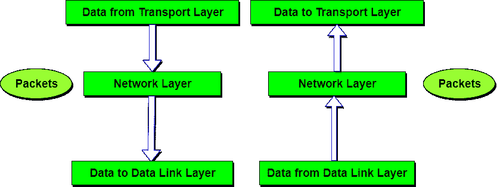

# 网络层-OSI 模型

> 原文：<https://www.studytonight.com/computer-networks/osi-model-network-layer>

网络层控制子网的运行。该层的主要目的是通过多条链路(网络)将数据包从源传送到目的地。如果两台计算机(系统)连接在同一链路上，则不需要网络层。它通过不同的通道将信号路由到另一端，并充当网络控制器。

它还将传出的消息分成数据包，并将传入的数据包组装成更高级别的消息。

在广播网络中，路由问题很简单，因此网络层通常很薄甚至不存在。

* * *

## 网络层的功能

1.  它将逻辑网络地址转换为物理地址。与电路、信息或分组交换有关的。
2.  路由器和网关在网络层运行。网络层提供了将数据包路由到最终目的地的机制。
3.  提供连接服务，包括网络层流量控制、网络层错误控制和分组序列控制。
4.  将较大的数据包分成小数据包。

* * *

### 网络层的设计问题

*   一个关键的设计问题是**确定数据包如何从源路由到目的地**。路由可以基于连接到网络的静态表，并且很少改变。它们也可以是高度动态的，为每个数据包重新确定，以反映当前的网络负载。
*   如果**子网中同时存在太多的数据包**，它们会相互干扰，形成**瓶颈**。这种拥塞的**控制**也属于网络层。
*   此外，提供的**服务质量**(延迟、传输时间、抖动等)也是网络层问题。
*   当数据包必须从一个网络传输到另一个网络才能到达目的地时，会出现许多问题，例如:
    *   第二网络使用的寻址可能与第一网络不同。
    *   第二个可能根本不接受数据包，因为它太大了。
    *   协议可能不同，等等。
*   网络层需要克服所有这些问题，以允许异构网络互联。

* * *