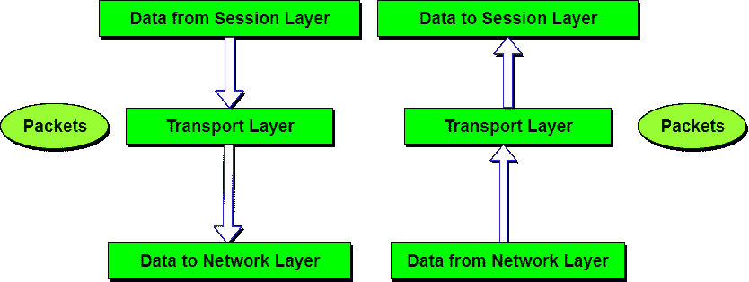

# 传输层-OSI 模型

> 原文：<https://www.studytonight.com/computer-networks/osi-model-transport-layer>

传输层的基本功能是接受来自上一层的数据，将其拆分成更小的单元，将这些数据单元传递到网络层，并确保所有数据块都正确到达另一端。

此外，所有这些都必须高效地完成，并且要将上层与硬件技术中不可避免的变化隔离开来。

传输层还决定向会话层以及最终向网络用户提供何种类型的服务。最流行的传输连接类型是**无错误点对点通道**，它按照消息或字节的发送顺序发送消息或字节。

传输层是真正的端到端层，从源一直到目的地。换句话说，源机器上的程序使用消息头和控制消息与目标机器上的类似程序进行对话。

* * *

## 传输层的功能

1.  **服务点寻址:**传输层报头包括服务点地址，即端口地址。这一层将消息发送到计算机上的正确进程，而不像网络层那样将每个数据包发送到正确的计算机。
2.  **分段和重组:**一条消息被分成多个段；每个段包含序列号，这使得该层能够重组消息。消息到达目的地后会被正确重组，并替换传输中丢失的数据包。
3.  **连接控制:**包括 2 种类型:
    *   无连接传输层:每个网段都被视为一个独立的数据包，并在目的机器上传送到传输层。
    *   面向连接的传输层:在传送数据包之前，在目的机器上与传输层建立连接。
4.  **流量控制:**在该层中，流量控制是端到端进行的。
5.  **差错控制:**该层端到端进行差错控制，确保完整的报文无差错到达接收传输层。纠错是通过重传完成的。

* * *

### 传输层的设计问题

*   接受来自会话层的数据，将其分割成段并发送到网络层。
*   确保高效、正确地交付数据。
*   将上层与技术变革隔离开来。
*   错误控制和流量控制。

* * *

* * *