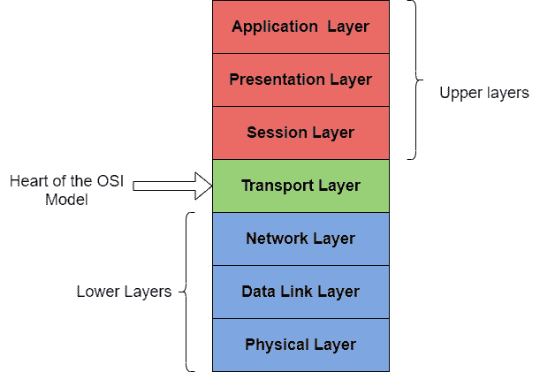
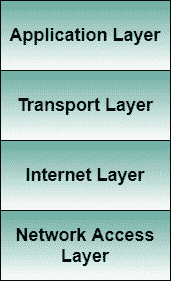

> 原文：<https://www.studytonight.com/computer-networks/comparison-of-osi-and-tcpip-reference-model>

[← Prev](/computer-networks/transmission-modes-in-computer-networks "Transmission Modes")[Next →](/computer-networks/presentation-layer "Presentation Layer")

<nav aria-label="breadcrumb">

1.  [家](/)
2.  [计算机网络](/computer-networks)
3.  现场视察与传输控制协议参考模型的比较

</nav>

<article>

# 现场视察与传输控制协议参考模型的比较

在本教程中，我们将介绍两种参考模型之间的比较，即现场视察模型和计算机网络中的传输控制协议模型。

**开放系统互连** (OSI)俗称 OSI 模型。

*   现场视察模型主要是一个概念框架，用于描述网络系统的功能。

*   现场视察模型由七层组成，每层执行其特定的功能。

*   该模型由国际标准化组织于 1984 年发布。

*   该模型主要将巨型任务分为七个可管理的小任务。之后，模型中的每一层都被分配一个特定的任务。

ISO-OSI 模型是一个七层架构。它在一个完整的通信系统中定义了七个层次。它们是:

1.  **应用程序层**

2.  **P** 代表层

3.  **S** 挤压层

4.  **T** 运输层

5.  **N** 网络层

6.  **D** 链接层

7.  **P** 物理层

### 现场视察模型

## TCP/IP 模型

TCP/IP 是传输控制协议和互联网协议，由**国防部的项目研究机构** (ARPA，后来的 DARPA)开发，作为连接远程机器的网络互连研究项目的一部分。

在研究过程中，导致制作 TCP/IP 参考模型的突出特点是:

*   支持灵活的架构。向网络中添加更多机器很容易。
*   网络是健壮的，并且连接保持完整，直到源和目标机器运行。

总体想法是允许一台计算机上的一个应用程序与另一台计算机上运行的另一个应用程序对话(发送数据包)。

### TCP/IP 模型

现在是时候比较我们到目前为止所学的两个参考模型了。让我们从解决这两个模型的相似之处开始。

以下是开放系统互连参考模型和传输控制协议参考模型之间的一些相似之处。

*   两者都有分层架构。

*   层提供类似的功能。

*   两者都是协议栈。

*   两者都是参考模型。

*   两者都有预定义的标准。

## 现场视察与传输控制协议参考模型的区别

以下是现场视察参考模型和 TCP/IP 参考模型之间的一些主要区别，下面是图解比较。

| 开放系统互连 | 传输控制协议/互联网协议 |
| 1.现场视察是一种通用的、独立于协议的标准，充当网络和最终用户之间的通信网关。 | 1.TCP/IP 模型基于标准协议，互联网就是围绕这些标准协议发展起来的。它是一种通信协议，允许主机通过网络连接。 |
| 2.在现场视察模型中，传输层保证数据包的传输。 | 2.在 TCP/IP 模型中，传输层不保证数据包的传送。不过，TCP/IP 模式更可靠。 |
| 3.遵循垂直方法。 | 3.遵循水平方法。 |
| 4.现场视察模型有一个单独的表示层和会话层。 | 4.TCP/IP 没有单独的表示层或会话层。 |
| 5.传输层面向连接。 | 5.传输层既面向连接又无连接。 |
| 6.网络层既面向连接又无连接。 | 6.网络层是无连接的。 |
| 7.现场视察是构建网络的参考模型。一般是作为引导工具使用。 | 7.在某种程度上，TCP/IP 模型是现场视察模型的实现。 |
| 8.现场视察模型的网络层提供面向连接和无连接的服务。 | 8.TCP/IP 模型中的网络层提供无连接服务。 |
| 9.这个 TCP/IP 模型还为许多设备提供了标准化，例如路由器、主板、交换机和一些其他硬件设备。 | 9.该模型没有提供任何这种类型的设备标准化。但是这个模型提供了不同计算机之间的连接 |
| 10.协议隐藏在现场视察模型中，随着技术的变化很容易被替换。 | 10.在 TCP/IP 中，替换协议并不容易。 |
| 11.现场视察模型非常清楚地定义了服务、接口和协议，并对它们进行了明确的区分。它与协议无关。 | 11.在 TCP/IP 中，服务、接口和协议没有明确分开。它也依赖于协议。 |
| 12.它有 7 层 | 12.它有 4 层 |
| 13.现场视察参考模型的使用率很低。 | 13.另一方面，TCP/IP 模型被高度使用。 |
| 14.现场视察模型有一个问题，就是如何将协议适配到模型中。 | 14.TCP/IP 模型不适合任何协议 |

</article>

* * *

* * *