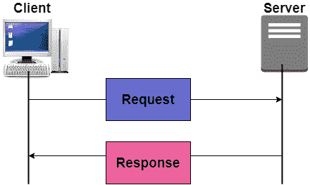
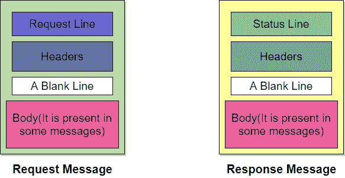
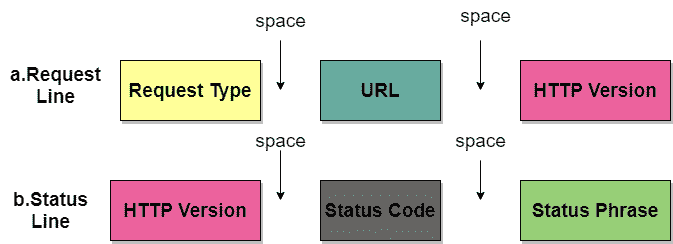
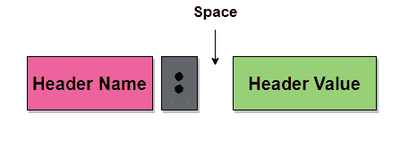

# HTTP 协议

> 原文：<https://www.studytonight.com/computer-networks/http-protocol>

在本教程中，我们将介绍作为OSI模型应用层协议的超文本传输协议。

**HTTP** 代表超文本传输协议，主要用于访问万维网上的数据，即 **(WWW)** 。 **HTTP** 主要作为 **FTP** (文件传输协议)和 **SMTP** (简单邮件传输协议)的组合。

*   **HTTP** 是**应用层**使用的协议之一。

*   **HTTP** 与 **FTP** 类似，因为 **HTTP** 用于传输文件，主要使用 **TCP 的服务。**

*   还有， **HTTP** 比 **FTP** 简单多了，因为只有**一个 TCP 连接**。

*   在 **HTTP 中，**没有单独的控制连接，因为只有数据在客户端和服务器之间传输。

*   **HTTP** 类似于 SMTP，因为客户端和服务器之间的数据传输看起来就像 **SMTP** 消息。但是有一点不同于 **SMTP，****HTTP**消息不会被人类**读取，因为它们是由 **HTPP 客户端**(即浏览器)和 HTTP 服务器读取和解释的。**

***   此外， **SMTP** 消息被**存储，然后被**转发，而 **HTTP** 消息被**立即发送。**

    *   **HTTP** 主要使用著名端口**端口 80 上的 **TCP** 的服务。**

    *   **HTTP** 是一个**无状态协议。**

    *   在 **HTTP 中，**客户端通过发送请求消息初始化事务，服务器通过发送响应进行回复。

    *   该协议用于以纯文本、超文本、音频以及视频等形式传输数据。**

 **## HTTP 的工作原理

HTTP 利用了客户机-服务器体系结构。正如我们已经告诉您的，浏览器充当 HTTP 客户端，该客户端主要与托管网站的网络服务器通信。

该图显示了 HTTP 事务

请求和响应消息的格式相似。请求消息有时主要由请求行、标题和正文组成。响应消息由状态行、标题，有时还有正文组成。

当客户端向网络服务器请求一些信息(比如客户端点击超链接)时。然后，浏览器向 HTTP 服务器发送请求消息，请求对象。

之后发生了以下事情:

*   客户端和网络服务器之间有一个通过 TCP 打开的连接。

*   之后，HTTP 向主要收集请求数据的服务器发送请求。

*   带有对象的响应通过 HTTP 发送回客户端

*   最后，HTTP 关闭连接。

让我们看看请求消息和响应消息的格式:

## 请求行和状态行

请求消息中的第一行称为请求行，而响应消息中的第一行称为状态行。

图:请求行和状态行

哪里，

### 请求类型

此字段用于请求行。定义了几种请求类型，这些类型在下表中有所提及；

| 方法名称 | 行动 |
| --- | --- |
| 得到 | 此方法用于向服务器请求文档。 |
| 头 | 该方法主要请求关于文档的信息，而不是文档本身的信息 |
| 邮政 | 该方法将一些信息从客户端发送到服务器。 |
| 放 | 此方法将文档从服务器发送到客户端。 |
| 微量 | 这个方法回显传入的请求。 |
| 连接 | 这个方法意味着保留 |
| 选择权 | 以便查询可用的选项。 |

### 统一资源定位器

网址是一个统一资源定位器，它主要是一种在互联网上指定任何类型信息的标准方式。

### HTTP 版本

HTTP 的当前版本是 1.1。

### 状态代码

状态代码是响应消息的字段。状态码由三位数字组成。

### 状态短语

此字段也用在响应消息中，用于以文本形式解释状态代码。

## 页眉

标头用于在客户端和服务器之间交换附加信息。表头主要由一个或多个表头行组成。每个标题行都有一个标题名、一个冒号、空格和一个标题值。

标题行进一步分为四类:

*   **一般标题**
    它提供了关于消息的一般信息，它可以出现在请求和响应中。
*   **请求头**
    仅出现在请求消息中，用于指定客户端的配置和客户端偏好的文档格式
*   **响应头**
    这个头只存在于响应头中，主要指定服务器的配置以及请求的特殊信息。
*   **实体标题**
    用于提供文档正文信息。

## 身体

它可以出现在请求消息或响应消息中。正文部分主要包含要发送或接收的文档。

## 超文本传输协议的特点

HTTP 提供了各种功能，如下所示:

1.  **HTTP 很简单**
    HTTP 协议被设计成简单易懂的。

2.  **HTTP 是无状态的**
    超文本传输协议(HTTP)是一种无状态的协议，简单来说就是在同一个连接上连续执行的两个请求之间没有连接。此外，客户端和服务器仅在当前请求期间相互了解，因此 HTTP 的核心本身是无状态的，另一方面，HTTP cookies 提供了对有状态会话的利用。

3.  **HTTP 是可扩展的**
    通过在客户端和服务器之间提供简单的协议，HTTP 可以很容易地与新功能集成。

4.  **HTTP 是无连接的**
    由于 HTTP 请求是由浏览器(HTTP 客户端)发起的，根据用户的请求信息，服务器处理客户端的请求，然后回应该客户端

## HTTP 的优势

下面给出了使用 HTTP 的好处:

1.  正常运行不需要运行时支持。

2.  因为它是无连接的，所以不存在创建和维护会话状态和信息的开销。

3.  HTTP 可以通过防火墙使用，全局应用也是可能的。

4.  HTTP 是独立于平台的。

5.  HTTP 在不关闭 TCP 连接的情况下报告错误。

6.  减少网络拥塞。

## 超文本传输协议的弊端

使用 HTTP 协议有一些缺点:

*   HTTP 没有针对移动优化。

*   HTTP 太啰嗦了。

*   它只能用于点对点连接。

*   该协议没有推送功能。

*   没有重试逻辑，该协议不能提供可靠的交换。

HTTP 支持代理服务器。代理服务器基本上是一台保存对最近请求的响应副本的计算机。代理服务器主要是减少原服务器的负载。为了使用代理服务器，必须配置客户端来访问代理，而不是目标服务器。

## HTTP 连接

HTTP 连接可以进一步分为两类:

*   持久连接

*   非持久连接

让我们逐一讨论它们:

### 1.持久连接

在持久的 HTTP 连接中，所有请求及其相应的响应都是通过相同的 TCP 连接发送的。默认情况下，1.1 版本的 HTTP 指定了持久连接。

在这种类型的连接中，服务器会在发送响应后保持连接打开，以接受更多请求。此外，服务器可以应客户端的请求或在超时时关闭连接。

在持久连接中，单个 TCP 连接主要用于相继发送多个对象。

通常，数据的长度与每个响应一起发送。有些情况下，服务器不知道数据的长度，这种情况发生在动态创建文档时，在这种情况下，服务器通知客户端长度未知，并在发送数据后关闭连接，以便让客户端通知数据的结束。

### 2.非持久连接

在非持久 HTTP 连接中，每个请求/响应建立一个 TCP 连接；这意味着每个对象都有一个单独的。

以下是使用的步骤；

*   客户端打开一个 TCP 连接，然后发送一个请求。

*   之后，服务器发送响应，然后关闭连接。

*   然后，客户端读取数据，直到遇到文件结束标记，然后关闭连接。

这种连接给服务器带来了很高的开销，因为服务器需要 N 个不同的缓冲区，并且每次打开连接时启动过程都很慢。

HTTP 1.0 版本支持非持久连接。** 

* * *

* * *