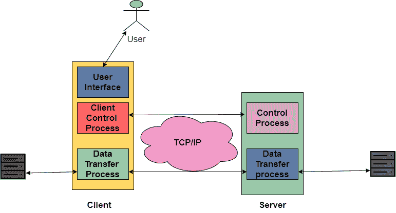
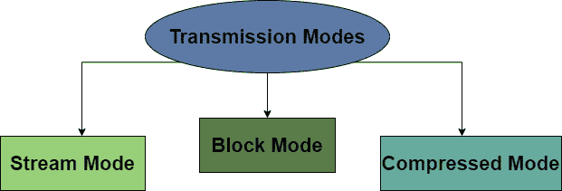

> 原文：<https://www.studytonight.com/computer-networks/ftp-protocol>

[← Prev](/computer-networks/http-protocol "HTTP Protocol")[Next →](/computer-networks/smtp-protocol "SMTP Protocol")

<nav aria-label="breadcrumb">

1.  [家](/)
2.  [计算机网络](/computer-networks)
3.  文件传输协议

</nav>

<article>

# 文件传输协议

在本教程中，我们将介绍现场视察模型应用层的文件传输协议。

文件传输协议的意思是文件传输协议，它是由 TCP/IP 提供的标准机制，以便将文件从一台主机复制到另一台主机。

*   文件传输协议是现场视察模型应用层的一种协议。

*   FTP 是通过互联网交换文件的一种更简单、更安全的方式。

*   FTP 不同于其他客户机/服务器应用程序，因为该协议在主机之间建立了两个连接。

    *   其中一个连接用于数据传输，称为**数据连接。**

    *   而另一个连接用于控制命令和响应等信息，这个连接被称为**控制连接。**

*   FTP 更有效，因为有命令分离。

*   文件传输协议使用两种协议；**端口 21** 用于**控制连接**和**端口 20** 用于**数据连接。**

*   FTP 中的控制连接利用了非常简单的通信规则，我们只需要一次传输一行命令或者一行响应。

*   另一方面，数据连接需要更复杂的规则；这背后的原因是有各种类型的数据需要传输。

*   将文件从客户端计算机传输到服务器被称为“上传”，而将数据从服务器传输到客户端计算机被称为“下载”。

*   使用 FTP 传输的文件类型有 ASCII 文件、EBCDIC 文件或图像文件。

## 文件传输协议的工作

下图显示了文件传输协议的基本模型，其中客户端由三个组件组成:用户界面、客户端控制过程和客户端数据传输过程。另一方面，服务器包括两个组件，主要是服务器控制过程和服务器数据传输过程。

1.  此外，控制连接在控制进程之间进行，而数据连接在数据传输进程之间进行。

2.  控制连接在 FTP 的整个交互会话期间保持连接，而数据连接对于传输的每个文件都是打开然后关闭的。

3.  简单来说，当用户启动 FTP 连接时，控制连接会打开，当它打开时，如果需要传输几个文件，数据连接可以多次打开和关闭。

## 数据结构

下面给出了 FTP 支持的三种数据结构:

**1。文件结构**
在文件数据结构中，文件基本上是一个连续的字节流。

**2。记录结构**
在记录数据结构中，文件简单地分为记录的形式。

**3。页面结构**
在页面数据结构中，文件被分为多个页面，每个页面都有一个页码和一个页眉。这些页面可以随机或顺序存储和访问。

# ftp 客户端

它基本上是一种软件，旨在通过互联网在计算机和服务器之间来回传输文件。FTP 客户端需要安装在您的计算机上，并且只能与互联网的实时连接一起使用。

一些常用的 FTP 客户端是 Dreamweaver、FireFTP 和 Filezilla。

## 文件传输协议的特点

以下是文件传输协议提供的功能:

*   FTP 主要用于一次传输一个文件。

*   FTP 执行的其他操作包括列出文件、创建和删除目录、删除文件、重命名文件等等。

*   FTP 还隐藏了单个计算机系统的细节。

*   FTP 允许那些有所有权和访问限制的文件。

*   这是一个面向连接的协议。

*   FTP 是有状态协议，因为在这种情况下，客户端在 FTP 会话期间建立控制连接，该会话通常跨越多个数据传输。

## 传输模式

FTP 可以使用三种给定模式之一通过数据连接传输文件:

### 1.流模式

流模式是 FTP 使用的默认传输模式。在这种模式下，文件作为连续的字节流传输到 TCP。

如果数据只是字节流的形式，那么就不需要文件结束，发送方关闭数据连接被认为是 EOF 或文件结束。如果数据被分成记录(即记录结构)，每个记录都有一个 I 字节的 EOR(记录结束)。

### 2.块状态

块模式用于以数据块的形式将数据从文件传输协议传送到传输协议。每个数据块前面都有 3 个字节的头，其中第一个字节代表块描述符，第二个和第三个字节代表块的大小。

### 3.压缩模式

在这种模式下，如果要传输的文件很大，则可以压缩数据。这种方法通常用于游程编码。对于文本文件，通常会删除空格/空白。而在二进制文件的情况下，空字符被压缩。

## FTP 的优势

以下是使用文件传输协议的一些好处:

*   FTP 的实现很简单。

*   FTP 提供了将文件从一台计算机传输到另一台计算机的最快方法之一。

*   FTP 是一种标准化的协议，被广泛使用。

*   文件传输协议更有效，因为不需要完成所有操作来获得整个文件，

## 文件传输协议的缺点

让我们来看看 FTP 的缺点:

*   文件传输协议不是传输数据的安全方式。

*   FTP 不允许从服务器到服务器的复制，也不允许递归目录的删除操作。

*   使用 FTP 协议编写作业脚本是很困难的。

*   可以对服务器进行欺骗，以便将数据发送到任何未授权计算机上的随机未知端口

</article>

* * *

* * *