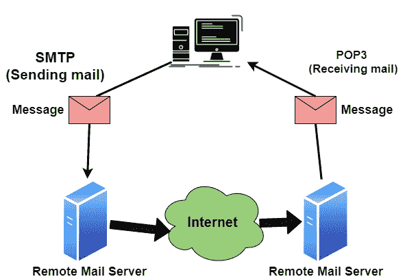
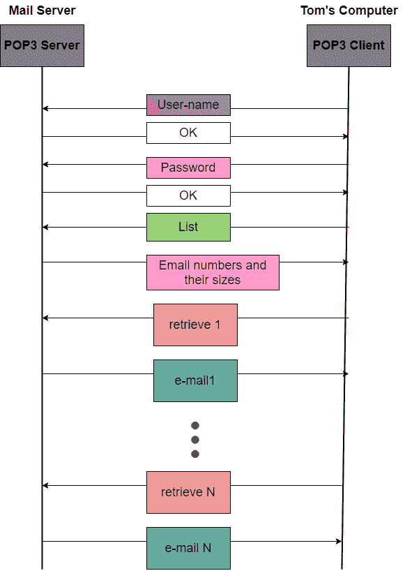

# POP 协议

> 原文：<https://www.studytonight.com/computer-networks/pop-protocol>

在本教程中，我们将介绍另一个应用层协议 POP 的概念。

POP 是邮局协议的简称。它是 OSI 参考模型应用层的另一种协议。

*   POP 主要是一种消息访问协议。

*   POP 基本上是一个互联网标准协议，正如我们已经告诉您的，它在应用层工作，被本地电子邮件软件使用，以便通过 TCP/IP 连接从远程电子邮件服务器检索电子邮件。

*   邮局协议不允许任何搜索工具。

*   该协议主要允许在服务器上创建一个协议。

*   由于该协议支持脱机访问消息，因此需要较少的互联网使用时间。

*   此协议不访问非电子邮件数据。

*   使用 POP3 的常见客户端有 Gmail、网景、互联网浏览器、Eudora。

## POP 的历史

POP(邮局协议)由互联网工程任务组于 1984 年发布。之后又更新了两次，因为后端开发者想让布局变得简单。

POP 的第二个版本开发于 1985 年，被称为 POP2，这个版本需要 SMTP 协议来推送电子邮件。

然后在 1988 年 POP 的第三个版本发布后，被称为 POP3，这个版本不需要 SMTP 协议。 **POP(邮局协议第 3 版)**也集成到著名的电子邮件软件中，如 Eudora 和 Outlook Express。

从那以后(1988 年)，POP3 是活跃版本。

## POP 的工作

所有传入的消息都存储在 POP 服务器上，直到用户使用电子邮件客户端登录并将消息下载到他们的计算机。用户下载邮件后，它会从服务器上删除。

我们知道，SMTP 是用来将电子邮件从服务器传输到服务器的，基本上 POP 是用来用电子邮件客户端从服务器收集电子邮件的，它不包括发送邮件的方式。

如果任何用户试图检查所有最近的电子邮件，那么他们将在服务器端与 **POP3** 建立连接。用户向服务器发送用户名和密码，以获得正确的身份验证。获得连接后，用户可以接收所有基于文本的电子邮件，并将其存储在他们的本地终端(机器)上，然后最终丢弃所有服务器副本，然后断开与服务器机器的连接。

为了从服务器检索消息，采取了以下步骤；

*   首先，客户端使用端口 110 建立一个 TCP 连接。

*   客户端向服务器表明自己的身份。

*   之后，客户端发出一系列 POP3 命令。

上图显示了 POP3 中命令和响应的交换

## POP 协议的特点

以下是 POP 协议提供的一些特性:

*   POP 协议使用端口 110。

*   它利用了持久的 TCP 连接。

*   这是一个拉协议。

*   这是一个面向连接的协议。

*   POP 协议是一个有状态的协议，直到邮件被下载并通过会话，它是一个无状态的协议。

现在让我们来看看 POP 的命令:

| 命令 | 描述 |
| --- | --- |
| 注册 | 此命令用于打开连接 |
| 斯达 | 此命令用于显示当前邮箱中的邮件。 |
| 删除符号 | 此命令用于删除消息。 |
| -你好 | 该命令主要用于将会话重置为初始状态。 |
| 放弃 | 此命令用于注销会话。 |
| 目录 | 此命令主要用于获取每个消息的摘要，其中显示了每个消息的摘要。 |
| 获得文件 | 此命令主要用于选择邮箱以访问邮件。 |

## POP 的优势

以下是 POP 提供的优势:

*   该协议不需要任何互联网连接来访问下载的电子邮件。

*   为了在单个设备上接收电子邮件，POP3 非常有用。

*   该协议的配置简单，易于使用。

*   为了在硬盘上存储电子邮件，需要更少的存储空间。

*   这个协议对那些几乎不在其他电脑上查看邮件的人来说更好。

## POP 的缺点

现在是时候看看邮局协议的缺点了:

*   不能从多台计算机或设备访问同一电子邮件帐户。

*   病毒的传播很容易使用这种协议，因为电子邮件附带的文件可能包含病毒。

*   将本地电子邮件文件夹传输到另一个电子邮件客户端是一项困难的任务。

* * *

* * *