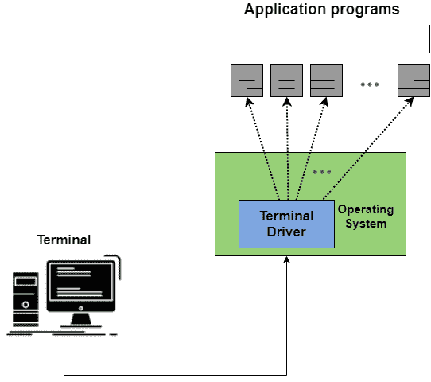
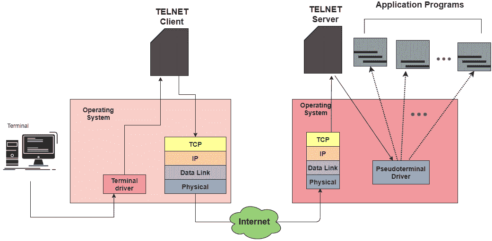
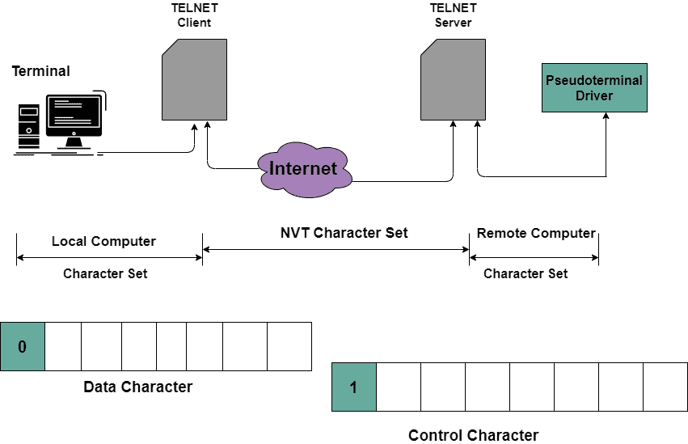

# 计算机网络中的远程登录

> 原文：<https://www.studytonight.com/computer-networks/telnet-in-computer-networks>

在本教程中，我们将介绍计算机网络中的应用程序 **TELNET** 。

TELNET 基本上是 TErminal NETwork 的简称。它基本上是一种用于虚拟终端服务的 TCP/IP 协议，主要由国际标准组织(ISO)提出。

*   它是一个通用的客户机/服务器应用程序。

*   该程序能够建立到远程系统的连接，使得本地系统开始作为远程系统的终端出现。

*   它是一个标准的 TCP/IP 协议，用于虚拟终端服务。

*   简单地说，我们可以说 telnet 允许用户登录远程计算机。登录后，用户可以使用远程计算机的服务，然后可以将结果传输回本地计算机。

*   TELNET 主要是在大多数操作系统在分时环境下运行的时候设计的。在这种环境下，一台大型计算机可以支持多个用户。通常，计算机和用户之间的交互是通过终端进行的(它是键盘、鼠标和显示器的组合)。

*   TELNET 只使用一个 TCP/IP 连接。

## 记录

在分时环境中，用户是系统的一部分，拥有访问资源的某些权限。需要注意的是，每个用户都有一个标识和密码。该用户标识主要表明用户是系统的一部分。

为了访问系统，用户通过**用户标识**登录系统。该系统还包括**密码检查**，以防止未经授权访问系统资源。

日志记录过程可以进一步分为两类:

1.  本地登录

2.  远程登录

### 本地登录

每当用户登录到本地分时系统时，就称为本地登录。

该图显示了本地登录

1.  一旦用户在终端键入，那么按键就被终端驱动程序接受。

2.  然后，终端驱动程序将字符传递给操作系统。

3.  之后，操作系统解释字符的组合，然后调用所需的应用程序。

### 远程登录

每当用户想要访问那些位于远程机器上的应用程序或实用程序时，就称之为远程登录。在这种类型的登录中，主要使用 TELNET 客户端/服务器程序。

该图显示了远程登录的概念

*   在这种情况下，用户主要将击键发送到终端驱动程序，操作系统只接受字符，不解释字符。

*   之后，字符被发送到 **TELNET 客户端**，该客户端主要将这些字符翻译成通用字符集，即通常所说的网络虚拟终端 **(NVT)字符**。

*   转换后，TELNET 客户端将它们传输到 TCP/IP 协议栈。

*   NVT 形式的文本随后通过互联网传播，然后到达远程机器上的 TCP/IP 协议栈。

*   之后，字符被传递给操作系统，然后操作系统将这些字符传递给远程登录服务器，

*   然后，远程登录服务器将这些 NVT 字符更改为远程计算机可以理解的相应字符。

*   字符不能直接传递到远程计算机的操作系统，因为远程操作系统的设计方式不能从远程登录服务器接收字符。

*   它的设计方式是从终端驱动程序接收字符。

*   添加了一个通常被称为伪终端驱动程序的软件程序，它主要假装字符来自终端。

## 网络虚拟终端(NVT)

主要是客户端远程登录将来自本地终端的字符翻译成 NVT 的形式，然后将它们传送到网络。另一方面，服务器远程登录将 NVT 形式的数据和命令转换成远程计算机主要接受的形式。

### NVT 字符集

网络虚拟终端主要使用两组字符，一组用于**数据**，另一组用于**控制。**

*   对于数据，NVT 是一个 8 位字符集，其中 7 个最低位与 ASCII 相同，最高位为 0。

*   为了在计算机之间发送控制字符，NVT 使用 8 位字符集，其中最高位设置为 1。

为了发送数据和控制字符，远程登录使用相同的连接。这仅仅是通过将控制字符嵌入到数据流中来实现的。

为了区分数据字符和控制字符，每个控制字符前面都有一个特殊的控制字符，通常称为解释为控制(IAC)。

### 选择

这些是拥有更复杂终端的用户可以使用的额外功能。

一些常见的选项如下:

| 密码 | 选项名称 | 选项的含义 |
| --- | --- | --- |
| Zero | 二进制的 | 该选项解释为 8 位二进制传输。 |
| one | 回声 | 该选项将接收到的数据从一端反射到另一端。 |
| three | 压制继续 | 数据后抑制前进信号 |
| five | 状态 | 它用于请求远程登录的状态。 |
| six | 计时标记 | 它用于定义时标。 |
| Twenty-four | 终端类型 | 用于设置终端类型。 |
| Thirty-two | 临界速度 | 它用于设置终端速度 |
| Thirty-four | 线路模式 | 它用于更改线路模式。 |

### 期权谈判

TELNET 程序允许客户端和服务器在服务之前或期间协商选项。

下面给出了用于此目的的四个控制字符:

| 性格；角色；字母 | 小数 | 二进制的 | 意义 |
| --- | --- | --- | --- |
| 将 | Two hundred and fifty-one | Eleven million one hundred and eleven thousand and eleven | 该控制字符:
1。提供启用
2。接受启用的请求 |
| 习惯 | Two hundred and fifty-two | Eleven million one hundred and eleven thousand one hundred | 该控制字符:
1。拒绝启用
2 的请求。提议禁用。
3。接受禁用的请求 |
| 防御命令(Defense Order) | Two hundred and fifty-three | Eleven million one hundred and eleven thousand one hundred and one | 该控制字符:
1。批准要启用的报价。
2。请求启用。 |
| DONT | Two hundred and fifty-four | Eleven million one hundred and eleven thousand one hundred and ten | 该控制字符:
1。不同意启用的提议。
2。批准禁用的提议。
3。请求禁用。 |

### TELNET 的优势

下面给出了使用远程登录的一些好处:

*   TELNET 的一个主要好处是它允许远程访问别人的计算机系统。

*   因为远程登录使用纯文本。因此，这允许用户以较少的数据传输问题进行更多的访问。

*   TELNET 节省了很多时间。

*   远程登录是通用的，因为它可以在任何计算机上使用，即使是最老的系统也可以轻松地连接到较新的机器，同时两者都有不同版本的操作系统。

### TELNET 的缺点

现在是时候看看 TELNET 的缺点了:

*   对初学者来说可能很难。

*   因为没有加密的概念，因为数据是以纯文本的形式发送的。因此，这不是一个安全的方法。

*   此外，远程设备不知道本地设备的功能，因为许多功能被禁用。

## 操作模式

TELNET 的实施主要以以下三种模式之一运行:

1.  默认模式

2.  字符模式

3.  线路模式

### 默认模式

*   如果通过选项协商没有调用其他模式，则使用该模式。

*   这种模式下的回显是由客户端完成的。

*   用户输入字符，客户端在屏幕上回显该字符，但直到整行完成后才发送。

### 字符模式

*   在这种模式下，键入的每个字符都由客户端发送到服务器。

*   之后，服务器将字符回显，以便在客户端屏幕上显示。

*   只有在传输时间过长的情况下，才会进行角色的呼应。

### 线路模式

*   提出这种模式是为了弥补默认模式和字符模式的不足。

*   这种模式下的行回显是由客户端完成的。

*   之后，整行由客户端发送到服务器。

* * *

* * *