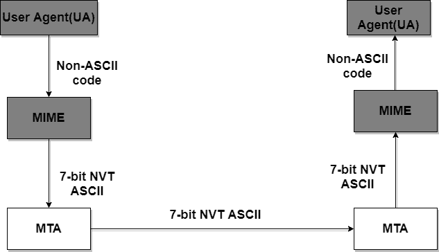
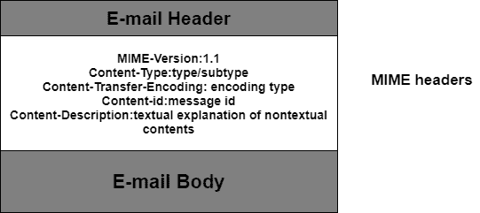

> 原文：<https://www.studytonight.com/computer-networks/mime-protocol>

# MIME 协议

在本教程中，我们将介绍计算机网络中另一个名为 MIME 的应用层协议。

MIME 是多用途互联网邮件扩展(MIME)的简称。

*   它主要用于描述消息内容类型。

*   MIME 基本上是一种辅助协议，主要允许通过电子邮件发送非 ASCII 数据。

*   它基本上是将发送方站点的非 ASCII 数据转换为 NVT ASCII 数据，然后将其传递给客户端，以便通过互联网发送。

*   在接收端，消息被转换回原始数据。

*   MIME 基本上是一组软件功能，主要将非 ASCII 数据转换为 ASCII 数据，反之亦然，

*   以下是可以在互联网上使用 MIME 交换的不同类型的数据文件:

    *   声音的

    *   形象

    *   文本

    *   录像

    *   其他特定于应用程序的数据(可以是 pdf、Microsoft word 文档等)。

*   MIME 是电子邮件的应用之一，它不仅仅局限于文本数据。

让我们举一个例子，用户想要通过用户代理发送一封电子邮件，而这封电子邮件是非 ASCII 格式的。所以这里我们使用的是 MIME 协议，主要是将这种非 ASCII 格式转换成 7 位 NVT ASCII 格式。

消息通过电子邮件系统以 7 位 NVT ASCII 格式传输到另一端，然后 MIME 协议再次将其转换回非 ASCII 代码。以便接收器可以读取它。

在任何电子邮件传输的开始，基本上都插入了 **MIME** 标题。

## 哑剧的特点

MIME 协议的特点如下:

1.  MIME 支持 ASCII 以外的字符集。

2.  借助 MIME，我们可以在一封邮件中发送多个附件。

3.  MIME 还支持不同的内容类型和多部分消息。

4.  它提供复合文档的支持

5.  它还支持电子邮件中的非文本内容。

## MIME 标头

MIME 标头主要添加到原始电子邮件标头部分，以便定义转换。下面给出了添加到原始标题中的五个标题:

1.  MIME 版本

2.  内容类型

3.  内容-传输-编码。

4.  内容标识

5.  内容-描述

### 1.MIME 版本

MIME 的这个头主要定义使用的 MIME 的版本。目前使用的 MIME 版本是 1.1。

### 2.内容类型

MIME 的这个头用于定义消息正文中使用的数据类型。在这种情况下，内容类型和内容子类型只是用斜线分开。

基本上，根据子类型，报头还包含其他参数:

`**Content-Type:**<type/subtype;parameters>`

**MIME 允许的不同类型的数据如下:**

| 类型 | 图表类型 | 描述 |
| --- | --- | --- |
| 文本 | 1.平原
2。超文本标记语言 | 1.无格式
2。以超文本标记语言格式 |
| 几部分的 | 1.混合
2。平行
3。
文摘 4。供选择的 | 1.正文主要包含不同数据类型的有序部分。
2。同上，但没有顺序。
3。它类似于混合子类型，默认为 message/RFC822。
4。这些部分是同一条消息的不同版本。 |
| 消息 | 1.RFC 822
2。偏
3。外体 | 1.正文采用封装消息的形式。
2。身体是更大信息的一个片段。
3。正文是对另一条消息的引用。 |
| 图像 | 1.JPEG
2 .GIF 格式 | 1.图像为 JPEG 格式。
2。图像是 GIF 格式。 |
| 录像 | 活动图像专家组国际标准 | 视频是 MPEG 格式的 |
| 声音的 | 基础 | 语音的单通道编码为 8 千赫 |
| 应用 | 1.postscript〔t0〕2。字节流 | 1.表示 Adobe PostScript
2。表示常规二进制数据(8 位字节)。 |

### 3.内容传输编码

MIME 的这个头主要定义了用于将消息编码为 0 和 1 进行传输的方法。

`**Content-Transfer-Encoding:**<type>`

| 类型 | 描述 |
| --- | --- |
| 7 位 | 它表示 NVT ASCII 字符和短线。 |
| 8 位 | 它表示非 ASCII 字符和短线。 |
| 二进制的 | 它表示具有无限长行的非 ASCII 字符。 |
| Base-64 | 它表示编码为 8 位 ASCII 字符的 6 位数据块。 |
| 报价-可打印 | 它表示非 ASCII 字符，这些字符被编码为一个等号，后跟一个 ASCII 码。 |

### 4.内容标识

在多消息环境中，MIME 的这个头用于唯一地标识整个消息。

`**Content-id:**id=<content-id>`

### 5.内容-描述

MIME 的这个头定义了主体是图像、音频还是视频的形式。

`**Content-Description**:<description>`

## MIME 的优点

使用 MIME 的一些好处如下:

*   支持交互式多媒体。

*   支持传输多个附件。

*   支持不同的内容类型。

*   还支持不同字体和颜色的文本。

* * *

* * *