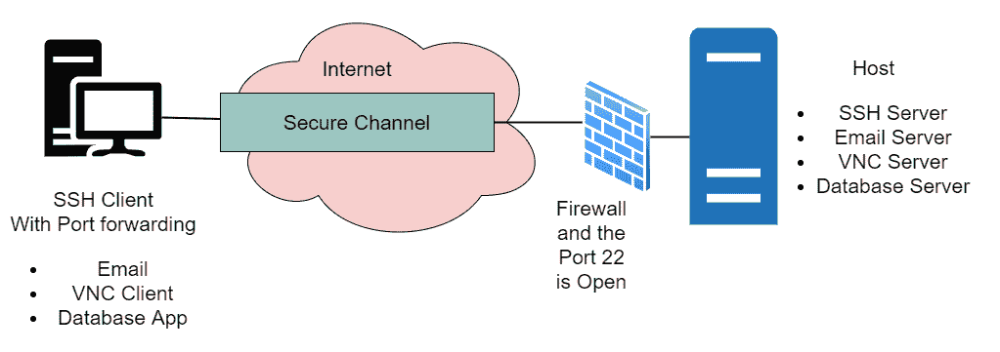

# SSH（安全外壳）

> 原文：<https://www.studytonight.com/computer-networks/ssh-secure-shell>

在本教程中，我们将详细介绍计算机网络中 SSH 的概念。

SSH 是安全外壳的缩写。它是通过互联网访问网络设备和服务器的主要协议之一。

*   它基本上是一个网络协议，主要运行在 TCP/IP 协议之上。

*   它被广泛用于远程管理和访问设备。

*   此外，安全外壳(SSH)主要使两个远程连接的用户能够在不安全的网络上执行网络通信和其他服务。

*   因此，它提供了安全的客户端/服务器通信，还可以用于其他任务，如**文件传输**和**电子邮件**。

*   在 SSH 的帮助下，您可以通过网络登录到另一台计算机，它允许您在远程机器上执行命令。

*   您可以轻松地将文件从一台机器移动到另一台机器。

*   该协议主要对双向流量进行加密；借助此功能，您可以防止贩卖、嗅探和密码盗窃。

*   默认情况下，SSH 运行在**端口号 22** 上，您也可以更改它。

*   它适用于公共网络。

SSH 主要以三个子协议的形式组织:

让我们在下一节中逐一详细讨论上述内容:

## 1.SSH 传输层协议

SSH 的传输层协议部分主要用于提供数据的机密性、服务器/主机身份验证和数据完整性。

*   可选地，它还提供数据压缩。
*   **服务器认证**

    *   主机密钥本质上是不对称的，就像公钥/私钥一样。

    *   服务器使用公钥向客户端证明其身份。

    *   客户端主要通过维护的数据库来验证所联系的服务器是否是“已知”的主机。

    *   一旦完成了服务器的身份验证，就会生成会话密钥。

*   **会话密钥建立**

    *   在服务器认证之后，客户端和服务器就要使用的密码达成一致。

    *   会话密钥通常由客户端和服务器生成。

    *   这些密钥主要是在用户身份验证之前生成的，因此可以发送的用户名和密码是加密的。

    *   会话密钥通常在会话期间定期更换(我们可以说一个小时)，然后在使用后立即销毁。

*   **数据完整性**
    SSH 主要按照数据完整性检查的顺序使用消息认证码(MAC)算法。

## 2.用户认证协议

顾名思义，SSH 的这一部分主要用于向服务器验证用户身份。

*   该协议用于确认作为客户端运行的代理的身份。

*   服务器主要识别应该只给予目标用户访问权。

*   出于身份验证的目的，可以使用几种方法；

    *   键入的密码

    *   公钥认证等。

## 3.SSH 连接协议

SSH 连接协议主要用于从单个客户端/服务器连接创建不同的数据流或逻辑通道。

*   因此，该协议主要通过单一底层 SSH 连接提供多个逻辑通道。

## SSH 命令

下面给出了一些用于 SSH 的重要命令:

*   **ls**
    用于显示目录内容(主要是列出文件的名称)。

*   **cd**
    这个命令主要帮助你更改目录

*   **mkdir**
    这个命令帮助你创建一个新的文件夹/目录。

*   **触摸**
    这个命令主要允许你删除一个文件。

## SSH 提供的服务

SSH 提供了三种主要服务，这些服务将在下一节中详细介绍:

### 1.安全命令外壳(TELNET )

SSH 提供的这项服务主要提供用户编辑文件，允许查看目录内容，还允许访问连接设备上的应用程序。系统管理员可以远程启动、查看、停止服务和进程，可以创建用户帐户，还可以更改文件/目录的权限。

现在，只要使用 SSH 提供的安全TELNET 服务，就可以从远程机器安全地执行机器命令提示符上所有可行的任务。

### 2.安全文件传输

为了安全传输文件，SSH 的一个扩展被设计成主要被称为 SFTP(SSH FTP协议)。

*   它是一个独立的协议，主要用于处理文件传输。

*   它用于加密用户名和密码。

*   它还对要传输的文件数据进行加密。

*   它还利用了端口 22。

### 3.端口转发

端口转发主要允许来自不安全的基于 TCP/IP 的应用程序的数据以安全的形式存在。

设置端口转发后，安全外壳会重新路由来自程序(通常是客户端)的流量，然后通过加密隧道将其发送到通常是服务器的另一端的程序。

在这种帮助下，多个应用程序可以通过单一的多路复用和安全通道传输数据，只需消除在防火墙或路由器上打开许多端口的需要。

## 安全外壳的优点

以下是安全外壳提供的优势:

1.  SSH 协议使用相同的协议提供多种服务。

2.  在强加密的帮助下，该协议提供了用户数据的隐私性，

3.  它是免费提供的。

4.  它用于非商业用途。

5.  它还允许用户查看目录内容、编辑文件以及远程访问自定义数据库应用程序。

6.  它用于验证发送方和接收方的身份。

7.  对于简单的虚拟专用网络，端口隧道以一种有效的方式工作。

8.  允许用户远程查看目录内容、编辑文件和访问自定义数据库应用程序。

9.  安全外壳还有助于安全地隧道传输不安全的应用程序，如 SMTP、IMAP、POP3 和 CVS。

## SSH 的缺点

下面给出了安全外壳(SSH)的一些缺点:

*   该协议无助于防范特洛伊木马或病毒。

*   该协议只适用于基于 TCP 的应用，不适用于基于 UDP 的应用。

*   这个协议需要更多的技术知识。

* * *

* * *