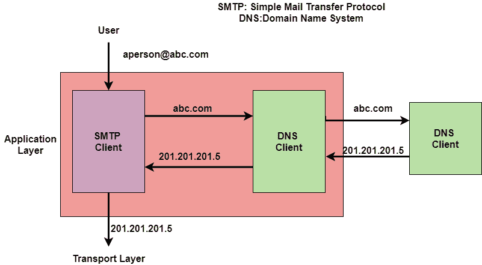
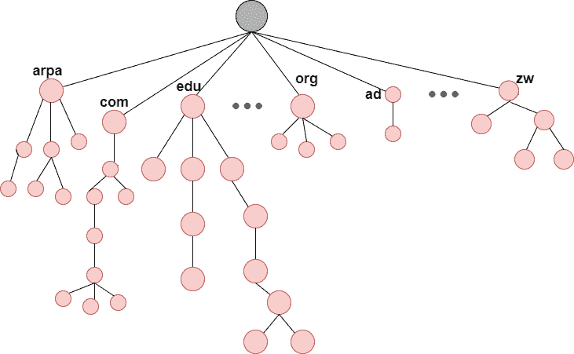
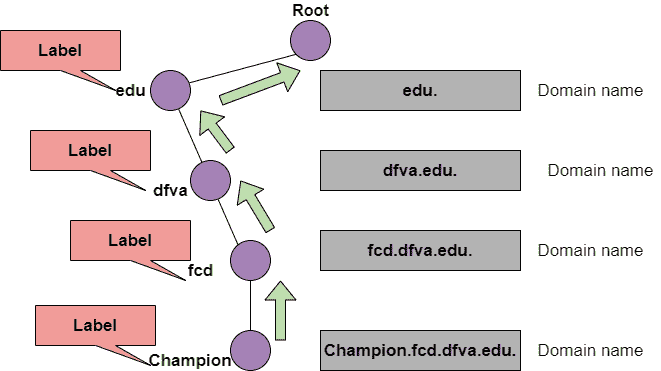
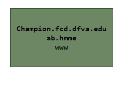

# DNS 协议

> 原文：<https://www.studytonight.com/computer-networks/dns-protocol>

在本教程中，我们将详细介绍计算机网络中域名系统的概念。

域名系统是域名系统或域名服务的缩写。它是一个应用层协议。

*   基本上，域名系统是由其他程序(如电子邮件)使用的支持程序。

*   电子邮件程序的用户知道收件人的电子邮件地址；互联网协议需要 IP 地址。

*   主要是 DNS 客户端程序向 DNS 服务器发送请求，以便将电子邮件地址映射到相应的 IP 地址。

*   为了识别一个实体，TCP/IP 协议还使用一个 IP 地址来唯一地识别主机到互联网的连接。但是人们通常更喜欢用名字而不是数字地址。因此，需要一种能够将名称映射到地址或将地址映射到名称的系统。

域名系统是一种可以将名称映射到地址或将地址映射到名称的系统。

## 例子

下面给出了一个使用域名系统的例子:

## 命名空间

NameSpace 基本上将每个地址映射到一个唯一的名称。分配给机器的名称必须是唯一的，因为地址是唯一的。

它进一步分为两类:

*   平面名称空间

*   分层名称空间

### 平面名称空间

基本上，在平面名称空间中，一个名称被分配给一个地址。

*   这个空间中的名字基本上是一个没有任何结构的字符序列。

*   此外，这些名称可能有也可能没有共同的部分。如果他们有一个共同的部分，那么它就没有意义。

*   这种系统的主要缺点之一是不能用于大型系统的情况；因为没有中央控制，这将导致模糊和重复。

### 分层名称空间

在分层名称空间中，每个名称由几个部分组成。

*   第一部分主要说明组织的性质。

*   第二部分主要指明机构名称。

*   第三部分主要界定了组织中的部门等。

*   中央当局可以指定名称中表明该组织名称和性质的部分，名称其余部分的责任由该组织自己承担。

*   组织也可以给名称添加后缀(或前缀)，以便定义主机或资源。

## 域名空间

当我们在这种情况下使用分层名称空间时，我们需要设计**域名空间**。在本设计中，名称是在根位于顶部的倒树结构中定义的。

此外，树可以有 128 个级别，这些级别从 0 级(根)到 127 级。

## 标签

树的每个节点都必须有一个标签。标签是最多 63 个字符的字符串。

*   根标签基本上是空字符串(表示空字符串)。

*   域名空间要求节点的子节点(即来自同一节点的分支)应具有不同的标签，这保证了域名的唯一性。

## 域名

树的每个节点都有一个域名。

*   完整域名基本上是一系列标签，通常用点(。).

*   域名总是从节点一直读到根。

*   最后一个标签是始终为空的根的标签。

*   所有这一切意味着完整的域名总是以空标签结束，这意味着最后一个字符总是一个点，因为空字符串什么也不是。

### 该图显示了域名和标签

域名进一步分为两类:

**1。完全限定域名**

*   如果标签以空字符串结尾，则它被称为完全限定域名。该域名包含主机的全名。

*   FQDN 主要由两部分组成:**主机名**和**域名**。

*   FQDN 主要包含从最具体的标签到最通用的标签的所有标签，有助于唯一地定义主机的名称。

*   示例:`Champion.fcd.dfva.edu.` 在本例中，主机名是 Champion。

下面给出了一些完全限定域名；

### 2.部分限定域名

如果标签不以空字符串结尾，则称之为部分限定域名。

*   该名称从节点开始，但没有到达根。

*   主要用于待解析的名称与客户端属于同一站点的情况，在这种情况下，解析器可以提供被称为**后缀**的缺失部分，以创建 FQDN。

## 领域

域基本上是域名空间的子树。域名通常是位于子树顶部的节点的域名。

* * *

* * *