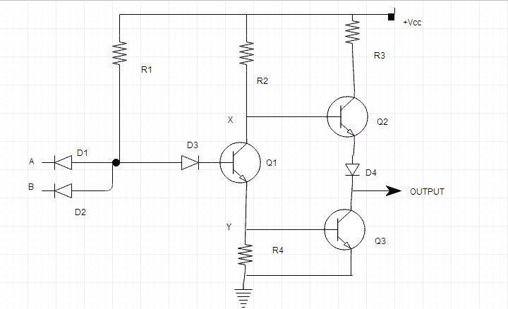
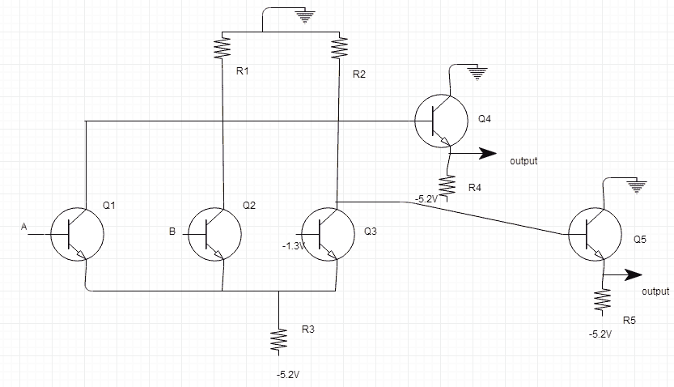
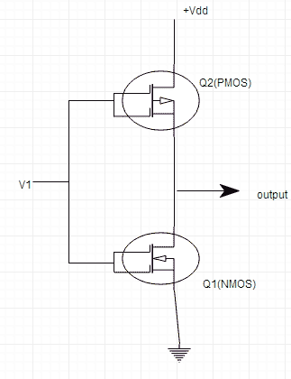
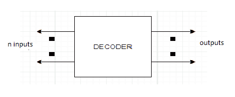
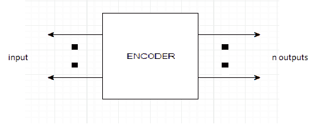
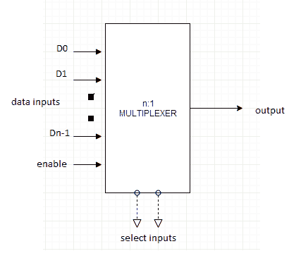

# 数字元件基础

> 原文：<https://www.studytonight.com/computer-architecture/basics-of-digital-components>

在本教程中，我们将学习数字计算机的基础知识。我们将涵盖集成电路、数字逻辑系列、编码器和解码器等。

* * *

## 集成电路

复杂的数字电路由集成电路构成。 **IC** 是一种小型硅半导体晶体，称为芯片，包含数字门的电子元件。各种门在芯片内部相互连接，形成所需的电路。芯片安装在陶瓷或塑料容器中，连接被焊接到外部引脚以形成集成电路。集成电路的引脚数量从 14 个到几千个不等。每个 pin 都由印在其主体上的唯一数字标识。

* * *

### 集成电路的分类

1.  **小型集成器件**

它在一个封装中包含几个独立的门。门的输入和输出直接连接到封装中的引脚。门的数量通常少于 10 个。

3.  **中型集成装置**

它在一个封装中包含 10 到 200 个门。它们执行基本的数字功能，如解码器、加法器、寄存器。

5.  **大规模集成电路(LSI)**

它在一个封装中包含 200 到几千个门。它们包括数字系统，如处理器、存储芯片等。

7.  **超大规模集成电路(超大规模集成器件)**

它在单个封装中包含数千个门，例如微型计算机芯片。

9.  **超大规模集成器件**

它在单个封装(如微型计算机芯片)中包含数十万个门。

* * *

## 数字逻辑家族

集成电路也按其所属的特定电路技术分类。每种技术的基本电路是**与非门**、**或非**、**非**门。

最早的逻辑家族是**电阻-晶体管逻辑**，它使用一个电阻作为输入，一个晶体管作为开关器件。

**二极管-晶体管逻辑**是晶体管-晶体管逻辑的直接祖先，使用二极管实现逻辑功能，而使用晶体管实现放大功能。

### 晶体管晶体管逻辑

它是 DTL(二极管晶体管逻辑)的改进形式，由詹姆斯·L·布依于 1961 年发明。二极管被晶体管取代，以改善电路运行。它被称为晶体管-晶体管逻辑，因为晶体管既执行逻辑功能又执行放大功能。

上图是双输入 TTL 与非门，一个输出。

#### 优点:

*   TTL 电路速度很快。
*   低传播延迟。
*   功耗不取决于频率。

#### 其他一些要点:

*   TTL 电路在静止时(即不使用时)消耗更多的功率，但如前所述，功耗不依赖于频率，因此功率速度不会像其他 CMOS 器件那样随着时钟速度而快速增加。
*   与 ECL 电路相比，TTL 使用较少的功率，但相对较慢。
*   TTL 比早期的 CMOS 器件更不容易因静电放电而损坏。
*   在超大规模集成电路器件出现之前，TTL 电路被用于制造微型计算机和大型处理器的处理器。
*   在使用过程中，制作了许多子类型的 TTL 电路，如**低功耗 TTL** (功耗较小，但速度降低)**高速 TTL** 、**肖特基 TTL** (开关时间有所改善)等。

* * *

### ECL(发射极耦合逻辑)

它提供最高速度的数字电路。它用于需要高速的系统，如超级计算机和信号处理器。ECL 在电路中使用了过驱动的 BJT(双极晶体管)。

上图是两个输入 ECL 门。

#### 优点:

*   ECL 是最快的逻辑家族。
*   传播延迟非常小。
*   噪声容限较低。

#### 其他一些要点:

*   在 ECL 电路中，每个门即使在不活动时也会持续汲取电流，因此与其他逻辑系列相比，功耗更高。
*   ECL 的大电流要求是恒定的，不依赖于电路的状态，这是功率噪声较低的原因。

* * *

### 金属氧化物半导体

它取决于一种载流子(电子或空穴)的流动。基本上是两种类型: **PMOS** 和 **NMOS** 。p 沟道金属氧化物半导体被称为 PMOS，n 沟道金属氧化物半导体被称为 NMOS。

就像其他场效应晶体管一样，它们有 4 个端子:栅极、漏极、源极和衬底。

它们有四种工作模式:*截止*(或亚阈值)*三极管**饱和(有时称为激活)**速度饱和*。

PMOS 晶体管通过在 n 型晶体管主体中创建反型层来工作。这个反型层被称为 **p 沟道**，可以在 p 型“源极”和“漏极”端子之间传导空穴。类似地，NMOS 晶体管通过在 p 型晶体管主体中创建 n 沟道(反型层)来发挥作用。

### 互补金属氧化物半导体

它也属于金属氧化物半导体的范畴，用于制造集成电路。它同时使用了 P 沟道和 N 沟道 MOS。它也被称为 COS-MOS(互补对称金属氧化物半导体)，因为它使用互补对称的 p 型和 n 型 MOS 对来实现逻辑功能。它用于需要低功耗的系统。

上图是两个输入 ECL 门。

#### 优点:

*   噪声容限很高。
*   功耗低。
*   与其他逻辑系列相比，废热产生非常少。
*   CMOS 允许在芯片上高密度集成逻辑功能。

* * *

### 解码器

解码器是将来自 n 个编码输入的二进制信息转换成 2^n 输出的组合电路。商用解码器包括一个或多个使能(E)输入，以控制电路的操作。当 E 等于 1 时启用解码器，当 E 等于 0 时禁用解码器。

*   用于代码转换器。
*   用于实现布尔函数。

* * *

### 编码器

编码器是一种数字电路，它执行解码器的反向操作。编码器具有 2^n 输入线和 n 条输出线。它将八进制输入转换为二进制数字。

#### 编码器的类型

*   优先编码器。
*   十进制到 BCD 编码器。
*   八进制到二进制编码器。
*   十六进制到二进制编码器。

#### 优点:

*   高度可靠和准确。
*   低成本反馈。
*   高分辨率。
*   集成电子学。
*   融合光学和数字技术。
*   可以整合到现有的应用程序中。
*   体积小巧。

#### 缺点:

*   易受磁性或无线电干扰(磁性编码器)。
*   直接光源干涉(光学编码器)。
*   易受污垢、油和灰尘污染。

* * *

### 多路器

多路复用器是一种组合电路，它接收来自 2^n 输入线之一的二进制信息，并将其导向单个输出线。

#### 优点:

*   它减少了电线的数量。
*   它降低了电路复杂性和成本。
*   它简化了逻辑设计。
*   我们可以用多路复用器实现许多组合电路。
*   它不需要 k 图和简化。

#### 缺点:

使用多路复用器芯片扩展 Arduino 上的输入/输出端口时，会出现以下缺点:

*   增加了交换端口的延迟。
*   增加了通过多路复用器传播的输入/输出信号的延迟。
*   对可以同时使用哪些端口的限制。
*   增加了固件复杂性以处理交换端口。
*   需要额外的输入/输出端口来控制多路复用器。

* * *

* * *