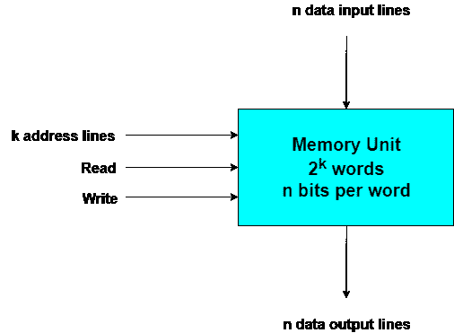

# 随机存取存储器

> 原文：<https://www.studytonight.com/computer-architecture/random-access-memory>

在**随机存取存储器**中，可以从任何期望的随机位置访问存储单元进行信息传输。也就是说，在内存中定位一个单词的过程是相同的，无论这些单元在内存中的物理位置如何，都需要相同的时间。

存储器与其环境之间的通信是通过数据输入和输出线、地址选择线和指定传输方向的控制线来实现的。

随机存取存储器单元的框图如下所示:

**n** 数据输入线提供要存储在存储器中的信息，而 **n** 数据输出线提供从存储器内可用的 **2 k** 中选择的特定字中出来的信息。两个控制输入指定所需的传送方向。

* * *

## 内存:写和读操作

随机存取存储器可以执行的两个操作是**写**和**读**操作。写信号指定一个输入操作，读信号指定一个输出操作。接受这些控制信号中的一个。存储器内部的内部电路提供所需的功能。为了将要存储的新单词转移到内存中，必须采取的步骤如下:

1.  将所需字的**二进制地址**应用于地址线。
2.  将必须存储在存储器中的**数据位**应用到数据输入线。
3.  激活**写**输入。

然后，存储单元将获取输入数据线中当前可用的位，并将它们存储在由地址线指定的位置。为了将存储的字从存储器中转移出来，必须采取的步骤如下:

1.  将所需字的**二进制地址**应用于地址线。
2.  激活**读取**输入。

然后，存储单元将从由地址选择的字中取出位，并将它们应用到输出数据线中。所选单词的内容在阅读后不会改变。

* * *

* * *