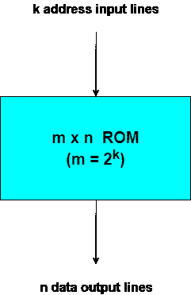

# 只读存储器

> 原文：<https://www.studytonight.com/computer-architecture/read-only-memory>

顾名思义，**只读存储器(ROM)** 是只执行读操作的存储单元；它没有写能力。这意味着存储在只读存储器中的二进制信息在设备的硬件生产过程中是永久的，不能通过向其中写入不同的字来改变。

随机存取存储器是一种通用设备，其内容可以在计算过程中改变，而只读存储器仅限于读取永久存储在该单元中的字。然后，由设计者指定的要存储的二进制信息被嵌入到单元中，以形成所需的互连模式。只读存储器带有特殊的内部电子保险丝，可以为特定的配置进行**编程**。一旦模式建立，即使电源关闭并再次打开，它也会保留在设备中。

一个 **m x n** ROM 是一个二进制单元的数组，每个单元组织成 **n** 位的 **m** 个字。如下图所示，一个只读存储器有 **k** 条地址输入线，用于选择存储器的 **2 k = m** 个字中的一个，以及 n 条输入线，每个字的一位一条。集成电路只读存储器还可以具有一个或多个使能输入，用于将多个封装扩展到具有更大容量的只读存储器中。

只读存储器不需要读控制线，因为在任何给定时间，输出线自动提供由地址值选择的字的 n 位。因为输出仅仅是当前输入(地址线)的函数，所以只读存储器被分类为组合电路。事实上，只读存储器内部是由解码器和一组或门构成的。不需要像在随机存取存储器中那样提供存储能力，因为只读存储器中的比特值是永久固定的。

只读存储器在数字系统设计中有广泛的应用。因此，它可以实现任何具有 **k** 输入和 **n** 输出的组合电路。当在计算机系统中用作存储单元时，只读存储器用于存储不可更改的固定程序和不可更改的常数表。只读存储器也用于设计数字计算机的控制单元。因此，它们被用来存储编码信息，这些编码信息代表在计算机中实现各种操作所需的内部控制变量序列。利用只读存储器存储二进制控制信息的控制单元称为微程序控制单元。

* * *

## 只读存储器:不同类型的只读存储器

只读存储器中所需的路径可以用三种不同的方式编程。

1.  第一个，**掩模编程**由半导体公司在该单元的最后制造过程中完成。这一过程成本很高，因为供应商向客户收取特殊费用，用于定制屏蔽特定的只读存储器。因此，只有订购大量相同的只读存储器配置时，掩模编程才是经济的。
2.  对于少量，使用第二种类型的只读存储器更经济，称为**可编程只读存储器(PROM)** 。编程只读存储器或可编程只读存储器的硬件程序是**不可逆的**，一旦编程，固定模式是永久性的，不能改变。一旦建立了位模式，如果要改变位模式，就必须丢弃该单元。
3.  第三种类型的只读存储器称为**可擦可编程只读存储器**或**可编程只读存储器**。即使电子顺磁共振的保险丝已经烧断，它也可以被重新调整到初始值。某些 PROMs 可以用电信号而不是紫外光擦除。这些 PROM 被称为**电可擦可编程只读存储器**或**电可擦可编程只读存储器**。闪存是一种 EEPROM，其中一个字节块可以在很短的时间内擦除。

**EEPROM** 器件的应用示例有:

*   在机器中存储当前时间和日期。
*   存储端口状态。

**闪存设备**的应用示例有:

*   在手机中存储信息。
*   将照片存储在数码相机中。

* * *

* * *