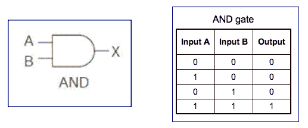
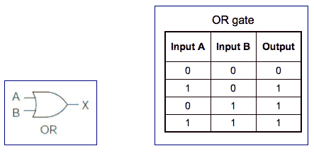
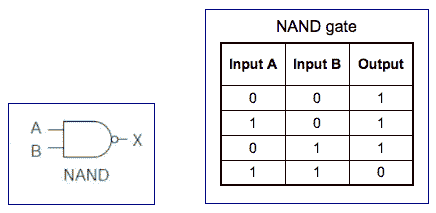
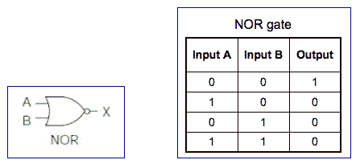
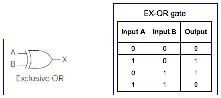
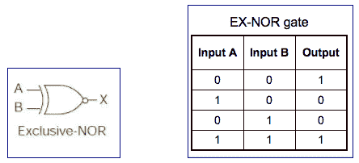

# 数字计算机中使用的逻辑门

> 原文：<https://www.studytonight.com/computer-architecture/logic-gates>

二进制信息在数字计算机中由称为**信号**的物理量表示。电压等电信号以两种可识别的状态之一存在于整个计算机中。这两种状态代表一个可以等于 1 或 0 的二进制变量。

例如，特定的数字计算机可以使用 **3 伏**的信号来表示二进制`1`，使用 **0.5 伏**的信号来表示二进制`0`。现在，数字电路的输入端将只接受 3 伏和 0.5 伏的二进制信号，分别表示对应于 1 和 0 的二进制输入和输出。

所以现在我们知道了，在核心层面，计算机以`0``1`的形式进行通信，无非是**低**和**高**电压信号。

但是如何对这些信号进行不同的操作呢？这是使用不同的逻辑**门**完成的。

* * *

## 盖茨是什么？

二进制逻辑处理二进制变量和具有逻辑意义的运算。它用于以代数或表格的形式描述被称为**门**的逻辑电路所完成的操作。

门是产生图形符号的硬件块，其操作可以用代数表达式来描述。每个门的二进制变量的输入输出关系可以用真值表以表格形式表示。

最基本的逻辑门是多输入的**和**或**，单输入的**非**。**

 **每个具有多个输入的门对其任何一个输入的逻辑 0 或逻辑 1 输入敏感，根据其功能产生输出。例如，多输入与门对其任何一个输入上的逻辑 0 敏感，而与其他输入上的任何值无关。

各种逻辑门有:

1.  和
2.  运筹学
3.  不
4.  “与非”
5.  也不
6.  异或
7.  xnor！x or

* * *

## 与门

与门产生“与”逻辑函数，即如果输入 A 和输入 B 都等于 1，则输出为 1；否则输出为 0。

AND 函数的代数符号与普通算术的**乘法**符号相同。

我们可以在变量之间使用一个**点**，或者在变量之间没有操作符号的情况下连接变量。与门可以有两个以上的输入，根据定义，当且仅当所有输入都为 1 时，输出为 1。

* * *

## 或门

或门产生包含或函数；也就是说，如果输入 A 或输入 B 或两个输入都为 1，则输出为 1；否则，输出为 0。

OR 函数的代数符号是`+`，类似于算术**加法**。

“或”门可能有两个以上的输入，根据定义，如果任何输入为 1，则输出为 1。

* * *

## 逆变器(非)门

反相器电路将二进制信号的逻辑意义反相。它产生非或补函数。

用于逻辑补码的代数符号是质数或变量符号上的条形。

* * *

## 与非门

“与非”功能是“与”功能的补充，如图形符号所示，它由“与”图形符号和一个小圆圈组成。

“与非”这个名称来源于“非与”的缩写。

* * *

## 或非门

“或非”门是“或”门的补充，它使用“或”图形符号，后跟一个小圆圈。

* * *

## 异或门

异或门有一个类似于或门的图形符号，除了输入端的附加曲线。

如果任一输入为 1，门的输出为 1，但当两个输入均为 1 时，门的输出不包括该组合。它类似于一个奇函数；也就是说，如果奇数个输入为 1，它的输出为 1。

* * *

## 异或门

异或是异或的补码，如图形符号中的小圆圈所示。

只有当两个输入都等于 1 或两个输入都等于 0 时，该门的输出才为 1。

* * *

* * ***