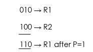

# 计算机体系结构中的寄存器

> 原文：<https://www.studytonight.com/computer-architecture/registers>

寄存器是一种非常快速的计算机内存，用于存储正在执行的数据/指令。

一个**寄存器**是一组触发器，每个触发器能够存储**一位**信息。一个 *n 位*寄存器有一组 *n 触发器*，能够存储 *n 位*的二进制信息。

如果不熟悉逻辑门概念，可以从[这里](logic-gates)学习。

寄存器由一组触发器和门组成。触发器保存二进制信息，并控制何时以及如何将新信息传送到寄存器中。商业上有各种类型的寄存器。最简单的寄存器只由触发器组成，没有外部门。

如今，寄存器也被实现为寄存器文件。

* * *

## 加载寄存器

将新信息传送到寄存器中被称为加载寄存器。如果用一个公共时钟脉冲同时加载寄存器的所有位，则称加载是并行进行的。

* * *

## 语域转换语言

用于描述寄存器间微操作转移的符号表示法称为**寄存器转移语言**。

术语**寄存器传送**是指**硬件逻辑电路**的可用性，其可以执行所述微操作并将操作结果传送到相同或另一个寄存器。

**语言**这个词是从将这个术语应用于编程语言的程序员那里借来的。这种编程语言是一种编写符号来指定给定计算过程的过程。

以下是一些常用寄存器:

1.  **累加器**:这是最常见的寄存器，用来存储从内存中取出的数据。
2.  **通用寄存器**:用于存储程序执行过程中的数据中间结果。它可以通过汇编编程访问。
3.  **专用寄存器**:用户不访问这些寄存器。这些寄存器用于计算机系统，

*   **MAR:** 内存地址寄存器是保存内存单元地址的寄存器。
*   **MBR:** 内存缓冲寄存器存储从内存接收并从内存发送的指令和数据。
*   **PC:** 程序计数器指向下一条要执行的指令。
*   **IR:** 指令寄存器保存要执行的指令。

* * *

## 寄存器传送

从一个寄存器传送到另一个寄存器的信息通过替换操作符以符号形式指定。

R2′R1

它促进数据从寄存器 r1 传输到 r2。

通常我们希望转移只在预定的控制条件下发生。这可以通过以下 **if-then** 语句来表示:if (P=1) then (R2 ← R1)

这里`P`是在控制部分产生的控制信号。

* * *

## 控制函数

控制函数是一个等于 1 或 0 的布尔变量。控制功能如下所示:

p:R2′R1

控制条件以冒号结尾。说明只有当 P=1 时，才能执行转移操作。

* * *

## 微操作

对存储在寄存器中的数据执行的操作称为微操作。微操作是对存储在一个或多个寄存器中的信息执行的基本操作。

**例:**移位、计数、清零、加载。

**微操作类型**

数字计算机中的微操作有四种类型:

1.  寄存器传输微操作将二进制信息从一个寄存器传输到另一个寄存器。
2.  算术微操作对存储在寄存器中的数字数据进行算术运算。
3.  逻辑微操作对存储在寄存器中的非数字数据执行位操作。
4.  移位微操作对数据执行移位微操作。

### 算术微操作

一些基本的微操作是加法、减法、增量和减量。

#### 添加微操作

它由以下语句定义:

```
*R3 → R1 + R2*
```

上述声明指示将 R1 寄存器的数据或内容添加到 R2 寄存器的数据或内容中，并将总和转移到 R3 寄存器。

#### 减法微操作

让我们再举一个例子:

```
*R3 → R1 + R2' + 1*
```

在减法微操作中，我们不使用减运算符，而是取 **1 的补语**并将 1 加到被减的寄存器中，即 **R1 - R2** 相当于**R3→R1+R2】+1**

#### 递增/递减微操作

递增和递减微操作通常分别通过向寄存器加 1 和从寄存器减 1 来执行。

```
*R1 → R1 + 1*
```

```
*R1 → R1 – 1*
```

| 符号名称 | 描述 |
| R3 ← R1 + R2 | R1+R2 的内容转移到 R3。 |
| R3 ← R1 - R2 | R1-R2 的内容转移到 R3。 |
| R2 ← (R2)' | 赞美 R2 的内容。 |
| R2 ← (R2)' + 1 | 让我们赞美 R2 的内容。 |
| R3 ← R1 + （R2）' + 1 | R1+R2 的赞美(减法)。 |
| R1 = R1+1 | 将 R1 的内容增加 1。 |
| R1 ← R1 - 1 | 将 R1 的含量减少 1。 |

#### 逻辑微操作

这些是对存储在寄存器中的位执行的二进制微操作。这些操作分别考虑每个位，并将它们视为二进制变量。

让我们用两个寄存器 R1 和 R2 的内容来考虑 X-OR 微操作。

```
*P: R1 ← R1 X-OR R2*
```

在上面的陈述中，我们还包括了控制功能。

假设每个寄存器有 3 位。让 R1 的内容为 **010** ，R2 为 **100** 。微操作将是:



#### 移位微操作

这些用于数据的串行传输。这意味着我们可以将寄存器的内容向左或向右移动。在**左移**操作中，串行输入将一位传送到最右边的位置，而在**右移**操作中，串行输入将一位传送到最左边的位置。

有以下三种类型的轮班:

**a)逻辑移位**

它通过串行输入传输 0。符号**“SHL”**用于逻辑左移，**“SHR”**用于逻辑右移。

```
*R1 ← she R1*
```

```
*R1 ← she R1*
```

箭头两侧的寄存器符号必须相同。

**b)循环移位**

这将在两端循环或旋转寄存器的位，而不会丢失任何数据或内容。在这种情况下，移位寄存器的串行输出与其串行输入相连。**“cil”****“cir”**分别用于左右循环换挡。

**c)算术移位**

这将一个有符号的二进制数向左或向右移动。向左**算术移位**将有符号二进制数乘以 2，**向左**将该数除以 2。算术移位微操作保持符号位不变，因为符号数在乘以或除以 2 时保持不变。

* * *

## 运算逻辑部件

计算机系统不是让单独的寄存器执行微操作，而是提供许多寄存器连接到一个称为算术逻辑单元(ALU)的公共单元。算术逻辑单元是计算机中央处理器中主要的也是最重要的单元之一。计算机的所有逻辑和数学运算都在这里进行。特定寄存器的内容放在 ALU 的输入中。算术逻辑单元执行给定的操作，然后将其传送到目的寄存器。


* * *

* * *