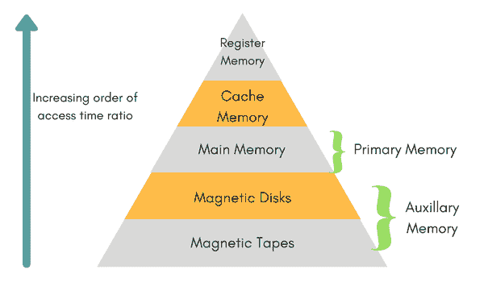
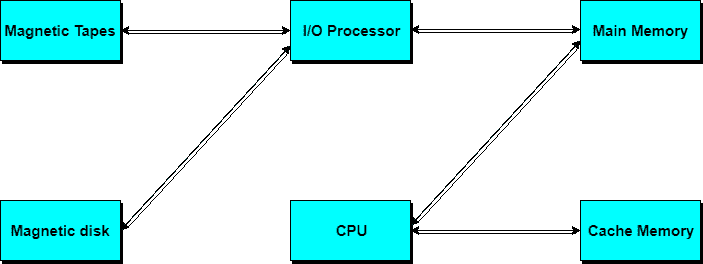

# 计算机系统中的内存组织

> 原文：<https://www.studytonight.com/computer-architecture/memory-organization>

存储单元是存储单元或设备的集合。存储单元以位的形式存储二进制信息。通常，内存/存储分为两类:

*   **易失性存储器**:断电时会丢失数据。
*   **非易失性存储器**:这是一个永久存储器，断电时不会丢失任何数据。

* * *

## 分级存储器体系

计算机的总存储容量可以通过组件的层次结构来可视化。内存层次系统由计算机系统中包含的所有存储设备组成，从慢速辅助内存到快速主内存，再到较小的缓存内存。

**辅助存储器**的访问时间一般是主存储器**的 1000 倍**，因此处于层次结构的最底层。

**主存储器**占据了中心位置，因为它配备有通过输入/输出处理器(I/O)与 CPU 和辅助存储设备直接通信的功能。

当 CPU 需要不在主存储器中的程序时，它们从辅助存储器中被引入。主内存中当前不需要的程序被转移到辅助内存中，以便在主内存中为当前正在使用的其他程序提供空间。

**高速缓冲存储器**用于存储当前正在 CPU 中执行的程序数据。高速缓冲存储器和主存储器之间的近似访问时间比大约是 **1 比 7~10**

* * *

## 内存访问方法

每种内存类型都是众多内存位置的集合。要从任何内存访问数据，首先必须找到它，然后从内存位置读取数据。以下是从内存位置访问信息的方法:

1.  **随机存取**:主存储器是随机存取存储器，其中每个存储单元都有一个唯一的地址。使用这个唯一的地址，可以在相同的时间内以任何顺序到达任何存储位置。
2.  **顺序访问**:这种方法允许按顺序或顺序访问内存。
3.  **直接存取**:在这种模式下，信息存储在磁道中，每个磁道都有单独的读/写磁头。

* * *

## 主存储器

直接在 CPU、辅助存储器和高速缓冲存储器内通信的存储器单元称为主存储器。它是计算机系统的中央存储单元。它是一个大而快速的内存，用于在计算机操作期间存储数据。主存由 **RAM** 和 **ROM** 组成，RAM 集成电路芯片占据主要份额。

*   随机存取存储器
    *   **DRAM** :动态 RAM，由电容和晶体管组成，每 10~100 ms 必须刷新一次，比 SRAM 慢，便宜。
    *   **静态随机存取存储器**:静态随机存取存储器，每个单元有一个六晶体管电路，保存数据，直到断电。
    *   **非易失性随机存取存储器**:非易失性随机存取存储器，保留其数据，即使关闭。例如:闪存。
*   只读存储器，是非易失性的，更像是信息的永久存储器。它还存储了**引导加载程序**程序，用于在计算机开机时加载和启动操作系统。**可编程只读存储器**(可编程只读存储器)**可编程只读存储器**(可擦除可编程只读存储器)和**电可擦除可编程只读存储器**是一些常用的只读存储器。

* * *

## 辅助存储器

提供备份存储的设备称为辅助存储器。**例如:**磁盘和磁带是常用的辅助设备。用作辅助存储器的其他设备有磁鼓、磁泡存储器和光盘。

它不能被 CPU 直接访问，而是通过输入/输出通道访问。

### 高速缓冲存储器

CPU 一次又一次使用的主存储器的数据或内容存储在高速缓冲存储器中，以便我们可以在更短的时间内轻松访问这些数据。

每当 CPU 需要访问内存时，它首先检查缓存内存。如果在高速缓冲存储器中找不到数据，则 CPU 移到主存储器上。它还将最近的数据块传输到缓存中，并不断删除缓存中的旧数据以容纳新数据。

### 命中率

高速缓存的性能是用一个叫做**命中率**的量来衡量的。当 CPU 访问内存并在缓存中找到该单词时，据说会产生一个**命中**。如果在高速缓存中没有找到该单词，则它在主存储器中，然后它被算作**未命中**。

命中数与 CPU 对内存引用总数的比率称为命中率。

`Hit Ratio = Hit/(Hit + Miss)`

* * *

## 相联存储器

也称为**内容可寻址存储器(CAM)** 。它是一种存储芯片，每个位的位置都可以进行比较。在这种情况下，内容在每个位单元中进行比较，这允许非常快速的表查找。因为可以比较整个芯片，所以内容是随机存储的，而不考虑寻址方案。这些芯片的存储容量比普通存储芯片少。

* * *

* * *