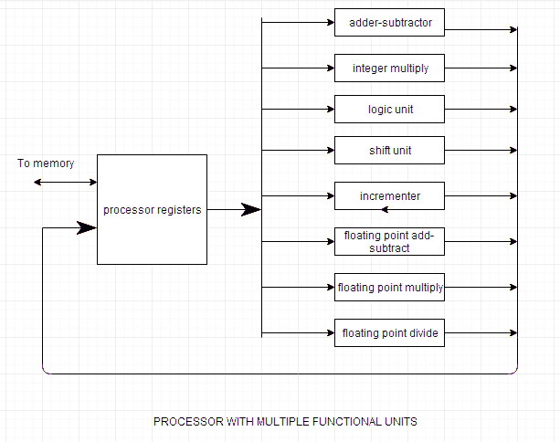

# 计算机系统中的并行处理和数据传输模式

> 原文：<https://www.studytonight.com/computer-architecture/parallel-processing-and-data-transfer>

一个**并行处理**系统提供并发数据处理来增加执行时间，而不是顺序处理每条指令。

在这种情况下，系统可能有两个或更多的算术逻辑单元，应该能够同时执行两个或更多的指令。并行处理的目的是加快计算机的处理能力，增加其吞吐量。

**注:** **吞吐量**是单位时间内可以执行的指令数。

并行处理可以从不同的复杂程度来看。在最底层，我们根据使用的寄存器类型来区分并行和串行操作。在更高的复杂性水平上，并行处理可以通过使用同时执行许多操作的多个功能单元来实现。

* * *

## 计算机系统的数据传输模式

根据数据传输方式，计算机可分为 4 大类:

1.  SISD
2.  单指令多数据
3.  MISD
4.  多指令流多资料流

* * *

### SISD(单指令流、单数据流)

它表示包含控制单元、处理器单元和存储单元的单个计算机的组织。指令按顺序执行。它可以通过流水线或多个功能单元来实现。

* * *

### SIMD(单指令流，多数据流)

它代表一个组织，该组织包括在一个公共控制单元控制下的多个处理单元。所有处理器从控制单元接收相同的指令，但对数据的不同部分进行操作。

它们是高度专业化的计算机。它们基本上用于以向量或矩阵形式表示的数值问题。但是它们不适用于其他类型的计算

* * *

### MISD(多指令流，单数据流)

它由一台包含多个处理器的计算机组成，这些处理器与多个控制单元和一个公共存储单元相连。它能够通过单个数据流同时处理多个指令。MISD 结构只是理论上的兴趣，因为还没有使用这个组织构建实际的系统。

* * *

### MIMD(多指令流，多数据流

它代表能够同时处理多个程序的组织。它是单个计算机的组织，包含与多个控制单元和一个共享存储单元相连的多个处理器。共享内存单元包含多个模块，可同时与所有处理器通信。多处理器和多计算机是 MIMD 的例子。它满足了大规模计算的需求。

* * *

* * *