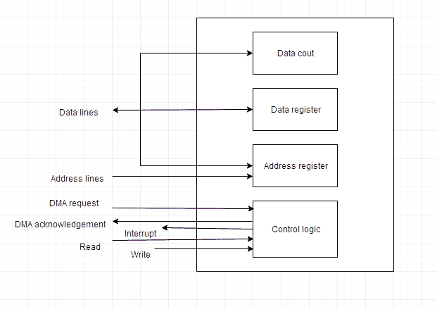

# 输入/输出组织

> 原文：<https://www.studytonight.com/computer-architecture/input-output-organisation>

在本教程中，我们将学习如何在计算机系统中处理输入和输出。

* * *

## 输入/输出子系统

计算机的输入/输出子系统在中央系统和外部环境之间提供了一种有效的通信模式。它处理计算机系统的所有输入输出操作。

* * *

## 外围设备

连接到计算机的输入或输出设备称为**外围设备**。这些设备被设计成根据来自CPU的命令将信息读入或读出存储单元，并且被认为是计算机系统的一部分。这些设备也被称为**外设**。

例如:*键盘*、*显示单元*和*打印机*都是常见的外设。

有三种类型的外设:

1.  **输入外设**:允许用户输入，从外界到电脑。例如:键盘、鼠标等。
2.  **输出外设**:允许信息输出，从电脑到外界。例如:打印机、显示器等
3.  **输入输出外设**:允许输入(从外部世界到计算机)以及输出(从计算机到外部世界)。例如:触摸屏等。

* * *

## 接口

接口是计算机系统的两个独立组件之间的共享边界，可用于将两个或多个组件连接到系统以进行通信。

有两种类型的接口:

1.  cpu 接口
2.  输入输出接口

让我们详细了解一下输入/输出接口，

#### 输入输出接口

连接到计算机的外围设备需要特殊的通信链路来与CPU接口。在计算机系统中，在CPU和外围设备之间有特殊的硬件组件来控制或管理输入输出传输。这些组件被称为**输入输出接口单元**，因为它们在处理器总线和外围设备之间提供通信链路。它们提供了一种在内部系统和输入输出设备之间传递信息的方法。

* * *

## 输入输出数据传输模式

中央单元和输入/输出设备之间的数据传输通常可以通过以下三种模式进行处理:

1.  编程输入输出
2.  中断启动的输入输出
3.  直接内存访问

* * *

### 编程输入输出

程序化输入输出指令是用计算机程序编写的输入输出指令的结果。每个数据项的传输都是由程序中的指令启动的。

通常程序控制CPU和外围设备之间的数据传输。在编程输入/输出下传输数据需要CPU持续监控外围设备。

* * *

### 中断启动的输入输出

在编程输入/输出方法中，CPU一直处于程序循环中，直到输入/输出单元表明它已准备好进行数据传输。这是一个耗时的过程，因为它让处理器不必要地忙碌。

这个问题可以通过使用**中断启动的输入/输出**来克服。在这种情况下，当接口确定外设已准备好进行数据传输时，它会产生一个中断。在接收到中断信号后，CPU停止正在处理的任务，并为输入/输出传输提供服务，然后返回到其先前的处理任务。

* * *

### 直接内存访问

将CPU从路径中移除并让外围设备直接管理内存总线将提高传输速度。这种技术被称为 **DMA** 。

在这种情况下，接口通过存储器总线将数据传送到存储器和从存储器传送数据。直接存储器存取控制器管理外围设备和存储单元之间的数据传输。

许多硬件系统使用直接存储器存取，如磁盘驱动器控制器、图形卡、网卡和声卡等。它也用于多核处理器中的芯片内数据传输。在直接存储器存取中，CPU将启动传输，在传输过程中进行其他操作，并在传输完成时从直接存储器存取控制器接收中断。

上图是直接存储器存取的框图

* * *

* * *