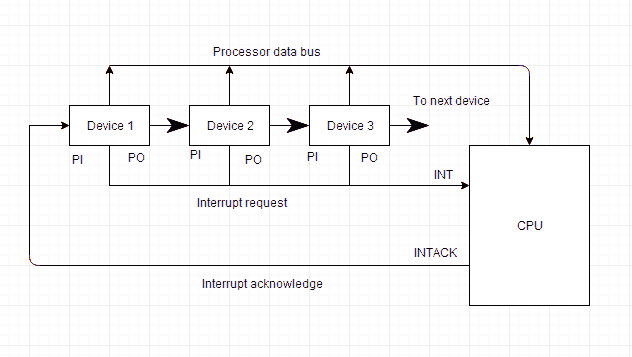

# 计算机体系结构:中断

> 原文：<https://www.studytonight.com/computer-architecture/priority-interrupt>

中央处理器和外围设备之间的数据传输由中央处理器发起。但是，除非外围设备准备好与中央处理器通信，否则中央处理器无法开始传输。当设备准备好与中央处理器通信时，它会生成一个中断信号。许多输入输出设备连接到计算机，每个设备都能够产生中断请求。

中断系统的主要工作是识别中断的来源。也有可能几个设备同时请求 CPU 通信。然后，中断系统必须决定首先服务哪个设备。

* * *

## 优先级中断

优先级中断是一种系统，它决定同时产生中断信号的各种设备由中央处理器服务的优先级。系统有权决定哪些条件允许中断中央处理器，而其他一些中断正在服务。一般来说，像*磁盘*这样的高速传输设备被赋予高优先级，像*键盘*这样的慢速设备被赋予低优先级。

当两个或多个设备同时中断计算机时，计算机首先以较高的优先级为设备提供服务。

* * *

## 中断类型:

以下是一些不同类型的中断:

### 硬件中断

当处理器的信号来自外部设备或硬件时，这种中断称为**硬件中断**。

让我们考虑一个例子:当我们按下键盘上的任何一个键来做某个动作时，那么这个键的按下将为处理器产生一个中断信号来执行某个动作。这种中断可以有两种类型:

*   **可屏蔽中断**

当高优先级中断同时发生时，可以延迟的硬件中断。

*   **不可屏蔽中断**

不能延迟的硬件中断，应由处理器立即处理。

* * *

### 软件中断

由计算机系统的任何内部系统引起的中断称为**软件中断**。它也可以有两种类型:

*   **正常中断**

由软件指令引起的中断称为**正常软件中断**。

*   例外

一些程序执行过程中产生的计划外中断称为**异常**，如被零除。

* * *

## 菊花链优先级

这种决定中断优先级的方式包括所有产生中断信号的设备的串行连接。优先级最高的设备位于第一个位置，其次是优先级较低的设备，优先级最低的设备位于链中的最后一个位置。

在菊花链系统中，所有设备都以串行形式连接。所有设备都有中断请求。如果任何设备的中断信号处于低电平状态，则中断线路进入低电平状态，并使能中央处理器中的中断输入。当没有中断时，中断线路保持高电平状态。中央处理器通过启用中断确认线来响应中断。该信号由设备 1 在其 PI 输入端接收。只有当设备 1 没有请求中断时，确认信号才通过 PO 输出传递到下一个设备。

下图显示了菊花链优先系统的框图。

* * *

* * *