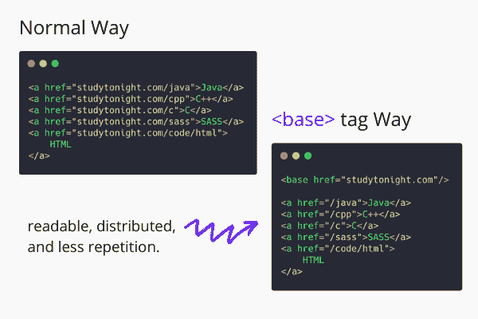

# HTML 基址标签

> 原文：<https://www.studytonight.com/html5-references/html-base-tag>

HTML `<base>`标签用于表示**的一个**基本网址**，该网址是 HTML 文档**中的所有网址。例如，如果我们在一个网页上有多个相同域名的网址，那么我们可以在 HTML 文档头中使用`<base>`标签指定基本网址，然后只需在 HTML 文档体中添加相对路径。基本网址将自动添加到网页上的所有相对网址。



*   我们只能有一个基本网址，并且**不应该有一个以上的基本网址**。

*   所以 HTML 任何文档只能有一个`<base>`标签，必须放在`<head>`标签里面( [HTML <头>标签！](https://www.studytonight.com/html5-references/html-head-tag))仅限。

*   该基本网址将是我们在网页上使用`<base>`标签的每个网址的基础，并且它必须是该特定页面上所有网址的前缀。因此，如果我们必须在同一页面上包含不同网站的网址，我们应该小心。

## HTML `<base>`标签-语法和用法

`<base>`标签是一个**空标签**，或者一个**开放标签**，这意味着它**不需要任何结束或关闭标签**。

以下是使用`<base>`标签的语法:

```
<!-- declaring the base URL -->
<base href="BASE_URL" />
```

正如您在上面的语法中看到的，就像 [HTML 锚标签](https://www.studytonight.com/html5-references/html-a-tag)一样，`<base>`标签也使用`href`属性来指定网址。

## HTML `<base>`标签属性

HTML `<base>`标签支持[全局属性](https://www.studytonight.com/html5-references/html-global-attributes)和[事件属性](https://www.studytonight.com/html5-references/html-event-attributes)以及一些具体的属性，如下所示:

| **属性** | **描述** |
| --- | --- |
| `href` | 要在整个文档中使用的基本网址是使用`href`属性指定的。 |
| `target` | 该属性用于指定在哪里打开超链接的网址，在同一个浏览器选项卡中，在新的选项卡中，等等。 |

## HTML `<base>`标签示例

下面我们有一个`<base>`标签的基本例子，我们用它来指定所有锚点标签的基本 URL。

## 

在上面的例子中，我们有 4 个锚标签，前 3 个将获得添加到其中的基本网址，但是如果我们必须在网页上包含一些其他网址，在这种情况下，我们可以提供以 http://或 https://开头的完整网址，那么基本网址将不会添加到该网址中。

此外，我们使用了带有 **_blank** 值的`target`属性，默认情况下，该属性应用于该网页上的所有超链接。其他可用于`target`属性的值有 **_self** 、 **_parent** 、 **_top** 等。

我们在我们的 HTML 文档中只使用了一个`<base>`标签，在上面的例子中，尝试再添加一个(将考虑第一个)。

而且是**推荐**在`<head>`标签里面用`<base>`标签，虽然你加在`<body>`标签里面，还是可以的。

## 对 HTML `<base>`标签的浏览器支持

以下浏览器支持此属性:

*   Firefox 1+

*   谷歌 Chrome 1+

*   Internet Explorer 2+

*   Apple Safari 1+

*   Opera 4+

* * *

* * *