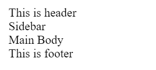

# HTML `<div>`标签

> 原文：<https://www.studytonight.com/html5-references/html-div-tag>

HTML `<div>`标签用于**将**网页划分为不同的分区或部分**。`<div>`标签基本上充当了其他 **HTML** 元素的容器**。

*   `<div>`标签用于将网页上的 HTML 元素分组为部分。

*   您也可以将 CSS (层叠样式表)应用于使用`<div>`标签分组的元素。

*   `<div>`标签不应该用在`<p>`标签里面，虽然你可以用在段落标签里面，如果在一个段落里你想把内容分成不同的部分。

*   此外，这是一个**块级元素。**

要了解`<div>`标签交互- **[HTML 交互教程](https://www.studytonight.com/code/web-beginner-III/)**

`<div>`标签是除了`display:block;`之外没有自己特定样式的标签，因为它是块级元素，这意味着两个`<div>`标签不会内联显示，

## HTML `<div>`标签-语法和用法

它既需要**开始标签** ( `<div>`)也需要**结束标签** ( `</div>`)。

以下是在 HTML 代码中使用此标记的语法:

```html
<div>
    ...content here...
</div> 
```

## HTML `<div>`标签基本示例

为了理解`<div>`标签是如何有用的，让我们举一个例子，我们将开发一个基本的网页结构，其中我们将有一个顶部**标题**、一个左侧**侧边栏**、一个**主体**部分和一个**页脚**。我们将使用`<div>`标签在我们的网页上创建这些部分。

在下面的代码示例中，我们简单地使用了`<div>`标签来进行划分。正如您在输出中看到的，如果我们使用`<div>`标签而没有任何特定的样式，那么它所做的就是创建不可见的块，我们认为它就像 [HTML 换行符](https://www.studytonight.com/html5-references/html-br-tag)一样，在单独的行中显示文本。

```html
<div class="header">This is header</div>
<div class="body">
    <div class="sidebar">Sidebar</div>
    <div class="main-body">Main Body</div>
</div>
<div class="footer">This is footer</div>
```



但是`<div>`标签是这样创建的，这样我们就可以[使用 CSS](https://www.studytonight.com/cascading-style-sheet/) 按照我们想要的样式来设计它。在下面的交互示例中，我们已经为上面的代码添加了样式。

在上面的例子中，我们可以在网页上创建的每个部分中使用更多的`<div>`标签。让我们看看如何做到这一点。

如上例所示，我们在**主体**内部使用了`<div>`标签。这是我们创建任何网页的方式。< div >标签是最常用的 HTML 标签之一。

```html
<div class="main-body">
    <div id="title">Feedback Form</div>
    <div id="form-box">
        <div><input type="text" placeholder="feedback..."/></div>
        <div><input type="submit" /></div>
    </div>
</div>
```

如果你是初学者，不要被看到这么多

标签搞糊涂了。网页就是这样创建的。将各种 HTML 组件封装在`<div>`标签中是一个很好的做法。

## HTML `<div>`标签属性

这个元素没有任何特定属性，虽然这个元素支持[全局属性](https://www.studytonight.com/html5-references/html-global-attributes)和[事件属性](https://www.studytonight.com/html5-references/html-event-attributes)。有一些常见的属性经常与`<div>`标签一起使用，如下所示:

| **属性** | **描述** |
| `id` | 它用于为`<div>`标签定义一个**唯一 id** |
| `class` | 它用于为`<div>`标签定义一个**类名** |
| `style` | 该属性用于为`<div>`标签定义[内嵌样式](https://www.studytonight.com/cascading-style-sheet/introduction-to-css) |

## HTML `<div>`标签的默认 CSS 样式

```html
div {
    display: block;
} 
```

## 对 HTML `<div>`标签的浏览器支持

以下浏览器支持此属性:

*   Firefox 1+

*   谷歌 Chrome 1+

*   Internet Explorer 2+

*   Safari 1+

*   Opera 4+

* * *

* * *