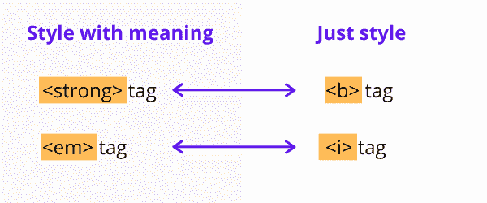

# 标签中的 HTML

> 原文：<https://www.studytonight.com/html5-references/html-em-tag>

HTML `<em>`标签用于将某些文本标记为**强调文本**，这意味着该文本相对于网页上的内容来说是重要的文本。这个标签通知搜索引擎抓取网页，网页上的哪些文本应该被强调或给予特殊的重要性。

在`<em>`标签中提供的文本被称为**强调文本**。



*   这个**强调的文字**被浏览器、搜索引擎赋予了比其他内容更大的重要性。

*   **强调的文本**以**斜体格式**显示在网络浏览器中，因此它的工作方式类似于 [HTML < i >标签](https://www.studytonight.com/html5-references/html-i-tag)，但也为包含在该标签中的文本以及斜体样式提供了额外的重要性。

    

*   另外，这是一个**内联元素**。

## HTML `<em>`标签-语法和用法

`<em>`标签需要**开始(开启)标签**和**结束(关闭)标签。**

下面我们有相同的基本语法:

```
<em>
    content here
</em>
```

### HTML `<em>`标签基本示例

下面我们有一个`<em>`标签的基本例子:

## HTML `<em>`标签属性

HTML `<em>`标签没有任何特定属性，但是支持[全局属性](https://www.studytonight.com/html5-references/html-global-attributes)和[事件属性](https://www.studytonight.com/html5-references/html-event-attributes)。

## HTML `<em>`标签的默认 CSS 样式

```
em {
    font-style: italic;
} 
```

## 对 HTML `<em>`标签的浏览器支持

以下浏览器支持此属性:

*   火狐-是的

*   谷歌浏览器-是的

*   Internet Explorer 2+

*   狩猎-是的

*   Opera 2.1+

* * *

* * *