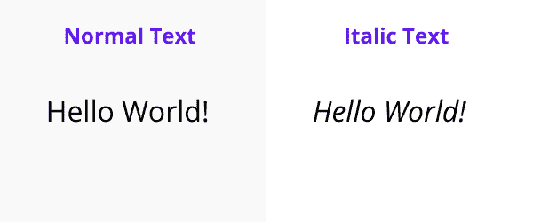

# HTML i(斜体)标签

> 原文：<https://www.studytonight.com/html5-references/html-i-tag>

HTML `i` 元素用于**使句子中的某些单词**或**术语**出现在*斜体样式*中，这只是略微倾斜的文本。



*   这里的 **i** 代表**斜体文字**就像 **b** 代表**粗体文字** ( [HTML < b >标签](https://www.studytonight.com/html5-references/html-b-tag))一样。

*   它位于**物理样式元素**下，用于**改变网页上文本的**外观**。**

*   网络浏览器以**斜体样式**呈现`<i>`元素中包含的文本。

*   强调标签或 [HTML `<em>`标签](https://www.studytonight.com/html5-references/html-em-tag)是斜体标签的一个有意义的版本。

    

*   我们可以用**斜体**标注文本，表示其与**普通文本**不同**。**

## HTML `<i>`标签-语法和用法

HTML `<i>`标签需要**开始(开始)标签**和**结束(结束)标签**。

另外，这是一个**内联元素**。以下是相同的基本语法:

```
<i>
    some text
</i>
```

## HTML `<i>`标签基本示例

下面我们有一个相同的基本例子:

## HTML `<i>`标签属性

虽然此元素支持[全局属性](https://www.studytonight.com/html5-references/html-global-attributes)和[事件属性](https://www.studytonight.com/html5-references/html-event-attributes)，但它没有任何特定属性。

## HTML `<i>`标签的默认 CSS 样式

```
i{
    font-style: italic;
}
```

## 对 HTML `<i>`标签的浏览器支持

以下浏览器支持此属性:

*   Firefox 1+

*   谷歌 Chrome 1+

*   Internet Explorer 2+

*   Safari 1+

*   Opera 2.1+

* * *

* * *