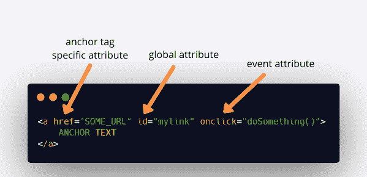

# HTML 事件属性

> 原文：<https://www.studytonight.com/html5-references/html-event-attributes>

在 HTML5 中，**事件属性**本质上是全局的，这意味着它们与几乎所有的 HTML 标签一起使用。

任何 HTML 标签的**属性只是它的一部分，可以用来给任何 HTML 标签添加更多的信息，例如，在[`<a>`标签](https://www.studytonight.com/html5-references/html-a-tag)中，`href` 是用来提供文本将被超链接到的网址的属性。同样，HTML 标签可以有事件属性，用于处理那些 HTML 标签/元素的 [JavaScript 事件](http://www.studytonight.com/javascript/javascript-events)。**

任何 HTML 标记都可以有多个属性。

*   当某些事件发生时，事件属性被应用于执行的 HTML 标签，例如，`onclick``onblur``onmousehover`等。

*   **事件属性本质上是全局的**但是也有一些**例外**，对于像`<title>`标签、`<link>`等标签，事件属性在 HTML 文档的`<head>`部分中是不相关的。

事件属性基本上是**观察者**，它们被添加到任何 HTML 标签中以观察任何特定的事件，并且当这种情况相对于为其指定了事件属性的特定 HTML 标签发生时，该属性将触发与其相关联的 Javascript 表达式的功能。

每个事件都有一个单独的事件属性。

## 事件属性类型

事件属性的类别很少，这些类别基于 JavaScript 支持的事件类型。这些是:

*   窗口事件属性

*   鼠标事件属性

*   表单事件属性

*   键盘事件属性

*   媒体事件属性

让我们逐一详细讨论上面给出的每个类别。

## 窗口事件属性

**窗口事件**是那些与[窗口对象](https://www.studytonight.com/javascript/javascript-window-object)相关的事件，这些事件适用于 [HTML `<body>`标签](https://www.studytonight.com/html5-references/html-body-tag)。

窗口事件类别下的事件属性如下所示:

| **属性** | **描述** |
| `onafterprint` | 该属性在与其相关联的文档被打印后立即激发 |
| `onbeforeprint` | 该属性在与其关联的文档被打印之前激发 |
| `onbeforeunload` | 该属性在卸载相关文档之前激发 |
| `onerror` | 当关联文档中出现错误时，会触发此属性。 |
| `onhashchange` | 当网址中哈希符号(#)后面的部分发生变化时，会触发此属性 |
| `onload` | 该属性在文档加载完成后立即激发。 |
| `onmessage` | 此属性在消息事件发生时触发，例如:-当用户以跨文档形式发送消息时 |
| `onoffline` | 此属性在网络连接失败且浏览器开始脱机工作时触发 |
| `ononline` | 该属性在网络连接开始工作并且浏览器开始联机工作时触发 |
| `onpagehide` | 该属性在页面隐藏且用户正在移动到另一个网页时触发 |
| `onpageshow` | 当页面显示且用户正在浏览网页时，此属性会触发 |
| `onpopstate` | 当对活动历史记录进行更改时，会触发此属性。 |
| `onresize` | 此属性在调整浏览器窗口大小时触发 |
| `onstorage` | 此属性在更新 web 存储时触发 |
| `onunload` | 该属性在浏览器窗口关闭前立即激发 |

## 键盘事件属性

**键盘事件**是用户与键盘交互时发生的事件。

键盘事件类别下的事件属性如下所示:

| **属性** | **描述** |
| `onkeydown` | 当用户按下键盘上的任意键时，该属性会触发。 |
| `onkeyup` | 该属性在用户按下字母数字键时触发 |
| `onkeypress` | 当用户释放键盘上的任意键时，该属性将触发。 |

## 表单事件属性

**表单事件**是 HTML 中的那些事件，当任何用户**与**表单控件交互**时就会发生。**

表单事件类别下的事件属性如下所示:

| **属性** | **描述** |
| `onblur` | 该属性在元素失去焦点时激发。 |
| `onchange` | 当元素的值或状态发生变化时，此属性会触发 |
| `onfocus` | 该属性在元素获得焦点时激发。 |
| `oninput` | 该属性在用户更改元素值时触发。 |
| `oninvalid` | 在表单验证期间，当 submittable 元素不满足约束时，将触发此属性 |
| `onreset` | 该属性在用户重置表单时触发。 |
| `onselect` | 当用户正在选择文本的某个部分或当前选择发生变化时，此属性将触发。 |
| `onsearch` | 当用户确实在搜索字段中写了一些文本时，该属性会触发。 |
| `onsubmit` | 该属性在表单提交时触发。 |

## 剪贴板事件属性

**剪贴板事件**是那些与剪贴板修改相关的事件，如复制、剪切和粘贴。

剪贴板事件类别下的事件属性如下所示:

| **属性** | **描述** |
| `oncopy` | 当用户复制元素或选择一段文本，并将其添加到系统剪贴板时，此属性将激发。 |
| `oncut` | 当元素或选定的文本从文档中移除并添加到系统剪贴板时，此属性将激发。 |
| `onpaste` | 当用户粘贴数据，将数据从系统剪贴板传输到文档时，此属性会触发。 |

## 媒体事件属性

**媒体事件**是在**处理嵌入在 HTML 文档中的媒体元素的事件**时发生的事件，例如`<audio>`标签、`<video>`标签、`<embed>`标签等。

媒体事件类别下的事件属性如下:

| **属性** | **描述** |
| `onabort` | 此属性在回放中止时触发，但不是由于错误。 |
| `oncanplay` | 该属性在有足够的数据可用于播放媒体时触发，至少播放几帧，但需要进一步缓冲。 |
| `oncanplaythrough` | 当整个媒体可以播放到最后而不需要停下来做进一步缓冲时，这个属性就会触发。 |
| `oncuechange` | 当<track>元素的文本轨迹提示改变时，该属性触发 |
| `ondurationchange` | 当介质的持续时间改变时，此属性会触发 |
| `onemptied` | 当媒体元素重置为其初始状态时，该属性会触发，这可能是因为加载时出现致命错误，也可能是因为调用了`load()`方法来重新加载它。 |
| `onended` | 当到达播放结束时，该属性触发 |
| `onerror` | 当在获取介质数据时出现错误时，此属性会触发 |
| `onloadeddata` | 当媒体数据加载到当前播放位置时，此属性会触发 |
| `onloadedmetadata` | 当媒体的元数据加载完毕时，此属性会触发。持续时间和维度是媒体的元数据。 |
| `onloadstarts` | 当开始加载媒体时，此属性会触发。 |
| `onplay` | 当暂停后开始播放媒体时，即请求`play()`方法时，该属性触发。 |
| `onplaying` | 此属性在播放音频或视频时触发 |
| `onpause` | 该属性在播放暂停时触发；它可以通过编程或由用户暂停。 |
| `onprogress` | 此属性定期触发，表示下载媒体数据的进度 |
| `onratechange` | 当播放速率或速度增加或减少时，如慢动作或快进模式，此属性会触发。 |
| `onseeking` | 当移动当前播放位置时，此属性会触发。 |
| `onseeked` | 当寻道操作结束时，此属性会触发。 |
| `onstalled` | 此属性在下载意外停止时触发。 |
| `onsuspend` | 该属性在有意停止加载介质时触发。 |
| `ontimeupdate` | 当播放位置改变时，例如当用户快进到不同的播放位置时，该属性会触发。 |
| `onvolumechange` | 此属性触发音量从静音变为非静音的时间 |
| `onwaiting` | 由于视频资源的下一帧不可用，播放停止时会触发此属性。 |

## 鼠标事件属性

**鼠标事件**是当用户像鼠标一样与定点设备交互时发生的事件。

鼠标事件类别下的事件属性如下所示:

| **属性** | **描述** |
| --- | --- |
| `onclick` | 该属性在用户单击元素上的鼠标左键时触发。 |
| `ondblclick` | 该属性在用户双击元素时激发。 |
| `oncontextmenu` | 当用户通过右键单击元素来触发上下文菜单时，会触发此属性。 |
| `ondrag` | 当用户拖动元素时，此属性会激发。ondrag 事件在整个拖动操作中引发了火灾。 |
| `ondragend` | 当用户在拖动操作结束时释放鼠标按钮时，此属性会触发。 |
| `ondragenter` | 当用户将元素拖动到有效的放置目标时，此属性会激发。 |
| `ondragleave` | 在拖动操作过程中，当元素离开有效的放置目标时，会激发此属性。 |
| `ondragover` | 当元素被拖动到有效的放置目标上时，此属性将激发。 |
| `ondragstart` | 当用户开始拖动文本选择或选定的元素时，此属性会触发。 |
| `ondrop` | 此属性在拖放操作中释放鼠标按钮时触发，即拖放被拖动的元素时。 |
| `onmousedown` | 当鼠标按钮在元素上按下时，此属性会激发。 |
| `onmousemove` | 当用户将鼠标指针移动到某个元素上时，该属性将激发。 |
| `onmouseout` | 当用户将鼠标指针移动到元素边界之外时，此属性将激发。 |
| `onmouseover` | 当用户将鼠标指针移动到某个元素上时，该属性将激发。 |
| `onmouseup` | 当用户将鼠标放在某个元素上并释放鼠标按钮时，此属性会触发。 |
| `onscroll` | 当用户通过滚动元素的滚动条来滚动元素的内容时，会触发此属性。 |
| `onshow` | 当上下文菜单被触发到同样具有`contextmenu`属性的元素上时，该属性被触发。 |
| `ontoggle` | 当用户打开或关闭
标签时，该属性触发
 |
| `onwheel` | 当用户通过在元素上上下滚动鼠标滚轮来滚动元素的内容时，会触发此属性。 |

有了这个，我们已经列出了所有的事件属性，你可以使用你的 HTML 标签。去我们的[网络游乐场](https://www.studytonight.com/code/playground/web/)试试吧。

* * *

* * *