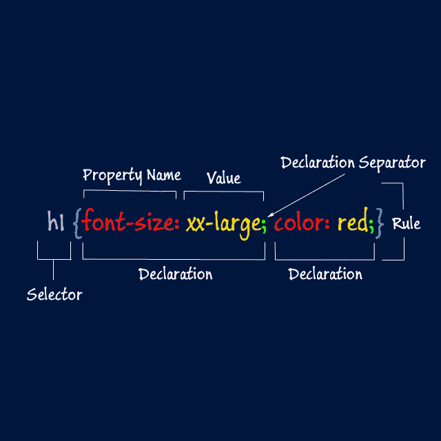

# CSS 的基本语法

> 原文：<https://www.studytonight.com/cascading-style-sheet/css-syntax>

让我们先来看看**级联样式表**。您可能已经知道，所有编程语言都有自己的语法，虽然 HTML 和 CSS 并不完全是编程语言，但它们确实有自己的语法。

CSS 语法不是很麻烦。CSS 规则被定义为一个**属性名**，后跟一个**冒号**，然后是一个**属性值**。单个规则以**分号**结束，最终规则有一个可选的分号。唷！让我们更仔细地看看这句话。

```
property-name1 : value1;  . . . property-nameN : valueN;
```

通过使用`style`属性，CSS 规则可以直接放置在大多数 HTML 标签中。例如，要设置`h1`标题的颜色和对齐方式，我们可以使用:

```
<h1 style = "color:red; text-align:center;">Hello, CSS!</h1>
```

CSS 的这种直接使用被称为**内联样式**，由于它干扰了 HTML 标签，增加了 HTML 文件的大小，并且样式没有可重用性，所以通常应该避免使用。

相反，我们可以创建一个将自己绑定到特定元素或一组元素的样式，这些元素可以根据需要进一步重用。考虑下面的例子，它显示了正确的 CSS 语法，并将其分解为各个组件。



> **注意:**样式块中的最终声明不需要分号。但是，为了更好地度量和便于以后插入属性，请始终考虑在所有属性后使用分号。

CSS **属性名称**使用多个单词时用破折号隔开，例如:`font-face`、`line-height`、`font-size`等。另外，一定要记住 CSS 是**而不是空白敏感的**，因此

```
h1{ 
    font-size: large; 
    text-align: center; 
    font-family: Arial
}
```

将呈现与相同的

```
h1{font-size: large; text-align: center; font-family: Arial }
```

另外，请注意 CSS 不区分大小写，也就是说

```
h1{ 
    FONT-SIZE: large; 
    text-align: CENTER; 
    FONT-FAMILY: Arial 
}
```

与...相同

```
h1{ 
    font-size: large; 
    text-align: center; 
    font-family: Arial
}
```

但是，在某些情况下，例如使用网址值、字体名称和某些选择器(例如:类)，大小写将被强制执行。因此，为了避免混淆和错误，最好假设 CSS 是**区分大小写的**。

**样式表**可以使用前面看到的`<style>...</style>`块与 HTML 一起放在同一个文档中。但是，它可以放在外部文件中，并通过包含在 HTML 文档的`<head>`标签中的`<link>`标签进行引用。考虑一个示例样式表。

### 使用`<style>`标签:

```
<style type = "text/css">
   *h1* { color: red; text-align: center; }
   *p* { line-height: 150%; }
</style>
```

### 使用`<link>`标签:

```
<link href = "mystyle.css" rel = "stylesheet" type = "text/css"/>
```

`mystyle.css`只包含 CSS 规则，没有 HTML 标签。

### 神秘. css

```
h1{ color: red; text-align: center; }
p{ line-height: 150%; }
```

在我们前进之前，应该注意的是，即使 CSS 和 HTML 一起组成了一个伟大的团队，CSS 也不同于 HTML，事实上依赖于它。CSS 不是标记的替代品，相反，它只能用来设计 HTML 的样式。

* * *

* * *