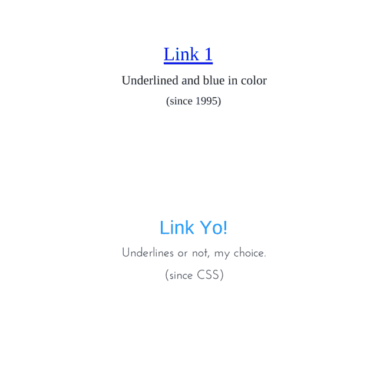

# CSS 样式 HTML 链接

> [https://www.studysouth.com/cascade-style sheet/style-link](https://www.studytonight.com/cascading-style-sheet/styling-links)

超链接是网页的主干。它允许我们链接一组网页，使之成为一个网站。有了 CSS，你可以大大修改这些链接的外观，让你的网页更有吸引力

众所周知，HTML 中的链接是使用`<a>`(锚点)标签创建的。

*示例:*

```
a {
    font-size: 12px;
    color: #222222;
}
```

超链接可以有多种不同的样式，当然，颜色、字体系列、背景等。属性确实对链接起作用，但是它们也可以根据它们所处的**状态**进行样式化。

一个链接可以处于四种类型的状态:

*   **A: Link** → A normal, unaccessed link.
*   **A:** → the link that the user has visited (clicked) before.
*   **A: Hover** → When the user moves the mouse over the link.
*   **A: Activate** → the moment when the link is clicked.

在设置链接状态的样式时，需要记住几个规则。

*   `a:hover` always comes after `a:link` `a:visited`
*   `a:active` is always ranked `a:hover`

之后考虑下面的例子:

[活例→](/code/playground/web?file=css-styling_links)

回想一下我们之前学过的`text-decoration`属性。文本装饰属性用于更改链接的外观，例如删除下划线或添加交叉线。另外，让我们回到背景属性。可以使用`class`和`id`选择器以不同的方式设置链接。所有这些属性都与`<a>`标签一起工作，所以请随意尝试。



* * *

### 小变化带大影响`cursor:pointer;`

每当我们将鼠标悬停在一个链接上，鼠标光标就会从箭头变成手形指针。你想过为什么吗？或者怎么做？使用属性`cursor`完成。可以取各种不同的值，其中`pointer`就是一个。

```
a:hover { 
    color: #000088; 
    **cursor**: *pointer*;
}
```

[活生生的例子→](/code/playground/web?file=css-cursor_pointer)

以下是一些常用的数值对于`cursor`的属性:

*   `cursor:crosshair`
*   `cursor:help`
*   `cursor:move`

*   `cursor:progress`

*   `cursor:wait` and so on.

此外，这不是强制性的，必须仅在链接上使用，这可以与任何 HTML 元素/标签一起使用。

[真人示例→](/code/playground/web?file=css-cursor_property)

* * *

### 将链接样式化为按钮

我们甚至可以将链接样式化为矩形按钮，悬停时改变颜色，就像下面的按钮一样:

这些是链接一旦完成`margin`和`padding`，我们将了解这是如何完成的。如果你不能阻止自己去查看像这些按钮一样的样式链接的 CSS 代码，去[查看教程](styling-link-into-nice-button)。

唷！到目前为止，你已经学习了所有关于选择器、背景和字体的知识。现在是时候进入 CSS 的下一个层次了。接下来是列表、表格和边框设计。继续走！下节课见！

* * *

* * *