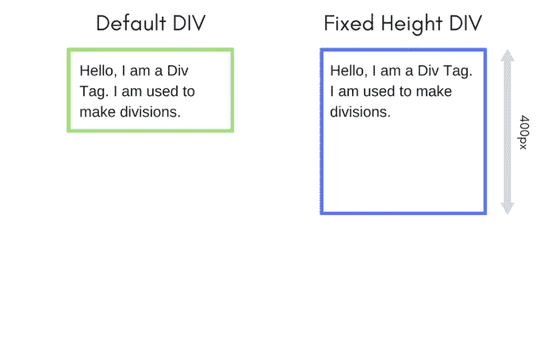

# CSS 溢出-处理额外的内容

> 原文：<https://www.studytonight.com/cascading-style-sheet/css-overflow>

有时候，元素内部的内容越多，就会导致元素外部的内容溢出。CSS `overflow`属性允许我们通过隐藏或者在元素中添加滚动条来处理溢出的内容。

溢出属性可以有以下值:

1.  `visible` →这是默认值。在这种情况下，不会对溢出的内容采取任何操作，它在元素外部也是可见的。
2.  `hidden` →在这种情况下，元素外部溢出的内容变得不可见，即被隐藏。
3.  `scroll` →在这种情况下，一个滚动条被添加到元素中，因此允许它保存其中的所有内容。
4.  `auto` →如果内容较少，这就像`visible`一样，但是当内容开始溢出到外部时，这个属性就开始像`scroll`一样，并给元素添加一个滚动条。

默认情况下，所有的 HTML 标签都是自动调整的，也就是说，它们可以长到无限高，并且可以容纳所有的内容。但是`overflow`属性的需求出现了，在固定高度元素的情况下。



* * *

### 溢出可见`overflow:visible`

这是默认值，允许内容溢出固定高度的元素。

```
div {
    width: 300px;
    height: 50px;
    background-color: #cccccc;
    /* setting overflow visible */
    overflow: visible;
}
```

[现场示例→](/code/playground/web?file=css-overflow_visible)

* * *

### 溢出隐藏`overflow:hidden`

`overflow`属性的这个值通过使元素不可见来隐藏元素外部流动的额外内容。

```
div {
    width: 300px;
    height: 50px;
    background-color: #cccccc;
    /* setting overflow hidden */
    overflow: hidden;
}
```

[现场示例→](/code/playground/web?file=css-overflow_hidden)

* * *

### 溢出滚动`overflow:scroll`

当内容开始溢出时，`overflow`属性的这个值将滚动条引入元素。因此没有隐藏任何内容，您可以使用滚动条轻松滚动并查看完整的内容。

```
div {
    width: 300px;
    height: 50px;
    background-color: #cccccc;
    /* setting overflow scroll */
    overflow: scroll;
}
```

[现场示例→](/code/playground/web?file=css-overflow_scroll)

* * *

### 溢出自动`overflow:auto`

`overflow`属性的这个值作为**默认的**，直到内容变少，随着内容开始溢出，这就像**滚动**。

```
div {
    width: 300px;
    height: 50px;
    background-color: #cccccc;
    /* setting overflow auto */
    overflow: auto;
}
```

[现场示例→](/code/playground/web?file=css-overflow_auto)

* * *

### 关于溢出的更多信息...

我们甚至可以使用`overflow-x`和`overflow-y`属性来控制水平和垂直溢出的不同溢出属性。正如您在上一个实时示例中注意到的，在添加`overflow:scroll`时，引入了水平和垂直滚动条。

```
div {
    overflow-x: hidden; /* Hide horizontal scrollbar */
    overflow-y: scroll; /* Add vertical scrollbar */
}
```

[现场示例→](/code/playground/web?file=css-overflow_xy)

* * *

* * *