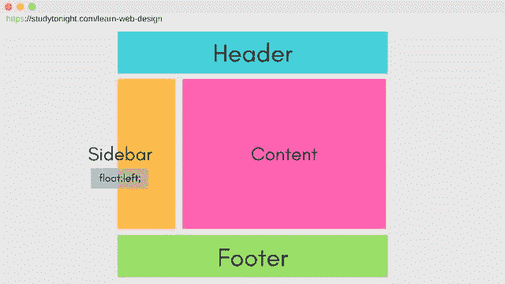

# CSS 中的左右浮动

> 原文：<https://www.studytonight.com/cascading-style-sheet/css-float>

`float`属性用于决定哪个元素浮动，哪个不浮动。

它的值可以是`left`或`right`。具有`float`样式属性的元素浮动在父元素的最末端`left`或最末端`right`侧。

当应用`float`样式属性时，元素不像块级元素那样采用完整的宽度，而是允许其同级元素包围它。

```
p {
    float: left | right;
}
```

[现场示例→](/code/playground/web?file=css-float_right)

* * *

### `clear`属性

每当我们在任何元素上使用`float`属性时，当浮动元素向左或向右移动时，它下面的元素会试图填充浮动元素清空的空间。

这种行为会扭曲你的网页设计。为了避免浮动元素下面的元素包围它，使用了`clear`属性。

通过将`clear:right`样式推送到浮动元素下面的元素，我们通知该元素，不要靠近向右浮动的元素。类似地`clear:left`，保持离开浮动的左侧元素。`clear:both`对两者都有效。

[现场示例→](/code/playground/web?file=css-clear_right)

* * *

### 使用`overflow:auto`黑客

如果我们有一个父元素，里面有一个子元素。并且子元素的高度大于父元素，即子元素比父元素高。现在，如果子元素是浮动的，它会离开父元素并在它上面呈现，将父元素减小到下一个最小大小，也可以为零，使父元素消失。

[现场示例→](/code/playground/web?file=css-overflow_auto_hack)

* * *

### 应用程序:网页布局示例

你知道吗，我们现在可以创建一个简单网页的基本布局。一个网页，它将有一个标题，一个由侧边栏和内容部分组成的正文部分，然后在正文下面有一个页脚。



转到:[设置基本网页结构](basic-webpage-structure)

or just go with the flow and click on **Next**, you will anyways reach there soon.

* * *

* * *