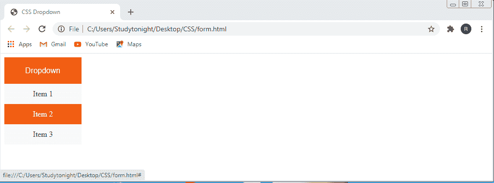
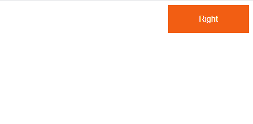

# CSS 下拉列表

> 原文：<https://www.studytonight.com/cascading-style-sheet/css-dropdown>

下拉菜单在使我们的网站具有互动性方面起着非常重要的作用。下拉菜单**是包含项目列表的菜单**。每当用户**点击**或**将光标悬停在**下拉按钮上时，该项目列表就会出现，用户必须从下拉列表中选择一个值。

下拉菜单提供两种状态:活动和非活动。在非活动状态下，仅显示单个列表项，而在活动状态下，下拉菜单中显示的所有项都是可见的，用户必须从中进行选择。当用户选择该值时，控件返回到非活动状态，并且只显示选定的项目。

让我们借助例子更好地理解。

## 示例:创建 CSS 下拉列表

在给定的示例中，我们将创建一个下拉列表。因此，我们使用`<button>`标签创建了一个`dropdown button`，并将其放置在作为父元素的`<div>`元素中。

对于下拉项，我们在下拉按钮后添加了另一个`<div>`元素。第二个`<div>`元素充当下拉项目的父元素。我们将使用`<a>`标签`<a>`在这个`<div>` 中创建下拉项目。

下拉菜单的 HTML 代码如下所示:

```
<!DOCTYPE html>
<html>
<head>
	<title>CSS Dropdown</title>
	</head>
<body>
<div class="dropdown">
	<button class="dropdown_btn">Dropdown</button>
	<div class="dropdown_item">
		<a href="#">Item 1</a>
		<a href="#">Item 2</a>
		<a href="#">Item 3</a>	
	</div>
</div>
</body>
</html>
```

我们必须应用 CSS 代码来提供样式，并为下拉按钮及其项目提供适当的定位。

*   这里`position: relative;` 属性是为`.dropdown`类指定的，将`dropdown items` 放在`dropdown button.`的正下方
*   默认情况下隐藏的下拉项通过应用`.dropdown_item` 类中的所有 CSS 属性来设置样式。
*   当用户将光标移动到下拉按钮上时，`:hover`属性用于显示下拉菜单。

//CSS 代码

```
.dropdown_btn {
  background-color:#f25e13;
  color: white;
  padding: 16px;
  height: 55px;
  width: 160px;
  font-size: 16px;
  border: none;
  cursor: pointer;

}

.dropdown {
  position: relative;
  display: inline-block;
}

.dropdown_item {
  display: none;
  position: absolute;
  background-color: #f9f9f9;
  min-width: 160px;
  z-index: 1;
}

.dropdown_item a {
  color: black;
  padding: 12px 16px;
  text-align: center;
  text-decoration: none;
  display: block;
}

.dropdown_item a:hover {background-color:  #f25e13;
	color: white;
}

.dropdown:hover .dropdown_item {
  display: block;
}

.dropdown:hover .dropdown_btn {
  background-color:  #f25e13;
} 
```

### 输出:



## CSS 中右对齐的下拉菜单

默认情况下，下拉列表的位置是左上角。因此，无论何时我们将创建一个下拉按钮，我们将不会指定位置，那么默认情况下，它将自己定位到父元素的左上角。让我们通过一个例子来学习如何在父元素的右边创建一个下拉列表。

## 示例:在 CSS 中创建右对齐的下拉菜单

在这个例子中，我们创建了一个右对齐的下拉列表。创建右对齐下拉按钮的步骤与上一步相同。我们刚刚又增加了一个 CSS 属性`float`，值为`right`。此属性将下拉按钮浮动到网页的右侧。

**// HTML 代码**

```
<!DOCTYPE html>
<html>
<head>
	<title>CSS Dropdown</title>
</head>
<body>
<div class="dropdown" style="float:right;">
  <button class="dropdown_btn">Right</button>
  <div class="dropdown_item" style="left:0;">
  <a href="#">Item 1</a>
  <a href="#">Item 2</a>
  <a href="#">Item 3</a>
  </div>
</div>
</body>
</html> 
```

//CSS 代码

```
.dropdown_btn {
		  background-color:#f25e13;
		  color: white;
		  padding: 16px;
		  height: 55px;
		  width: 160px;
		  font-size: 16px;
		  border: none;
		  cursor: pointer;

		}

		.dropdown {
		  position: relative;
		  display: inline-block;
		}

		.dropdown_item {
		  display: none;
		  position: absolute;
		  right: 0;
		  background-color: #f9f9f9;
		  min-width: 160px;
		  z-index: 1;
		}

		.dropdown_item a {
		  color: black;
		  padding: 12px 16px;
		  text-align: center;
		  text-decoration: none;
		  display: block;
		}

		.dropdown_item a:hover {background-color:  #f25e13;
			color: white;
		}

		.dropdown:hover .dropdown_item {
		  display: block;
		}

		.dropdown:hover .dropdown_btn {
		  background-color:  #f25e13;
		}
```

### 输出:

###  

# Navbar 下拉列表

导航栏是一个总是放在网页顶部的导航标题。导航栏由导航菜单组成，用户只需点击导航栏的菜单项，就可以访问网站的不同页面。也有可能一些菜单有它们的子菜单。因此，我们可以使用下拉菜单创建子菜单，并轻松地向任何菜单项添加类似的子菜单。

下面是 navbar 下拉列表的例子。

**HTML:** 在给定的示例中，我们添加了`<div>` 元素以及类`.navbar`来创建导航栏菜单。

使用`<button>`元素创建下拉按钮。

同样，`<div>`元素用作创建下拉子菜单项的容器元素。这个`<div>`元素也用于为下拉子菜单提供正确的对齐和定位。

**CSS:** 我们使用 CSS `background-color` 属性为`navbar`、`nav-items`和`dropdown buttons`提供背景颜色。通过指定 CSS `padding`属性来增加导航条边框和导航项目之间的空间。

`.dropdown_menu`类包含实际的下拉菜单。此菜单是`hidden` 由`default`和可`visible`当用户`moves`将`cursor` 置于下拉按钮之上。这可以通过应用`:hover`属性来实现。我们还指定了`box-shadow`属性和`z-index`属性，前者用于使下拉菜单看起来像卡片，后者用于将下拉菜单放在其他元素前面。

# 结论

在这一课中，我们学习了下拉菜单，如何使用 CSS 创建它们，以及如何向它们添加子菜单。此外，我们还有如何创建一个右对齐的下拉菜单和带有下拉菜单的导航栏。

* * *

* * *