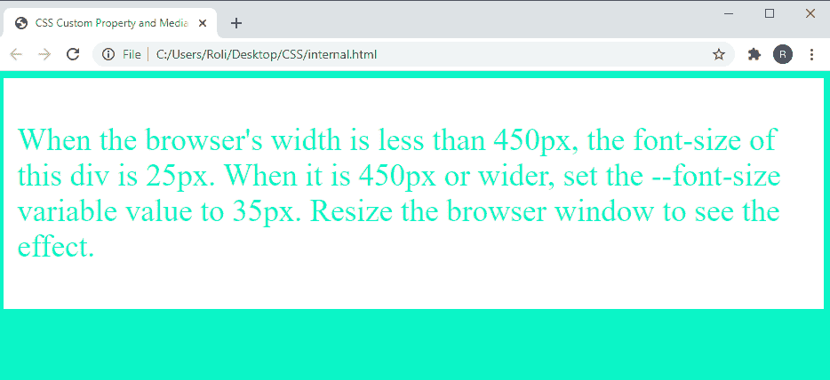

# CSS 自定义属性和媒体查询

> 原文：<https://www.studytonight.com/cascading-style-sheet/css-custom-properties-and-media-queries>

CSS 自定义属性本质上是动态的，这意味着它允许我们**定义**和**重新定义**自定义属性的**值，甚至在**媒体查询**中也是如此。我们可以在`@media`中执行自定义属性的所有任务，我们可以在 HTML 元素中执行这些任务。**

### CSS 媒体查询的语法

```
@media screen and (max-width: 900px) {
element {
/* CSS property*/ 
}
}
```

### 示例:指定 CSS 媒体查询

在这个例子中，我们首先在`:root`元素中声明了一个自定义属性`--font-size`，并在`.container`类中使用它。然后，我们创建了一个`@media`规则，指定当浏览器的宽度为 **450px** 和**更多**时，`.container`类的字体大小值变为 **50px** 。

```
<!DOCTYPE html>
<html>
<head>
	<title>CSS Custom Property and Media Query</title>
	<meta name="viewport" content="width=device-width, initial-scale=1">
	<style>
		/* Variable declarations */ 
		:root {
		  --blue:#97f7ec;
		  --white: #ffffff; 
		}

		.container {
		  --font-size: 25px;
		}

		/* Styles */ 
		body {
		  background-color: var(--blue);
		}

		h2 {
		  border-bottom: 2px solid var(--blue);
		}

		.container {
		  color: var(--blue);
		  background-color: var(--white);
		  padding: 15px;
		  font-size: var(--fontsize);
		}

		@media screen and (min-width: 450px) {
		  .container {
		    --font-size: 50px;
		  }
		}
	</style>
</head>
<body>
<div class="container">
  <p>When the browser's width is less than 450px, the font-size of this div is 25px. When it is 450px or wider, set the --font-size variable value to 50px. Resize the browser window to see the effect.</p>
</div>
</body>
</html> 
```

### 输出:



## 活生生的例子

在给定的示例中，我们在`: root`伪类中创建了两个自定义属性`--blue`和`--white`，在`.container` 类中创建了一个自定义属性( **- fontsize** )。然后我们指定了媒体查询所以，当浏览器`width`是**450 px****比那个多**时`font-size`从 **15px** 变成**35px**`background-color`从**浅绿色**变成**浅蓝色**。

## 结论

在本课中，我们学习了如何在 CSS 中实现媒体查询。我们还学习了如何使用媒体查询来更改特定屏幕尺寸下的属性值。

* * *

* * *