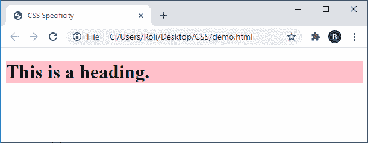
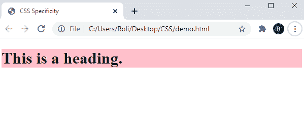

# CSS 特异性

> 原文：<https://www.studytonight.com/cascading-style-sheet/css-specificity>

CSS 特性是一种方法，当两组或多组 CSS 属性应用于一个特定元素时应用。这个方法帮助浏览器决定哪组 CSS 属性在所有属性中更相关。

有时会发生一些元素无法获取 CSS 属性的情况，这是因为 CSS 的特殊性。

## CSS 中的特定层次结构

具体来说，在将 CSS 属性应用于元素时，浏览器遵循选择器的层次结构。通常，特异性层次结构分为四个部分，用于描述选择器的级别:

`Inline styles -`内联样式作为样式属性值直接附加到元素上。

`IDs-` 标识充当特定元素的唯一标识符。

`Classes, attributes, and pseudo-classes -`该类别由类、属性和伪元素组成，如`.class`、`hover`、
、`:focus`等。

`Elements and pseudo-elements -` 该类别由一个元素名称和伪元素组成，如`div`、`p,`、`::before`、`::after`等。

## 特异性规则

### 规则 1:同等具体:最新的规则最重要

如果在 CSS 文件中多次指定具有不同值的相同 CSS 属性，则稍后声明的属性被认为更接近元素，并且将被应用。

### **示例:**同等特异性:最新规则计数

在给定的示例中，我们用不同的值为 `<h1>`元素指定了 CSS 属性`background-color`两次。首先，我们确定了`background-color`房产的价值为`red`，然后是`pink`。

```html
<!DOCTYPE html>
<html>
<head>
  <title>CSS Specificity</title>
  <style>
    h1 { background-color: red; }
    h1 { background-color: pink; }
  </style>
</head>
<body>
  <h1>This is a heading.</h1>
</body>
</html>
```

### 输出:

正如我们在输出图像中所看到的，标题的背景颜色是粉红色的，这是我们稍后指定的。



### 规则 2:标识选择器比属性选择器具有更高的特异性值。

在给定的示例中，我们以三种不同的方式为同一元素设置了 CSS 属性。因此，根据这个规则，元素接受为 id 选择器声明的属性。

```html
<!DOCTYPE html>
<html>
<head>
	<title>CSS Specificity</title>
	<style>
		h1#head {background-color: pink;}
		#head {background-color: yellow;}
		h1[id=head] {background-color: blue;}
	</style>
</head>
<body>

<h1 id="head">This is a heading.</h1>

</body>
</html> 
```

### 输出:

### 

**规则 3:** 上下文选择器比单个元素选择器具有更高的特异性。

**规则 4:** 类选择器比元素选择器具有高得多的特异性值。

**规则 5:** 通用选择器和继承选择器的特异性值为 0。

### 身体和*由特异性值零(0)组成。

## **现场示例**

在给定的示例中，我们以两种不同的方式为同一个元素设置了 CSS 属性，一种是元素名称，另一种是类名。因此根据这个规则，类选择器比元素选择器更优先，元素获得在类选择器中设置的属性。

### 结论:

在本课中，我们学习了 CSS 特性以及浏览器在将 CSS 属性应用于元素时遵循的选择器层次结构。我们还学习了下面给出的特异性规则:

*   同等特异性:最新的规则起作用。
*   标识选择器比属性选择器具有更高的特异性值。
*   上下文选择器比单个元素选择器具有更高的特异性。
*   类选择器比元素选择器具有更高的特性值。
*   通用选择器和继承选择器的特异性值为 0。

* * *

* * *