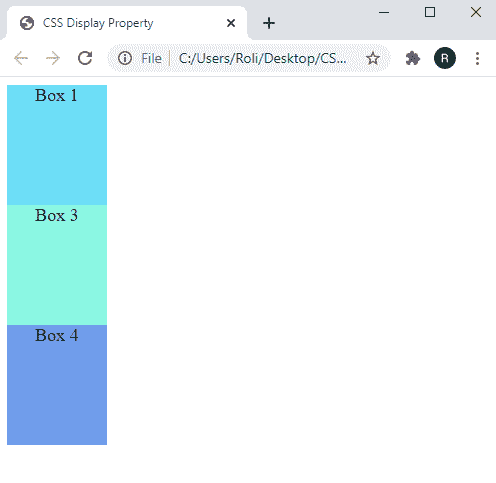
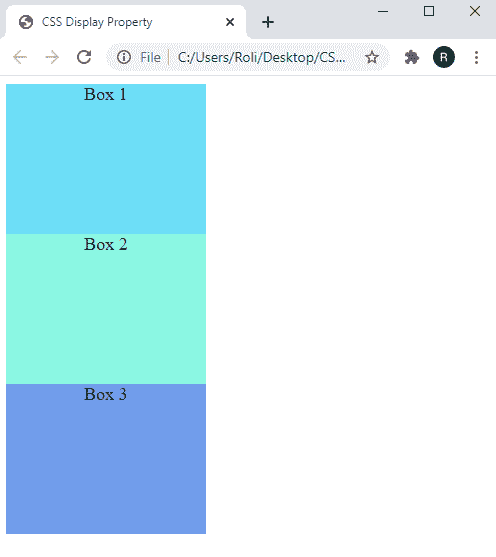

# CSS 显示

> 原文：<https://www.studytonight.com/cascading-style-sheet/css-display>

“CSS 显示”属性是控制 HTML 元素布局的最常用属性。此属性指定 HTML 元素在网页上的显示方式。

网页将每个 HTML 元素(div，p，heading)视为一个矩形框，CSS display 属性有助于设置这些框的位置。

### CSS 显示属性的语法

```html
display: value; 
```

## 显示值

CSS display 属性有几个值，下面给出了其中最常用的值:

*   在一条直线上的
*   没有人
*   街区
*   内联块

## CSS 内联值

`inline` 显示值将元素设置为内嵌元素，这意味着元素并排放置或在一条线上(水平放置)。该属性只提供任何元素所需的空间。每当为 HTML 元素指定`display: inline`属性时，该元素不接受高度、宽度、上下边距属性。

### CSS 内联值的语法

```html
display: inline;
```

### 示例:指定 CSS 内联值

在给定的示例中，我们创建了 4 个 **< div >** 元素。一般来说，这 4 个 **< div >** 元素的内容是**在网页上垂直显示**，也接受给定的**高度**和**宽度**。但是，我们已经将 CSS `display: inline`属性应用到了 **< div >** 元素，因此这个 **< div >** 元素的内容是并排显示的，并且只根据需要取尽可能多的**高度**和**宽度**。

```html
<!DOCTYPE html>
<html>
<head>
	<title>CSS Display Property</title>
	<style>
		div {
			display: inline;
			height: 120px;
			width: 100px;
			color: white;
			background-color: black;
		}
	</style>
</head>
<body>
<div>Box 1</div>
<div>Box 2</div>
<div>Box 3</div>
<div>Box 4</div>
</body>
</html>
```

### 输出:

正如我们在输出中看到的，这些盒子并排放置，占据了它们所需的空间。


## CSS 无值

CSS 显示`none` 值删除了 HTML 元素，并且在被删除的元素处也不显示任何空格。移除的元素存在于 HTML 结构中，但不会显示在网页上。

### CSS 无值的语法

```html
display: none;
```

### 示例:指定 CSS 无值

在给定的示例中，我们借助**<【div】>**元素创建了四个框。我们已经通过应用 CSS `display: none` 属性移除了第二个框。因此，当我们运行给定的代码时，第二个框不会显示在网页上，但它存在于 HTML 结构中。

```html
<!DOCTYPE html>
<html>
<head>
	<title>CSS Display Property</title>
	<style>
		.class1 {
			height: 120px;
			width: 100px;
			color: black;
			font-size: 18px;
			text-align: center;

		}
		.class2{
			display: none;
		}
	</style>
</head>
<body>
<div class="class1" style="background-color: #6ddef7;">Box 1</div>
<div class="class2">Box 2</div>
<div class="class1"  style="background-color: #8bf7e3;">Box 3</div>
<div class="class1"  style="background-color: #719deb;">Box 4</div>
</body>
</html>
```

### 输出



## CSS 块值

CSS 显示`block`值占据了屏幕的整个宽度。这些值将每个元素的内容放在一个新行中，并允许它们作为一个单独的块。有一些 HTML 元素的默认显示值是 block 这些元素是< div >、< p >、< ul >等。

**注意:**用户可以根据需要设置块的高度和宽度。

### CSS 块值的语法

```html
display: block;
```

### 示例:指定 CSS 块值

在给定的示例中，我们使用 **< span >** 元素创建了 3 个框，并设置了 CSS 属性`display: block;`。 **< span >** 元素的默认显示值是内联的，我们在此基础上创建的框并排显示，仅占用所需的高度和宽度。但是我们已经设置了`display: block` 属性及其**高度**和**宽度**。因此，这使得每个块显示在单独的行中。

```html
<!DOCTYPE html>
<html>
<head>
	<title>CSS Display Property</title>
	<style>
		span {
			display: block;
			color: black;
			font-size: 18px;
			height: 150px;
			width: 200px;
			text-align: center;
		}

	</style>
</head>
<body>
<span style="background-color: #6ddef7;">Box 1</span>
<span style="background-color: #8bf7e3;">Box 2</span>
<span style="background-color: #719deb;">Box 3</span>

</body>
</html>
```

### 输出



## CSS 内联块值

`inline-block` 提供了值**内联**和**块**的属性。每当我们想要并排(内嵌)放置内容，并且想要设置元素的高度、宽度和边距时，都会使用该值。

### CSS 内联块值的语法

```html
display: inline-block;
```

### 示例:指定 CSS 内联块值

在给定的示例中，我们使用 **< div >** 元素创建了三个框。这个的默认布局是垂直的，因为 **< div >** 元素的默认显示值是 **block** 。然后，我们指定了显示:内联块由于这个属性，布局由值**内嵌**和**块**的属性组成。该布局的块并排放置(直列)，并接受**高度**和**宽度**的**值。**

## 其他显示值

元素。元素。元素。

| **序列号** | **值** | **描述** |
| --- | --- | --- |
| 1. | 弹性 | 该值将元素显示为块级 flex 容器。 |
| 2. | **直列伸缩** | 该值将元素显示为内联级别的 flex 容器。 |
| 3. | **网格** | 该值将元素显示为块级网格容器。 |
| 4. | **直列网格** | 该值将元素显示为内联级网格容器。 |
| 5. | **直列表** | 该值将元素显示为内联级表。 |
| 6. | **列表项** | 该值使元素表现为*   Elements. |
| 7. | **磨合** | 该值在块或内嵌布局中显示为元素。 |
| 8. | **表** | 该值允许元素的行为类似于表元素。 |
| 9. | **表格标题** | 该值允许元素表现为 |<caption>元素。</caption>
| 10. | **表-列-组** | 该值允许元素表现为 |
| 11. | **表格-表头-组** | 该值允许元素表现为 |
| 12. | **表格-页脚-组** | 该值允许元素表现为 |
| 13. | **初始** | 该值设置元素的默认属性，不接受其他 CSS 属性。 |
| 14. | **继承** | 该值允许元素继承其父元素的属性。 |

## 结论

在本课中，我们学习了 CSS 显示属性及其工作原理。此外，我们还了解了 display 属性的值，以及每个值如何以不同的方式更改布局。数值如下:

*   在一条直线上的
*   没有人
*   街区
*   内联块

* * *

* * *