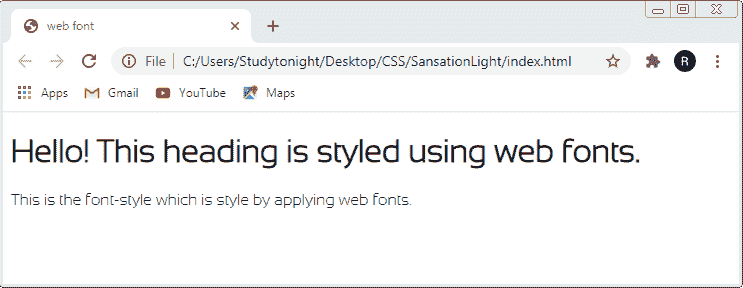

# CSS 网页字体

> 原文：<https://www.studytonight.com/cascading-style-sheet/css-web-fonts>

CSS 网页字体允许用户使用用户系统不支持或未安装的字体。

当你想使用一种非常罕见并且不是所有系统都支持的字体时，那么在你的网络服务器上包含该字体文件，当用户需要时它会自动下载。

**注意:**要在 CSS 中定义自己的字体，我们必须使用`@font-face rule`。

### CSS 网页字体的语法

```html
@font-face {

/* font details */
font-family: value;
src: url('');

}
```

## CSS 中网页字体的类型

*   TrueType 字体(TTF)
*   OpenType 字体(OTF)
*   网络开放字体格式(WOFF)
*   网络开放字体格式(WOFF 2.0)
*   SVG 字体/形状
*   嵌入式开放式字体

### TrueType 字体(TTF)

TrueType Fonts 是 20 世纪 80 年代由微软和苹果开发的字体标准。这是一种非常常见的字体格式，适用于苹果操作系统和微软视窗系统。

### OpenType 字体(OTF)

OpenType 是一种可用于可缩放计算机字体的字体格式。这是在 TrueType 上开发的，是微软的注册商标。OpenType 字体现在是主要计算机平台上使用最多的网络字体。

### 网络开放字体格式(WOFF)

WOFF 字体格式主要用于网页。它是在 2009 年开发的，是 W3C 的推荐。WOFF 基本上是一个带有压缩和附加元数据的 OpenType 和 TrueType。这种字体格式实现了在带宽受限的网络上从服务器到客户端的字体分发。

### 网络开放字体格式(WOFF 2.0)

这个版本的 WOFF 提供了比 WOFF 1.0 更好的压缩。

### SVG 字体/形状

SVG 字体允许用户在显示文本时使用 SVG 作为字形图标。SVG 1.1 规范定义了一个字体模块，允许在 SVG 文档中创建字体模块。用户可以将 CSS 应用于 SVG 文档，并且@font-face 规则可以应用于 SVG 文档中的文本。

### 嵌入式开放式字体

嵌入式字体是由微软设计的一种密集的 OpenType 字体。EOT 用作网页上的嵌入字体。

示例:在 CSS 中实现网页字体

```html
<!DOCTYPE html>
<html class="no-js">
    <head>
        <meta charset="utf-8">
        <meta http-equiv="X-UA-Compatible" content="IE=edge">
        <title> web font</title>
        <style type="text/css">
		@font-face {
    font-family: 'SansationLight';
    src: url('./SansationLight.eot');
    src: local('SansationLight'), url('./SansationLight.woff') format('woff'), url('./SansationLight.ttf') format('truetype');
}
.para {
    font-family: 'SansationLight' !important;
}
		h1 {
			font-family: 'SansationLight';
		}
		</style>
    </head>
    <body>
        <h1>Hello! This heading is styled using web fonts.</h1>
    	<p class="para">This is the font-style which is style by applying web fonts.</p>
    </body>
</html>
```

### 输出



## 字体描述符

| **描述符** | **值** | **描述** |
| **字体系列** | 名字 | **字体系列**描述符定义了字体的名称。(必需) |
| **src** | 统一资源定位器 | **src** 描述符定义字体文件的网址。(必需) |
| **字体拉伸** | 正常、浓缩、半浓缩、超浓缩、超浓缩、膨胀、半膨胀、超膨胀、超膨胀。 | 字体拉伸描述符指定应该如何拉伸字体。(可选) |
| 字体风格 | 正常、斜体、倾斜 | 字体样式描述符指定应该如何设置字体样式。(可选) |
| **字体粗细** | 正常，粗体，100。200, 300, 400, 500, 600, 700, 800, 900 | 字体粗细指定字体的粗细。(可选) |
| **Unicode 范围** | Unicode 范围 | Unicode 范围描述符指定字体支持的 Unicode 字符范围。(可选) |

## 结论

在本模块中，我们学习了 CSS 网页字体。此外，下面给出了网页字体的类型:

*   TrueType 字体(TTF)
*   OpenType 字体(OTF)
*   网络开放字体格式(WOFF)
*   网络开放字体格式(WOFF 2.0)
*   SVG 字体/形状
*   嵌入式开放式字体

* * *

* * *