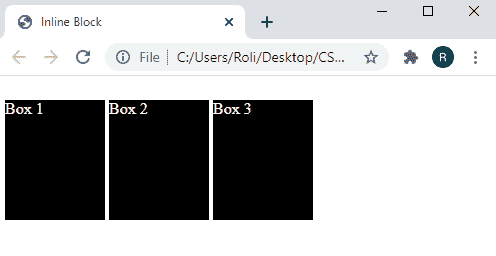

# 内嵌块

> 原文：<https://www.studytonight.com/cascading-style-sheet/css-inlineblock>

在 CSS 中，显示属性是最常用的属性之一。它基本上控制块中任何元素的显示行为。display 属性有许多值，inline-block 就是其中之一。

## `inline-block`CSS 中的值

该值具有内联值和块值的特征。此属性用于为之前使用浮动对齐的布局提供正确的对齐方式。

与`display: inline-block`的`display: inline;` 属性相比，不同之处在于`inline-block` 值允许用户设置元素的高度和宽度。该值还防止换行，这意味着一个元素可以放在块中其他元素的旁边。

### 示例:指定`inline-block` 值

在给定的示例 1 中，`display: inline-block`属性与`height`和`width`属性一起被指定给 **< p >** 元素。如果我们将`height`和`width` 属性与`display: inline;`一起指定，则给定的高度和宽度不适用于该元素。它将只采用默认的高度和宽度，这将在下一个实例中实现。

```
<!DOCTYPE html>
<html>
<head>
	<title>Inline Block</title>
	<style>
		p{
			display: inline-block;
			height: 120px;
			width: 100px;
			color: white;
			background-color: black;
		}
	</style>
</head>
<body>
<p>Box 1</p>
<p>Box 2</p>
<p>Box 3</p>
</body>
</html>
```

### 输出:

正如我们在输出图像中看到的那样，即使当 **< p >** 是**块级**元素时，这些框也是并排放置的。这是因为我们将 CSS 属性`display`指定为**内联**的值。



## 实时示例:在 CSS 中指定`display`值

在本例中，我们指定了`display: inline`属性而不是`display: inline-block`，那么我们使用 **< p >** 元素创建的块将不会采用给定的**高度**和**宽度**。只取默认的**高度**和**宽度**。

## 结论

在本课中，我们学习了 display 属性的内联块值是如何工作的，以及它与 display 属性的内联值有何不同。

* * *

* * *