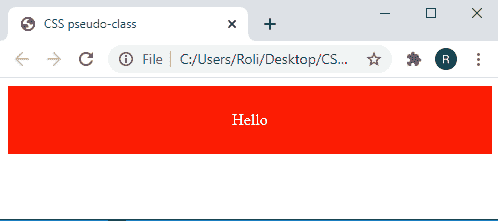
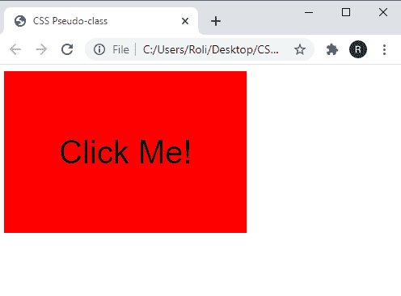

# CSS 伪类

> 原文：<https://www.studytonight.com/cascading-style-sheet/css-pseudoclass>

CSS 伪类是带有前置冒号的 CSS 特殊字符，用于向元素添加特殊效果。CSS 伪类与 CSS 选择器一起使用，为任何现有的 HTML 元素提供特殊效果。

**语法**

```
selector: pseudo-class {

property: value;

}
```

**示例**

*   **:悬停**用于在光标移动到任何元素或按钮上时改变其颜色。
*   **:已访问**伪类通过将链接的颜色从蓝色变为紫色来显示已访问的链接。

## 伪类

CSS 提供了几个伪类，其中最常用的类及其解释和实现如下:

### 悬停伪类

当我们想要给任何按钮或元素一些效果时，使用:hover 类。基本上，当我们将光标移到元素或按钮上时，这个类会改变它的颜色。

### **语法**

```
HTML element/selector :hover {

/*CSS property*/

}
```

### **例**

在给定的示例中，我们使用**<>**元素创建了一个块，并且还将**:悬停**属性设置为**<>**元素。块的背景颜色设置为**红色**，当我们将光标移动到块上时，颜色变为**黄色**。

```
<!DOCTYPE html>
<html>
<head>
	<title>CSS pseudo-class</title>
	<style>
		div {
		  background-color: #fc1c03;
		  color: white;
		  padding: 25px;
		  text-align: center;
		}

		div:hover {
		  background-color: #fcba03;
		}
	</style>
</head>
<body>

<div>Hello</div>

</body>
</html> 
```

## 输出



## CSS:活动伪类

**:激活**伪类的目的是当用户点击任何元素或链接时激活它。

### **语法**

```
HTML element/selector :active {

/* CSS Property*/

}
```

### **例**

在给定的示例中，我们使用 **<按钮>** 元素创建了一个按钮，并设置了按钮的高度、宽度和边距属性。然后，我们设置**按钮:激活**属性，当有人点击按钮时，该属性允许按钮改变颜色。

```
<!DOCTYPE html> 
<html> 
<head> 
    <title>CSS Pseudo-class</title> 
    <style> 
    button{ 
        background-color: red; 
        width: 300px; 
        height: 200px; 
        margin: auto; 
        font-size: 40px; 
        text-align: center; 
        border: none;
    } 

    button:active{ 
        background-color: yellow;
        border: none; 
    } 

    </style> 
</head> 

<body> 
     <button>Click Me!</button> 
</body> 
</html> 
```

## 输出



## CSS:访问了伪类

**:已访问**伪类用于突出显示用户已经访问过的链接。默认情况下，当用户单击链接时，此类将链接的颜色从蓝色变为紫色。

### **语法**

```
HTML element/selector:visited {

/* CSS Property*/

}
```

### **例**

在给定的示例中，通过使用 **<和>** 标签来创建链接。然后，CSS 属性 **a:已访问**被设置为每当我们点击链接时，链接的颜色都会改变。

## 其他 CSS 伪类

| 

### No in the south.

 | 

### Pseudo-class

 | 

### Description

 |
| **1。** | **:勾选** | 当我们想给<input>元素的选中属性设置一些 CSS 属性时，会用到这个伪类。此类选择所有选中的属性元素，并将属性应用于所有这些元素。 |
| **2。** | **:禁用** | 这个伪类禁用了所有的<input type=" text">字段，并为它们提供了浅灰色的背景色。 |
| **3。** | **:空** | 这个伪类用于为所有没有子元素的元素设置样式。 |
| **4。** | **:启用** | 当我们想要启用所有<input type=" text">字段时，使用这个伪类。 |
| **5。** | **:第一个孩子** | 这个伪类用于为任何 HTML 元素的第一个子元素设置样式。 |
| **6。** | **:聚焦** | 每当用户点击任何元素时，这个伪类都被用来聚焦它。 |
| **7。** | **:范围内** | 这个伪类用于将 CSS 属性设置为在特定范围内有值的所有元素。 |
| **8。** | **:无效** | 此伪类用于设置表单元素的样式属性，这些属性不会根据元素的设置进行验证。 |
| **9。** | **:郎** | 这个伪类用于为所有具有阿郎属性的元素设置样式。 |
| **10。** | **:最后一个孩子** | 这个伪类用于将 CSS 属性设置为 HTML 元素的所有最后一个子元素。 |
| **11 时。** | **:链接** | 这个伪类用于设计网页中所有未访问链接的样式。用户不能为已经访问过的链接设置样式。 |
| **12 时。** | **:不是** | 这个伪类为那些没有在:not selector 中指定的元素设置样式。 |
| **13。** | **:第 n 个子(n)** | 这个伪类用于为任何 HTML 元素的第 n 个子元素提供样式，而不考虑其类型和父元素。 |
| **14。** | **:第 n 种类型(n)** | 这个伪类用于将 CSS 属性设置为特定类型的 HTML 元素的第 n 个子元素，从最后第 n 个元素开始计数。n =数字、关键字或公式。 |
| **15。** | **唯一类型** | 当我们想要为元素设置 CSS 样式属性时，使用这个伪类，元素是它的类型或它的父元素的唯一子元素。 |
| **16。** | **:第 n 个最后类型(n)** | 这个伪类用于将 CSS 属性设置为特定类型的 HTML 元素的第 n 个子元素，从最后一个子元素开始计数。 |
| **17。** | **:独生子女** | 这个伪类选择并设置所有元素的 CSS 属性，这些元素是其父元素的唯一子元素。 |
| **18。** | **：可选** | 这个伪类用于为没有属性的表单元素设置样式。 |
| **19。** | **:超范围** | 这个伪类用于为具有最小或最大属性的<input>元素设置 CSS 属性。 |
| **20。** | **:只读** | 该伪类用于将 CSS 属性仅设置为那些具有只读属性的<input>元素。 |
| **21。** | **:读写** | 这个伪类用于将 CSS 属性设置为<input>元素，该元素可读或可写，没有只读和禁用属性。 |
| **22。** | **:必选** | 该伪类用于将 CSS 属性设置为由所需属性组成的

<form>元素。这只能应用于输入、选择和文本区域。</form>

 |
| **23。** | **:根** | 这个伪类用于设置网页根元素的 CSS 属性，默认情况下是元素。 |
| **24。** | **:目标** | 这个伪类用于设置所有活动目标链接的 CSS 属性。这基本上用于 |
| **25。** | **:有效** | 该伪类用于表单元素，如带有电子邮件字段、文本区域、最小值或最大值等的输入元素。所以这个类基本上是用来在用户通过改变样式属性输入不正确的值时指示错误的。 |
| **26。** | **:参观了** | 这个伪类用于选择被访问的链接。 |
| **27。** | **:激活** | 这个伪类用于设置活动链接的样式。 |
| **28。** | **:首创** | 这个伪类用于为元素的第一个子元素 CSS 元素设置样式。 |
| **29。** | **:悬停** | 当我们想要在任何元素、按钮或链接上移动光标时改变颜色时，使用这个伪类。 |
| **30。** | **:最后一种** | 这个伪类用于对其父类的特定类型的最后一个子类进行样式化。 |

* * *

* * *