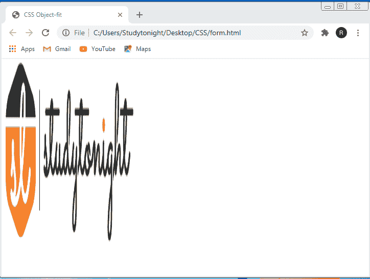

# CSS 对象适配

> 原文：<https://www.studytonight.com/cascading-style-sheet/css-objectfit>

CSS 对象适配属性指定元素应该如何调整大小以适合其容器元素。它专门用于图像、视频和其他嵌入式媒体格式。此属性的目的是通过拉伸或收缩父容器内部的元素来填充父容器，而不管其纵横比如何。

### CSS 中的对象适配属性示例

在给定的示例中，我们已经自行设置了图像的`height`和`width` 。但是，我们可以看到`image` 正在被拉伸以适合`250px * 350 px`的容器，其原始长宽比被破坏。

```
<!DOCTYPE html>
<html>
<head>
  <title>CSS Object-fit</title>
  <style>
    img {
      width:250px;
      height:350px;

    }
  </style>
</head>
<body>
  
</body>
</html> 
```

### 输出:



## CSS 对象拟合的值

对象拟合属性有五个不同的值。这些内容如下:

| **序列号** | **值** | **描述** |
| **1。** | **填充** | **填充**是允许元素填充内容框的默认值。如果元素的实际比例与盒子的实际比例不匹配，那么元素将拉伸或收缩自身以适应盒子。 |
| **2。** | **包含** | 包含值的**增加或减少元素的大小以填充容器，并保持其纵横比。** |
| **3。** | **盖** | **cover** 值用于在填充元素的整个内容框时保持元素的纵横比。如果元素的长宽比与其容器的长宽比不匹配，则元素将被剪裁以适合盒子。 |
| **4。** | **无** | **无**值不会调整元素的大小以适应容器框。元素保持其原始大小，并忽略父元素的高度和宽度。 |
| **5。** | **缩小** | 元素的大小就像没有指定或指定了 contain 一样，这将导致最小的具体对象大小。 |

## 示例:在 CSS 中应用对象拟合的所有值

在给定的示例中，我们演示了`object-fit` 属性的所有可能值:

## 结论

在本文中，我们学习了如何使一个元素适合它的容器元素。这可以使用 object-fit 属性来完成，通过使用它的各种值，您可以根据自己的需要调整其父元素中的元素。

* * *

* * *