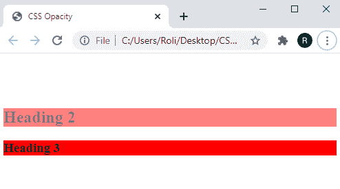
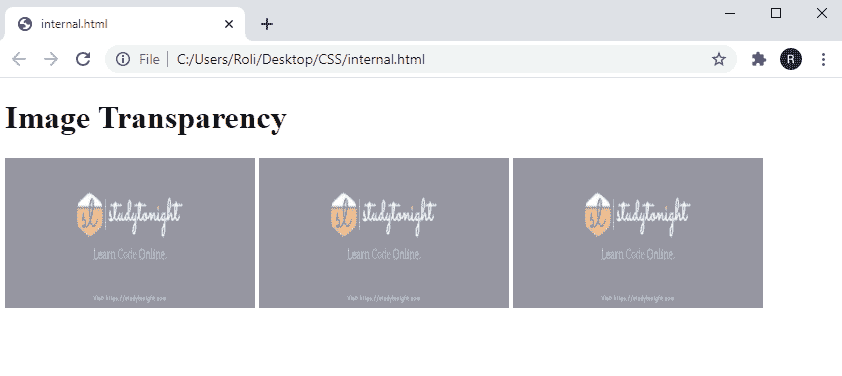

# CSS 不透明度

> 原文：<https://www.studytonight.com/cascading-style-sheet/css-opacity>

CSS 不透明度属性决定了元素在从 **0.0** 到 **1.0** 之间的透明度。不透明度值越大，元素越清晰。当值为 **1.0** 也是默认值时，元素是完全透明或清晰的，在 **0.5** 时，元素显示**相当模糊**，在 **0.0** 时，元素是**完全不透明的。**

### CSS 中不透明度属性的语法

```html
HTML element{

opacity: value; 

}
```

### 示例:对 HTML 元素应用不透明度

在给定的示例中，我们使用

# 、

## 和

### 元素创建了三个标题。在**标题 1** 中，我们将**不透明度值指定为 0.0** ，在**标题 2** 中，我们将**不透明度值指定为 0.5** `**,**`，在**标题 3** 中，我们将**值指定为**1.0。

```html
<!DOCTYPE html>
<html>
<head>
	<title>CSS Opacity</title>
	<style> 
		h1 {
		  background-color: red;
		  opacity: 0.0;
		}
		h2{
			opacity: 0.5;
			background-color: red;

		}
		h3{
			opacity: 1.0;
			background-color: red;
		}
	</style>
</head>
<body>
	<h1>Heading 1</h1>
	<h2>Heading 2</h2>
	<h3>Heading 3</h3>
</body>
</html> 
```

### 输出:

所以实现后我们能看到的是，值为 **0.0** 的**标题 1** 根本看不到**。在**不透明度****值为 0.5** 的标题 2** 中，内容为**相当模糊**但**可见**，而在**不透明度**值为 1.0** 的标题 3** 中，内容为清晰可见**。******

 ****

## CSS 中的透明和悬停效果

CSS 允许我们使用 CSS 不透明度和`:hover`效果。当我们为任何元素提供悬停效果时，当用户将鼠标悬停在它上面时，它的不透明度会发生变化。

### 示例:在 CSS 中应用透明和悬停效果

在这个例子中，有**三个图像**，每个图像都有一个**不同的不透明度值**以及**悬停效果**。当用户将光标移动到任何图像上时，它将再次变得透明。

```html
<!DOCTYPE html>
<html>
<head>
<style>
img {
  opacity: 0.5;
}

img:hover {
  opacity: 1.0;
}
</style>
</head>
<body>

<h1>Image Transparency</h1>


</body>
</html> 
```

### 输出:

正如我们所看到的，这三个图像都是模糊的，因为我们已经指定了 CSS 属性**不透明度**，其**值为 0.5** 。当我们**将**光标**移动到任意**图像**上时，它将再次变为**透明**，因为我们已经在**悬停效果后将**不透明度**的值指定为 **1** 。****



## 在 CSS 透明框中添加文本

在 CSS 的帮助下，我们还可以在图像上插入文本以及不透明度属性。让我们借助一个实例来理解它。

### 示例:使用 CSS 不透明度在透明框中添加文本

在这个例子中，我们用类`.background`创建了一个 **< div >** 元素，并指定了 CSS 属性`background-image`和`border`。然后我们用类**创建了另一个 **< div >** 。** `transbox` 内第一 **<分区>。**在`.transbox`类中，我们添加了 **< p >** 元素来插入文本。

## 结论

在本课中，我们学习了如何使用 CSS 不透明度属性使图像模糊或不可见。我们还学习了如何通过应用不透明度属性使图像透明。借助这个属性，我们还可以使文本模糊。

* * *

* * *****