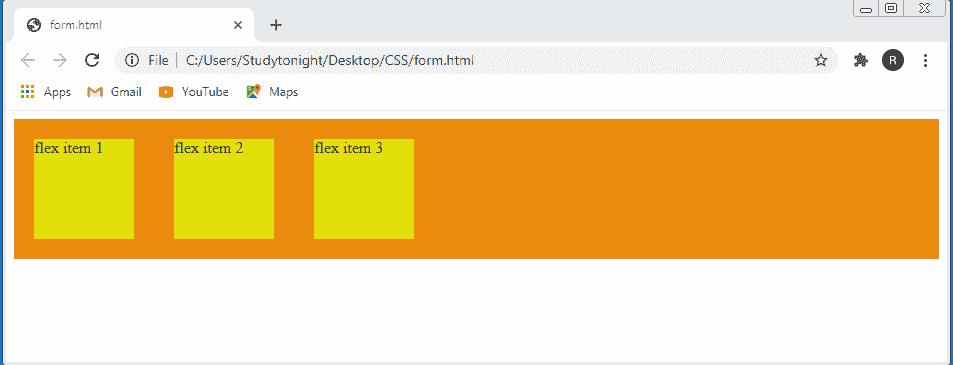

# CSS 柔性盒

> 原文：<https://www.studytonight.com/cascading-style-sheet/css-flexbox>

柔性盒布局模块或柔性盒提供了一种在不使用浮动或定位属性的情况下设计柔性响应布局的方法。借助 CSS flexbox，我们可以使用行和列水平或垂直对齐项目。

它还使元素在与不同屏幕尺寸和不同显示设备一起使用时自动调整其高度和宽度。

## CSS 弹性框属性

| **序列号** | **属性** | **描述** |
| **1。** | **显示** | 显示属性定义了哪种类型的框用于 HTML 元素。 |
| **2。** | **弯曲方向** | flex-direction 属性定义了 flex 容器中 flex 项的方向。 |
| **3。** | **证明内容** | 当项目没有获得主轴上的所有可用空间时，调整内容属性水平对齐伸缩项目。 |
| **4。** | **对齐-项目** | align-items 属性在项目未获得横轴上所有可用空间时垂直对齐伸缩项目。 |
| **5。** | **软包** | flex-wrap 属性指定 flex-item 是否应该换行。 |
| **6。** | **对齐-内容** | align-content 属性用于修改 flex-wrap 属性的行为。 |
| **7。** | **柔性流** | flex-flow 属性是 flex 方向和 flex-wrap 的简写属性。 |
| **8。** | **订单** | order 属性指定弹性项的顺序。 |
| **9。** | **自动校准** | align-self 属性用于重写父元素的 align-items 属性。 |
| **10。** | 弹性 | flex 属性是 flex-增长、flex-收缩和 flex-based 属性的简写属性。 |

## CSS 中的弹性容器和弹性项

flex 容器用于指定父元素(容器)的属性。为了使父容器灵活，我们必须用值`flex`指定 CSS 属性`display`。

flex 项用于指定作为 flex 容器的直接子元素的子元素的属性。灵活容器中可以有任意数量的灵活项目。

### 示例:使用 CSS 创建弹性项和弹性容器

在给定的示例中，我们使用`three flex items.`创建了一个`flex element`，我们为`parent element`指定了类`.flex-container`，为父级 `div`指定了类`.flex-item`。然后我们指定了 CSS 属性`display`到`flex`。这使得`flex container flexible element`和所有的`direct children of the flex container`变成了`flexible items`。

```
<!DOCTYPE html>  
<html>  
<head>
  <title>CSS Flexbox</title>
  <style>  
    .flex-container {  
        display: flex;  
        background-color:#eb8b0e;  
    }  
    .flex-item {  
        background-color: #e3df0b;  
        width: 100px;  
        height: 100px;  
        margin: 20px;  
    }  
  </style>  
</head>  
<body>  
  <div class="flex-container">  
    <div class="flex-item">flex item 1</div>  
    <div class="flex-item">flex item 2</div>  
    <div class="flex-item">flex item 3</div>  
  </div>  
</body>  
</html> 
```

### 输出:

正如我们在输出中看到的，橙色部分是父元素或 flex 容器，其中的三个小框是 flex 项目。



## CSS 中的响应灵活框

我们可以通过添加媒体查询来使我们的 flex 布局具有响应性。媒体查询用于为不同的屏幕尺寸和设备设置不同的布局。

假设，您想要创建一个多列布局。这种多列布局在大屏幕设备上清晰可见，但它会给小屏幕设备带来可见性问题。为了克服这个问题，我们需要为小屏幕尺寸创建一维布局。为此，我们必须使用媒体查询在特定断点处将 flex 方向从行更改为列。

### 示例:使用 CSS 创建响应性弹性框

在本例中，我们演示了如何通过应用媒体查询来使 flexbox 具有响应能力。

## 结论

在本课中，我们学习了如何使用 CSS flex 属性创建一个灵活的响应容器。我们还学习了如何在 flex 容器中添加 flex 项，以及如何通过应用 CSS 媒体查询来使它们具有响应性。

* * *

* * *