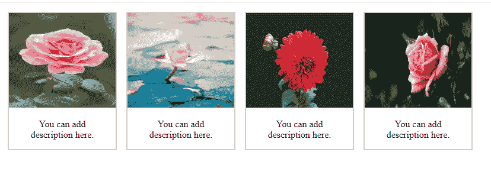

# CSS 画廊

> 原文：<https://www.studytonight.com/cascading-style-sheet/css-image-gallery>

术语画廊是指存储和显示在网页内特定位置的图片/图像的集合。CSS 画廊允许我们通过应用一些 CSS 属性来创建一个响应性的图像网格。要使用 CSS 创建响应画廊，步骤如下:

## 创建基本结构

众所周知，我们可以连续创建多个分区，但不能超过 12 个。在本文中，我们将展示如何使用 HTML 创建画廊及其描述。

在给定的代码中，我们在父级< div >元素中添加了``元素，以在网页上添加图像。然后我们在``元素之后添加了另一个`<div>` 元素来添加图像的描述。

```html
<div>
	
<!--- for description--->
	<div>Add description here.</div>
</div>
```

## 使用 CSS 设置画廊的样式

现在，我们将指定 CSS 属性来提供正确的对齐，使画廊响应，并提供样式。我们为画廊指定的 CSS 属性如下所示:

```html
<style>
		div.grid {
  margin: 8px;
  border: 2px solid #ccc;
  float: left;
  width: 180px;
}
div.grid img {
  width: 100%;
  height: auto;
}

div.content {
  padding: 15px;
  text-align: center;
}
	</style>
```

### 示例:使用 CSS 创建画廊

这是我们在上面讨论过的图像画廊的正确的实际实现。

```html
<!DOCTYPE html>
<html>
<head>
	<title>Image Gallery</title>
	<style>
		div.grid {
  margin: 8px;
  border: 2px solid #ccc;
  float: left;
  width: 180px;
}
div.grid img {
  width: 100%;

}

div.content {
  padding: 15px;
  text-align: center;
}
	</style>
</head>
<body>
<div class="grid">
	
	<div class="content">You can add description here.</div>
</div>
<div class="grid">
	
	<div class="content">You can add description here.</div>
</div>
<div class="grid">
	
	<div class="content">You can add description here.</div>
</div>
<div class="grid">
	
	<div class="content">You can add description here.</div>
</div>
</body>
</html>
```

### 输出:

给定代码的输出如下所示:



# CSS 中的响应画廊

在上一课中，我们已经使用 CSS 创建了一个画廊。在本课中，我们将创建一个响应画廊。

众所周知，网站的响应性在用户交互中起着巨大的作用。为了使这个画廊具有响应性，我们必须添加媒体查询。媒体查询会自动调整不同屏幕尺寸的图像布局。

## 实时示例:使用 CSS 创建响应画廊

在这个例子中，我们指定了 CSS 媒体查询，它允许布局根据屏幕大小自行调整。

## 结论

在本课中，我们学习了如何使用 CSS 创建画廊。我们还可以使用 CSS 媒体查询让他们做出响应。

* * *

* * *